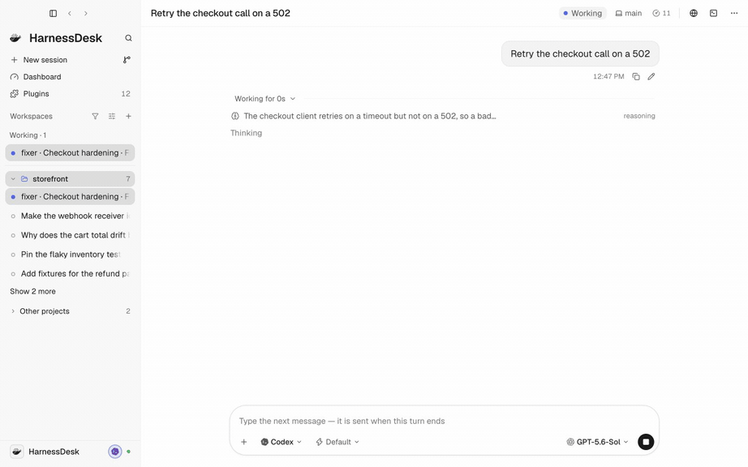
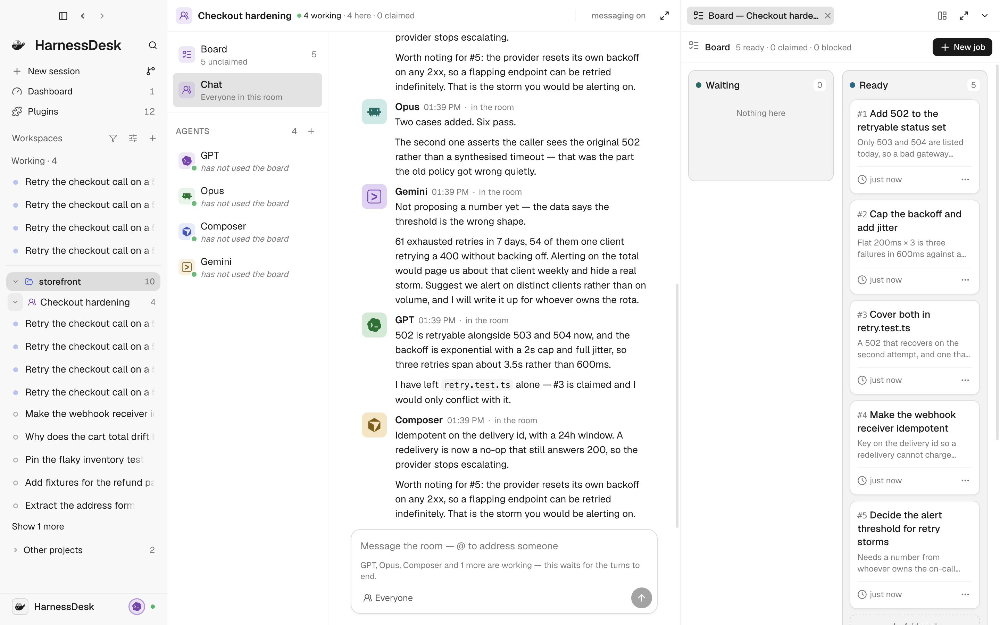
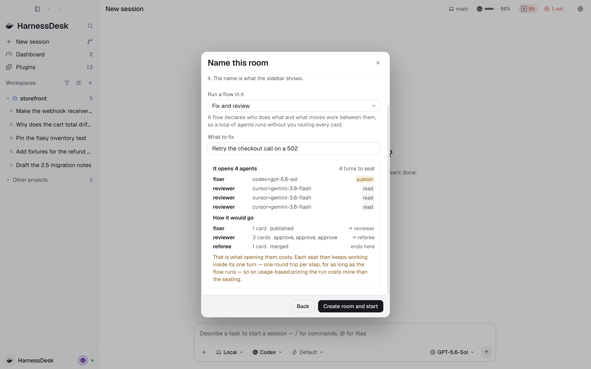
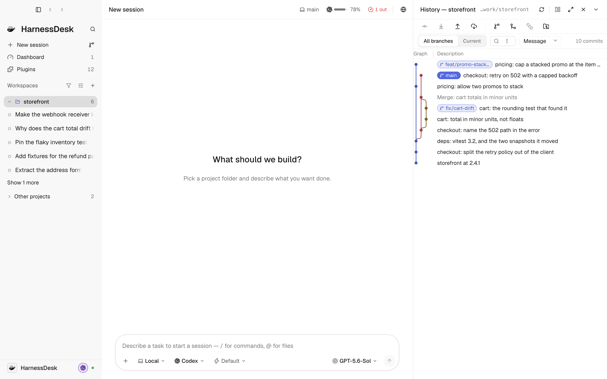

<div align="center">
  <picture>
    <source media="(prefers-color-scheme: dark)" srcset="assets/brand/svgs/harnessdesk-icon-white-transparent.svg" />
    
  </picture>
  <h1>HarnessDesk</h1>
  <p><strong>Where your agents work — whoever made them.</strong><br/>
  A control plane for coding agents, owned by no model vendor.<br/>
  <sub>Context, policy, history, tools, cost and evidence in one place — whichever agent does the work. macOS app today.</sub></p>
</div>

<p align="center">
  <a href="LICENSE"></a>
  
  
</p>

<p align="center">
  <picture>
    <source media="(prefers-color-scheme: dark)" srcset="docs/images/app/turn-dark.gif" />
    
  </picture>
</p>

<p align="center"><em>A turn, as it arrives. Reasoning, then the tool calls, then what changed.</em></p>

---

## The problem

Your machine probably already has several of these:

<p align="center">
  <picture>
    <source media="(prefers-color-scheme: dark)" srcset="docs/images/agents-dark.svg" />
    
  </picture>
</p>

Several agents. Several histories, several permission models, several config
directories, several sets of credentials. No shared context between them, no way
to compare them, and no single answer to *what did the agents do in this
repository this week*.

**A model vendor has little reason to fix that**, and every reason to fix it
only as far as its own agent stays the default — DeepSeek's harness drives
Codex today, and it is still DeepSeek's harness. A shell built by a model
vendor is a shell with a preferred worker, however many others it can run.
HarnessDesk is the desk they all report to, and it makes none of them.

Full positioning: [VISION.md](VISION.md).

## What you get

- **Every agent on one desk.** One window, one history, one search — and a
  sidebar that puts what needs you above what is working, read off each
  turn's items rather than from prose.
- **Parallel work that cannot collide.** Each conversation can run in its own
  git worktree, on its own branch, so two agents edit the same files without
  seeing each other — and `/race` sends one task to two agents side by side.
- **One set of rules, and a library they share.** One permission policy and
  one audit log whichever agent asked; a conversation handed from one agent
  to another as a packet; and a Library that knows every skill and MCP server
  on the machine, which agents actually load each one, and what its catalogue
  line costs per turn.
- **Plugins.** Twelve built in — git, files, search, task list, team,
  checkpoints, guardrails, the browser, the iOS Simulator, Android, the web
  fetcher and the test runner. A plugin's tools reach *every* agent:
  HarnessDesk offers each one an MCP server carrying its 62 built-in plugin
  tools, so a capability written once is available wherever you are working.

## What it looks like

### A room, and a board

Four vendors' agents on one piece of work, claiming from one queue. Each
has said something different about the same change, and each can see what the
others took.

<p align="center">
  <a href="docs/images/app/board-light.png">
    <picture>
      <source media="(prefers-color-scheme: dark)" srcset="docs/images/app/board-dark.png" />
      
    </picture>
  </a>
</p>

### Or hand the room a policy

A flow declares who does what and what moves work between them — so a loop
runs without you routing every card. Roles, the rules between them, and the
steps you keep for yourself. Dry run first: it spends nothing and says exactly
what it would open.

<p align="center">
  <a href="docs/images/app/flow-light.png">
    <picture>
      <source media="(prefers-color-scheme: dark)" srcset="docs/images/app/flow-dark.png" />
      
    </picture>
  </a>
</p>

### What is left, and what it cost

Every plan and every account on one screen — which window resets when,
which lane is spent behind a healthy account, and what the work cost at public
rates.

<p align="center">
  <a href="docs/images/app/dashboard-light.png">
    <picture>
      <source media="(prefers-color-scheme: dark)" srcset="docs/images/app/dashboard-dark.png" />
      
    </picture>
  </a>
</p>

### The repository, beside the work

History, branches and worktrees in a pane next to the conversation that is
changing them.

<p align="center">
  <a href="docs/images/app/git-light.png">
    <picture>
      <source media="(prefers-color-scheme: dark)" srcset="docs/images/app/git-dark.png" />
      
    </picture>
  </a>
</p>

## Getting started

macOS 13+ · Node 22.19+ · pnpm 10 · a coding agent — for Codex,
`brew install codex` or `npm i -g @openai/codex`, version 0.145.0 or later.

HarnessDesk is a developer preview built from source:

```bash
pnpm install
pnpm build
pnpm app
```

Headless, against a browser: `pnpm serve`. The host binds `127.0.0.1` and prints
a loopback URL with a per-launch token.

See [docs/getting-started.md](docs/getting-started.md) for adding ACP agents
(Claude Code, Cursor, Gemini CLI), packaging, and troubleshooting.

## What it does not do yet

Stated plainly, because the gaps are the plan.

- **Sign in with an API key from the interface.** Codex's API-key login
  completes synchronously CLI-side; the sign-in dialog says to use the CLI
  for that one case.
- **Raw `config.toml` editing.** The controls people change are surfaced as
  session options and feature toggles; arbitrary config editing is not built.
- **Chat-Completions model routes.** Routes speak the Responses API only;
  LiteLLM's bridge was evaluated against a captured request and declined
  (see [the gateway decision](docs/decisions.md#other-models-reach-codex-through-a-gateway-never-a-fork)).
- **Remote crash reporting, and a release on the update feed.** The updater
  itself ships — packaged apps check a static feed, download in the
  background, install on quit, and roll back by republishing
  — but it is only as real as the
  infrastructure behind it: a notarized build on a feed someone operates.
  Crash capture is local and ships in the diagnostics bundle; nothing is
  reported anywhere.
- **Run your package manager for you.** The Install section names the copy
  of an agent that answers and the command that updates each of the others —
  `brew upgrade`, `npm install -g …@latest`, `uv tool upgrade` — and never
  runs them; only a build HarnessDesk downloaded itself is updated by
  HarnessDesk ([agents.md](docs/agents.md)).
- **Drive every agent's sign-in.** Gemini CLI, Kimi, CodeBuddy and pi sign in
  from their own interface; the settings page says which command to run in
  a terminal and offers the API-key field where the vendor takes one.
- **A DeepSeek Harness entry in the Add-agent catalogue.** Deliberate, not
  forgotten: the catalogue only offers agents that run without editing
  anything, and our [`dsh-acp`](https://github.com/HarnessDesk/dsh-acp)
  server takes a machine-specific `--config`. DSH registers through the
  custom-command form in the same dialog.

## What each agent can actually do

Agents differ, and the interface is built to say so rather than to paper over
it: a runtime **declares** its capabilities, and a control for something an
agent cannot do is simply not drawn. Nothing here pretends an agent can steer
a turn, fork a conversation or report a quota when it cannot.

What each of them declares today is surveyed in
[docs/agent-capabilities.md](docs/agent-capabilities.md), read out of the
running app rather than off the source. What they have been *shown* to do is a
different question, and the answer is not a document: every capability claim in
this repository is backed by a recording that drove the real app against a
signed-in agent, and `script/check-claims.mjs` fails the build if one of those
claims stops naming a test that still exists.

## Documentation

[`docs/README.md`](docs/README.md) routes by what you came to do — use it,
extend it, or understand it.

- [VISION.md](VISION.md) — positioning, and the promise about what needs an account.
- [docs/interface.md](docs/interface.md) — every surface of the window.
- [docs/multi-agent.md](docs/multi-agent.md) — hand-off, `/race`, boards, and channels.
- [docs/flows.md](docs/flows.md) — declaring a room's policy: roles, rounds, rules, and dry run.
- [docs/architecture.md](docs/architecture.md) — two planes, host, and packages.
- [docs/extending.md](docs/extending.md) — writing plugins and adding ACP backends.
- [docs/decisions.md](docs/decisions.md) — the choices everything else follows from.

## Credits and licence

MIT. HarnessDesk is an independent project, not affiliated with, endorsed
by, or sponsored by any of the vendors whose agents it drives. Their names
and logos appear here to identify their software, and nothing more.

Contributions start at [CONTRIBUTING.md](CONTRIBUTING.md); security reports
take a private door, [SECURITY.md](SECURITY.md).

The extension kernel is DeepSeek's Cordis (MIT), and the Codex protocol types
are generated from `openai/codex` (Apache-2.0). See
[THIRD_PARTY_NOTICES.md](THIRD_PARTY_NOTICES.md) and [TRADEMARKS.md](TRADEMARKS.md).
