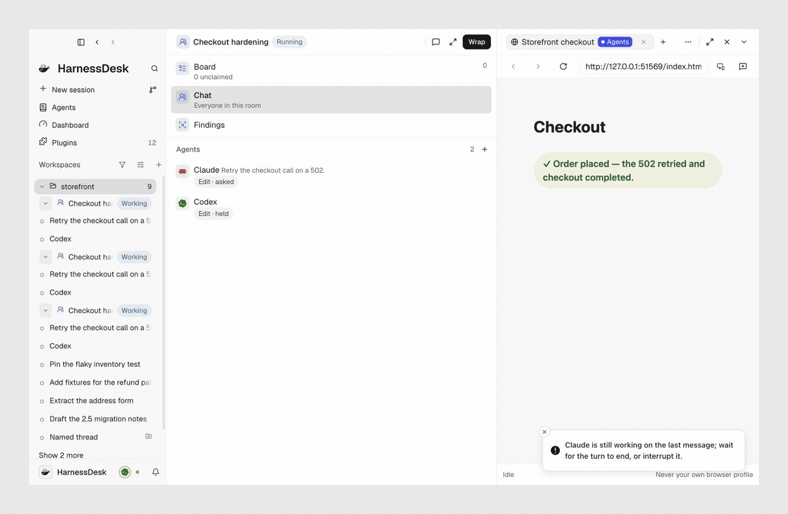
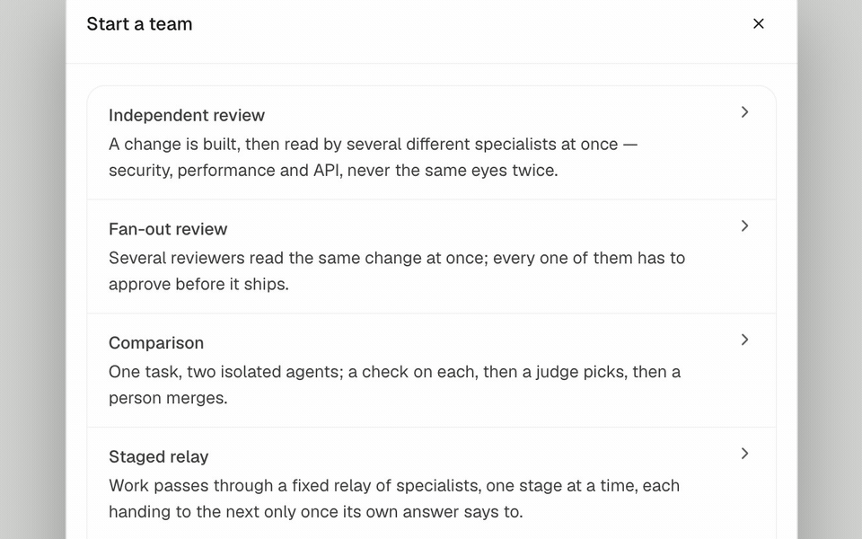
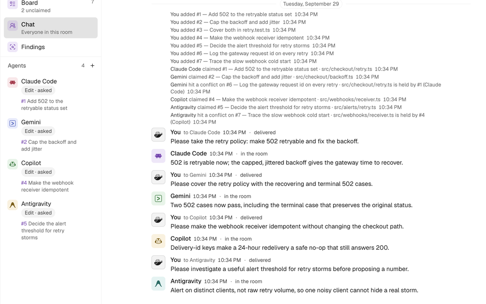
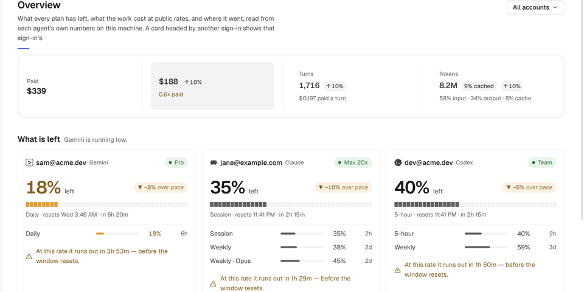
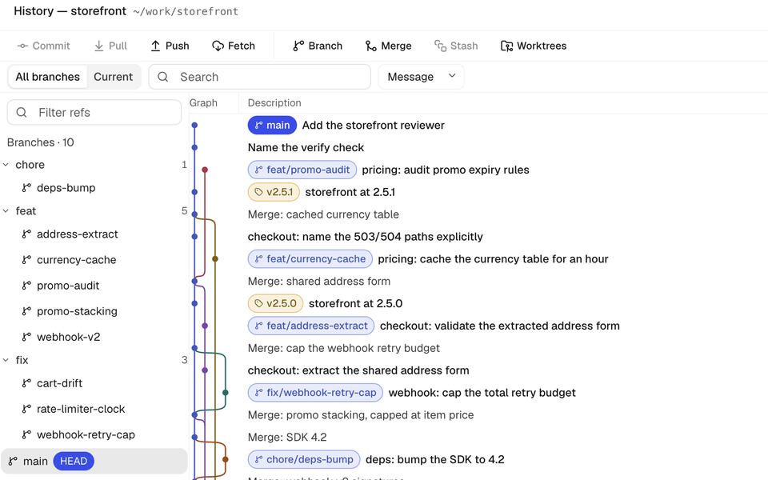
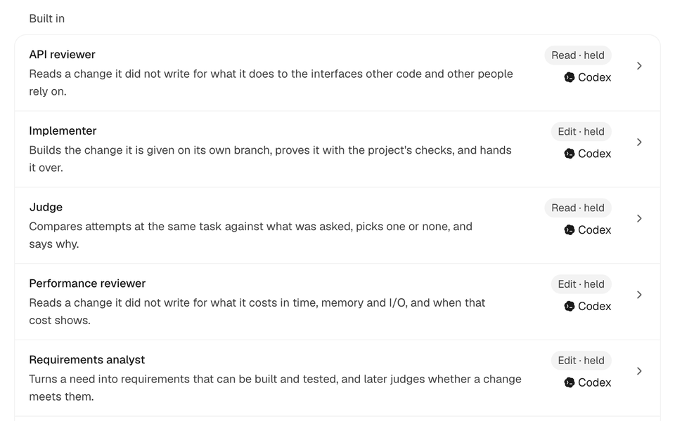

<h1 align="center">
  <picture>
    <source media="(prefers-color-scheme: dark)" srcset="assets/brand/svgs/harnessdesk-icon-white-transparent.svg" />
    
  </picture>
  HarnessDesk
</h1>

<p align="center">
  <a href="LICENSE"></a>
  
  
</p>

<p align="center">
  <strong>Where your agents work — whoever made them.</strong><br/>
  Put Codex, Claude Code, Cursor and Gemini on one piece of work — one room, one board, one set of rules.
</p>

<h3 align="center"><a href="#getting-started"><ins>Get started</ins></a></h3>

<p align="center">
  <a href="docs/images/app/hero-light.gif"><picture>
    <source media="(prefers-color-scheme: dark) and (prefers-reduced-motion: no-preference)" srcset="docs/images/app/hero-dark.gif" />
    <source media="(prefers-color-scheme: dark)" srcset="docs/images/app/hero-dark-poster.png" />
    <source media="(prefers-reduced-motion: no-preference)" srcset="docs/images/app/hero-light.gif" />
    
  </picture></a>
</p>

Your machine already has several coding agents, each with its own history, permissions and credentials, and
nothing shared between them. A model vendor's shell always has a preferred worker; HarnessDesk is the desk they
all report to, and it makes none of them. [Why →](VISION.md)

## Features

<table>
<tr>
<td width="40%" valign="middle">

### Flows

Pick a shape — independent review, fan-out review, comparison, a staged relay — or write your own: who does what,
and what moves work between them. The dry run spends nothing and shows every seat before you start; shipping stays
yours.

[Docs →](docs/flows.md)

</td>
<td width="60%">
  <a href="docs/images/app/flows-light.png"><picture>
    <source media="(prefers-color-scheme: dark)" srcset="docs/images/app/flows-dark.png" />
    
  </picture></a>
</td>
</tr>
<tr>
<td width="40%" valign="middle">

### Rooms

Agents from different vendors on one piece of work, claiming from one board — each sees what the others took, and a
second reach for a file already held is refused by name.

[Docs →](docs/multi-agent.md#4-the-room-the-shared-workspace)

</td>
<td width="60%">
  <a href="docs/images/app/rooms-light.png"><picture>
    <source media="(prefers-color-scheme: dark)" srcset="docs/images/app/rooms-dark.png" />
    
  </picture></a>
</td>
</tr>
<tr>
<td width="40%" valign="middle">

### Dashboard

Every plan and every account on one screen — what is left, when it resets, what the work cost at public rates, and
each agent's days, week by week.

[Docs →](docs/usage-dashboard.md)

</td>
<td width="60%">
  <a href="docs/images/app/dashboard-tour-light.gif"><picture>
    <source media="(prefers-color-scheme: dark) and (prefers-reduced-motion: no-preference)" srcset="docs/images/app/dashboard-tour-dark.gif" />
    <source media="(prefers-color-scheme: dark)" srcset="docs/images/app/dashboard-tour-dark-poster.png" />
    <source media="(prefers-reduced-motion: no-preference)" srcset="docs/images/app/dashboard-tour-light.gif" />
    
  </picture></a>
</td>
</tr>
<tr>
<td width="40%" valign="middle">

### The repository, beside the work

History, branches and worktrees in a pane next to the conversation that is changing them.

[Docs →](docs/interface.md)

</td>
<td width="60%">
  <a href="docs/images/app/history-light.png"><picture>
    <source media="(prefers-color-scheme: dark)" srcset="docs/images/app/history-dark.png" />
    
  </picture></a>
</td>
</tr>
<tr>
<td width="40%" valign="middle">

### Agents

Who does the work: a brief, the most it may do, and the seats it prefers. Nine ship — reviewers, an implementer,
a judge, a researcher — and each sits on whichever runtime can offer it a seat.

[Docs →](docs/agents.md)

</td>
<td width="60%">
  <a href="docs/images/app/agents-light.png"><picture>
    <source media="(prefers-color-scheme: dark)" srcset="docs/images/app/agents-dark.png" />
    
  </picture></a>
</td>
</tr>
</table>

**Also in the box:**

- **[`/race`](docs/multi-agent.md#3-race-competing-in-parallel)** — one task to two agents, each in its own worktree, side by side.
- **[Hand-off](docs/multi-agent.md#2-hand-offs-passing-the-baton)** — a conversation moves to another agent as a packet it can pick up.
- **[A browser the agent drives](docs/browser-control.md)** — it opens the page, clicks, reads the console; you watch.
- **Plugins.** Twelve built in, and their tools reach every agent: each one gets an MCP server carrying its 73 built-in plugin tools. [Docs →](docs/extending.md)
- **[Library](docs/interface.md#settings)** — every skill and MCP server on the machine, and which agents actually load each.
- **[One policy, one audit log](docs/architecture.md)** — the same rules whichever agent asked.

## Supported agents

<p align="center">
  <picture>
    <source media="(prefers-color-scheme: dark)" srcset="docs/images/agents-dark.svg" />
    
  </picture>
</p>

<p align="center">…and any agent that speaks ACP. <a href="#what-each-agent-can-actually-do">What each one can actually do →</a></p>

## Getting started

**Download.** The signed, notarized app for macOS 13+ — Apple silicon or Intel — is on the
[latest release](https://github.com/HarnessDesk/HarnessDesk/releases/latest), and it updates itself from there.
Bring a coding agent: for Codex, `brew install codex` or `npm i -g @openai/codex`, version 0.145.0 or later.
What has landed here since that release is listed under `Unreleased` in [CHANGELOG.md](CHANGELOG.md).

**Build from source** to contribute — Node 22.19+ and pnpm 10:

```bash
pnpm install
pnpm build
pnpm app
```

Headless, against a browser: `pnpm serve`. The host binds `127.0.0.1` and prints
a loopback URL with a per-launch token.

See [docs/getting-started.md](docs/getting-started.md) for adding ACP agents
(Claude Code, Cursor, Gemini CLI), packaging, and troubleshooting.

## What it does not do yet

Stated plainly, because the gaps are the plan.

- **Sign in with an API key from the interface.** Codex's API-key login
  completes synchronously CLI-side; the sign-in dialog says to use the CLI
  for that one case.
- **Raw `config.toml` editing.** The controls people change are surfaced as
  session options and feature toggles; arbitrary config editing is not built.
- **Chat-Completions model routes.** Routes speak the Responses API only;
  LiteLLM's bridge was evaluated against a captured request and declined
  (see [the gateway decision](docs/decisions.md#other-models-reach-codex-through-a-gateway-never-a-fork)).
- **Remote crash reporting.** Crash capture is local and ships in the
  diagnostics bundle; nothing is reported anywhere.
- **Run your package manager for you.** The Install section names the copy
  of an agent that answers and the command that updates each of the others —
  `brew upgrade`, `npm install -g …@latest`, `uv tool upgrade` — and never
  runs them; only a build HarnessDesk downloaded itself is updated by
  HarnessDesk ([runtimes.md](docs/runtimes.md)).
- **Drive every agent's sign-in.** Gemini CLI, Kimi, CodeBuddy and pi sign in
  from their own interface; the settings page says which command to run in
  a terminal and offers the API-key field where the vendor takes one.

## What each agent can actually do

Agents differ, and the interface is built to say so rather than to paper over
it: a runtime **declares** its capabilities, and a control for something an
agent cannot do is simply not drawn. Nothing here pretends an agent can steer
a turn, fork a conversation or report a quota when it cannot.

What each of them declares today is surveyed in
[docs/agent-capabilities.md](docs/agent-capabilities.md), read out of the
running app rather than off the source. What they have been *shown* to do is a
different question, and the answer is not a document: every capability claim in
this repository is backed by a recording that drove the real app against a
signed-in agent, and `script/check-claims.mjs` fails the build if one of those
claims stops naming a test that still exists.

## Documentation

[`docs/README.md`](docs/README.md) routes by what you came to do — use it,
extend it, or understand it.

- [VISION.md](VISION.md) — positioning, and the promise about what needs an account.
- [docs/interface.md](docs/interface.md) — every surface of the window.
- [docs/multi-agent.md](docs/multi-agent.md) — hand-off, `/race`, boards, and channels.
- [docs/flows.md](docs/flows.md) — declaring a room's policy: roles, rounds, rules, and dry run.
- [docs/architecture.md](docs/architecture.md) — two planes, host, and packages.
- [docs/extending.md](docs/extending.md) — writing plugins and adding ACP backends.
- [docs/decisions.md](docs/decisions.md) — the choices everything else follows from.

## Credits and licence

MIT. HarnessDesk is an independent project, not affiliated with, endorsed
by, or sponsored by any of the vendors whose agents it drives. Their names
and logos appear here to identify their software, and nothing more.

Contributions start at [CONTRIBUTING.md](CONTRIBUTING.md); security reports
take a private door, [SECURITY.md](SECURITY.md).

The extension kernel is DeepSeek's Cordis (MIT), and the Codex protocol types
are generated from `openai/codex` (Apache-2.0). See
[THIRD_PARTY_NOTICES.md](THIRD_PARTY_NOTICES.md) and [TRADEMARKS.md](TRADEMARKS.md).
