<h1 align="center">
  <picture>
    <source media="(prefers-color-scheme: dark)" srcset="assets/brand/svgs/harnessdesk-icon-white-transparent.svg" />
    
  </picture>
  HarnessDesk
</h1>

<p align="center">
  <a href="LICENSE"></a>
  
  <a href="https://github.com/HarnessDesk/HarnessDesk/releases/tag/v0.4.0"></a>
</p>

<p align="center">
  <strong>Where your agents work, whoever made them.</strong><br/>
  Run coding agents in Teams. Set the rules with Flows, follow each Run, and step in where the work needs you.
</p>

<p align="center">
  <a href="https://github.com/HarnessDesk/HarnessDesk/releases/tag/v0.4.0"><strong>Download for macOS</strong></a> · <a href="docs/README.md">Documentation</a>
</p>

<p align="center">
  <picture>
    <source media="(prefers-color-scheme: dark) and (prefers-reduced-motion: no-preference)" srcset="docs/images/app/race-hero-dark.gif" />
    <source media="(prefers-color-scheme: dark)" srcset="docs/images/app/race-hero-dark-poster.png" />
    <source media="(prefers-reduced-motion: no-preference)" srcset="docs/images/app/race-hero-light.gif" />
    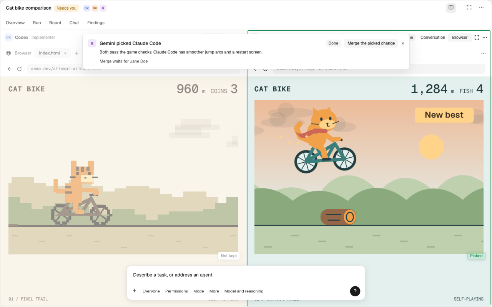
  </picture>
</p>

<p align="center">Two agents build the same thing side by side, a judge picks one, and a person decides what lands — an illustrated, time-compressed run.</p>

**Team** — the agents and their shared work, gathered in one place.<br/>
**Flow** — the rules for who works, what gets checked, and where you step in.<br/>
**Run** — one start of that Flow, with its rounds, checks and outcomes recorded.

## Features

<table>
<tr>
<td width="40%" valign="middle">

### Teams

Find Teams by project, with work that needs you first. The project sidebar keeps linked checkouts, conversations and a Team’s Seats together.

[Docs →](docs/interface.md#the-teams-page)

</td>
<td width="60%">
  <picture>
    <source media="(prefers-color-scheme: dark)" srcset="docs/images/app/teams-dark.png" />
    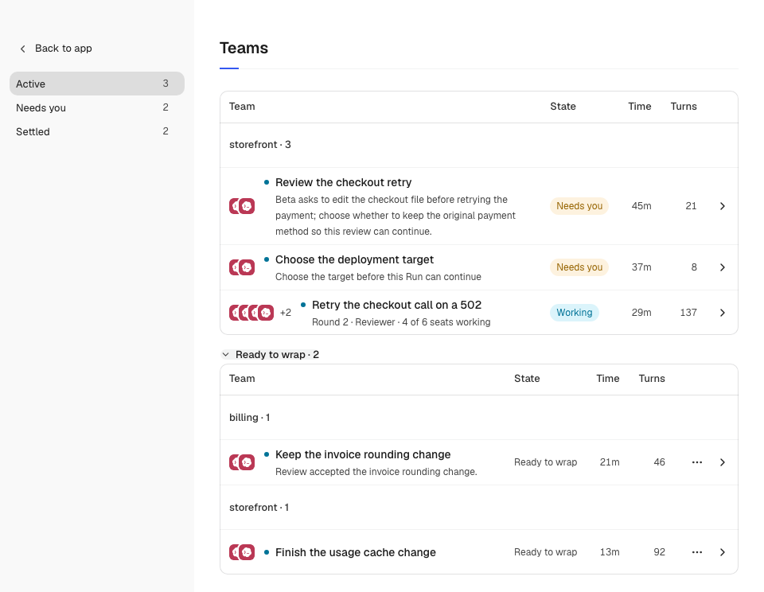
  </picture>
<details>
<summary>Project sidebar</summary>

<picture>
    <source media="(prefers-color-scheme: dark)" srcset="docs/images/app/project-sidebar-dark.png" />
    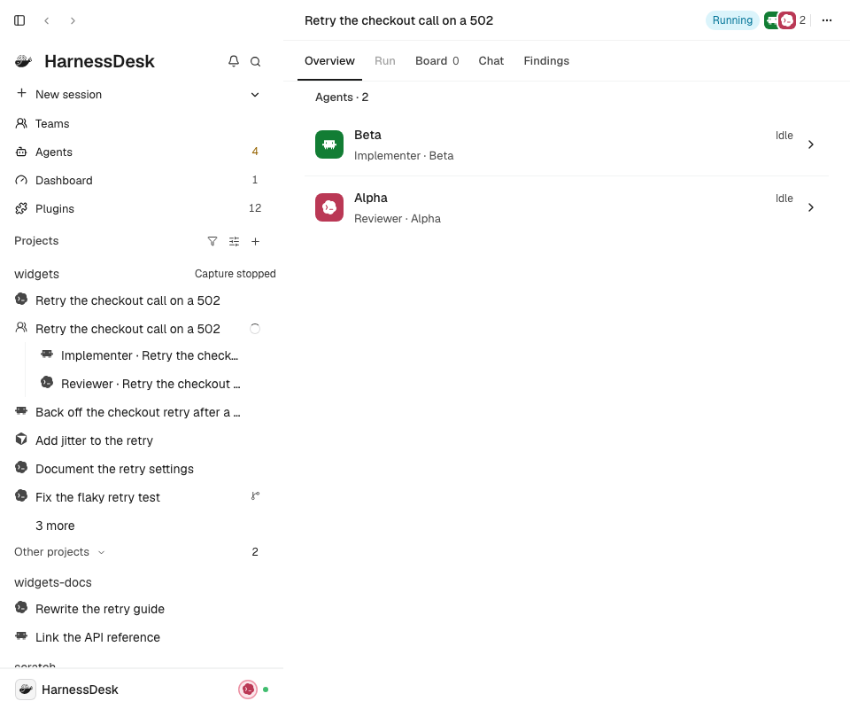
  </picture>

</details>
</td>
</tr>
<tr>
<td width="40%" valign="middle">

### Runs

Follow the brief, review rounds, repairs and checks on a timeline. Switch to the Flow to see the route this Run took, and stop it or run it again.

[Docs →](docs/flows.md)

</td>
<td width="60%">
  <picture>
    <source media="(prefers-color-scheme: dark)" srcset="docs/images/app/run-timeline-dark.png" />
    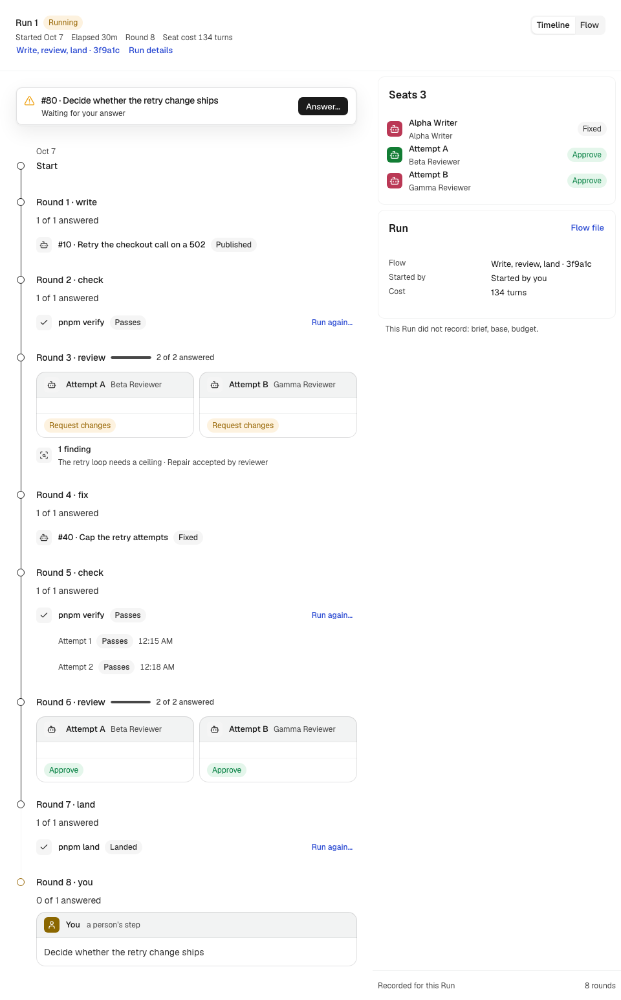
  </picture>
<details>
<summary>The route this Run took</summary>

<picture>
    <source media="(prefers-color-scheme: dark)" srcset="docs/images/app/run-flow-dark.png" />
    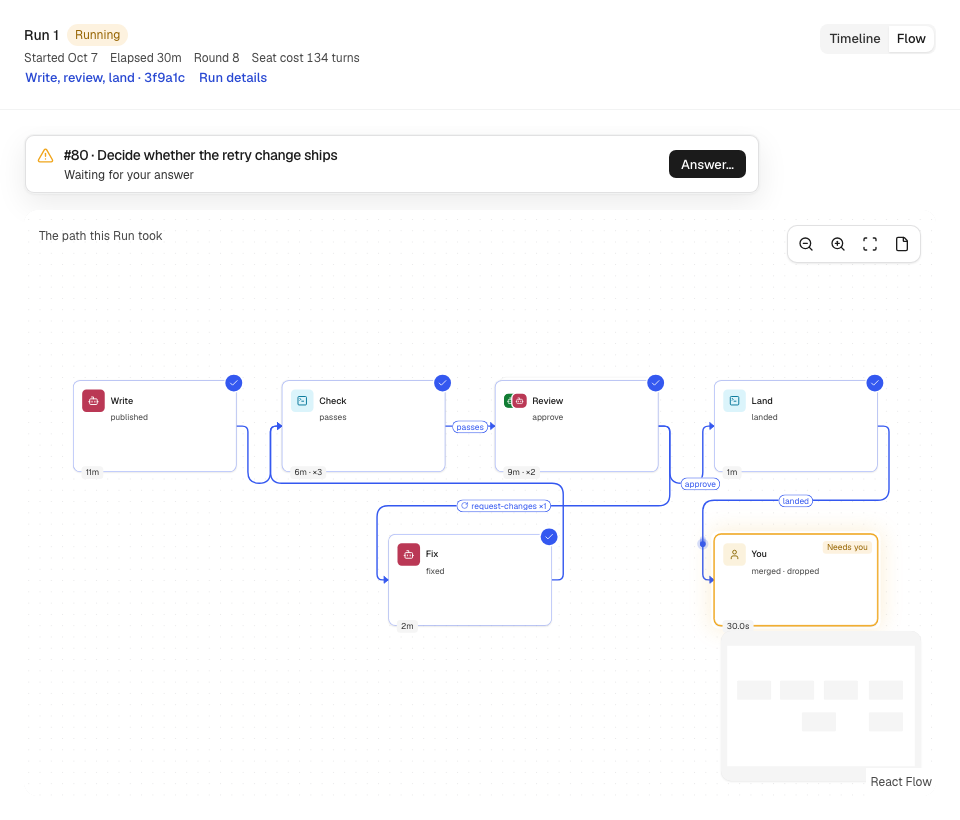
  </picture>

</details>
</td>
</tr>
<tr>
<td width="40%" valign="middle">

### Race

Send the same task to two isolated Seats and watch them Side by side, with a browser per tile. The judge marks Picked and Not kept; the person step decides whether to merge the picked change.

[Docs →](docs/multi-agent.md#3-race-competing-in-parallel)

</td>
<td width="60%">
  <picture>
    <source media="(prefers-color-scheme: dark)" srcset="docs/images/app/race-tiles-dark.png" />
    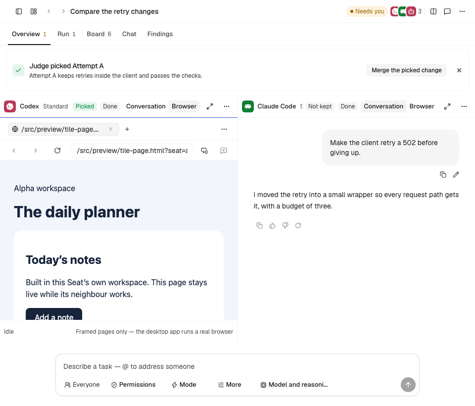
  </picture>
<details>
<summary>The comparison Run</summary>

<picture>
    <source media="(prefers-color-scheme: dark)" srcset="docs/images/app/run-picked-dark.png" />
    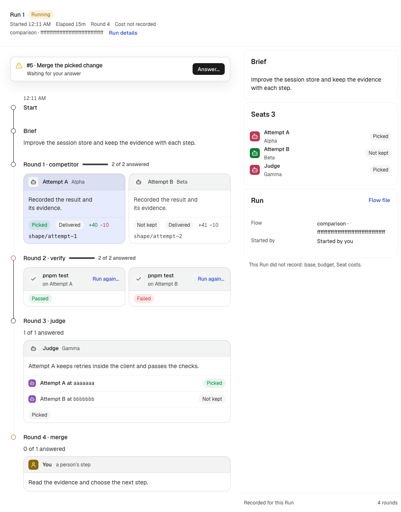
  </picture>

</details>
</td>
</tr>
<tr>
<td width="40%" valign="middle">

### Flows

Choose or write the rules for who works, which checks run and where the person steps in. Preview the Seats, ceilings and checks before Start.

[Docs →](docs/flows.md)

</td>
<td width="60%">
  <picture>
    <source media="(prefers-color-scheme: dark)" srcset="docs/images/app/flow-start-preview-dark.png" />
    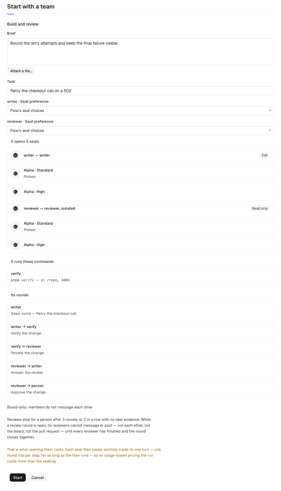
  </picture>
<details>
<summary>An illustrated Flow</summary>

<picture>
    <source media="(prefers-color-scheme: dark) and (prefers-reduced-motion: no-preference)" srcset="docs/images/app/anim-flow-dark.svg" />
    <source media="(prefers-color-scheme: dark)" srcset="docs/images/app/anim-flow-dark-poster.png" />
    <source media="(prefers-reduced-motion: no-preference)" srcset="docs/images/app/anim-flow-light.svg" />
    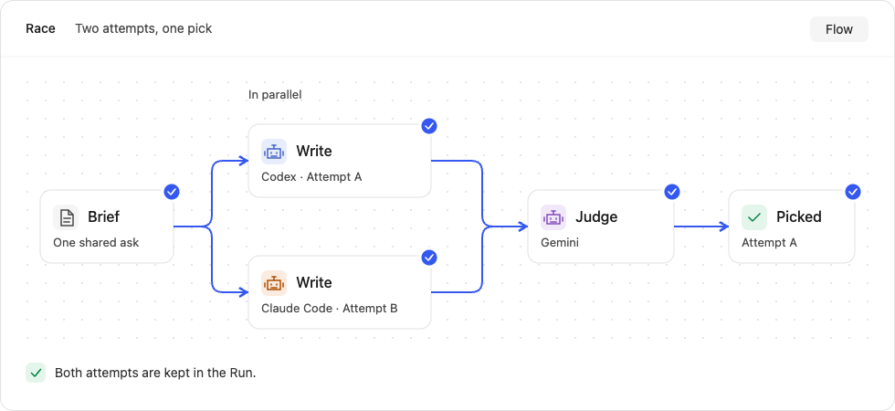
  </picture>

</details>
</td>
</tr>
<tr>
<td width="40%" valign="middle">

### Command line

Script it, or let your agent run it: the same Run from a terminal. Start a Flow and watch its events with the `harnessdesk` command line bundled with the app.

[Docs →](docs/cli.md)

</td>
<td width="60%">
  <picture>
    <source media="(prefers-color-scheme: dark) and (prefers-reduced-motion: no-preference)" srcset="docs/images/app/anim-cli-dark.svg" />
    <source media="(prefers-color-scheme: dark)" srcset="docs/images/app/anim-cli-dark-poster.png" />
    <source media="(prefers-reduced-motion: no-preference)" srcset="docs/images/app/anim-cli-light.svg" />
    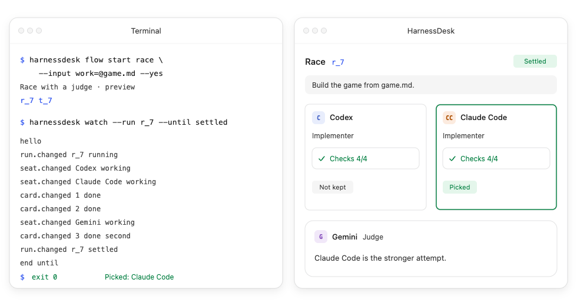
  </picture>

</td>
</tr>
<tr>
<td width="40%" valign="middle">

### Dashboard

See Paid beside Value, and recorded activity By hour. Value is an estimate at public API rates, not a bill; unpriced work and incomplete coverage stay visible.

[Docs →](docs/usage-dashboard.md)

</td>
<td width="60%">
  <picture>
    <source media="(prefers-color-scheme: dark)" srcset="docs/images/app/dashboard-plans-dark.png" />
    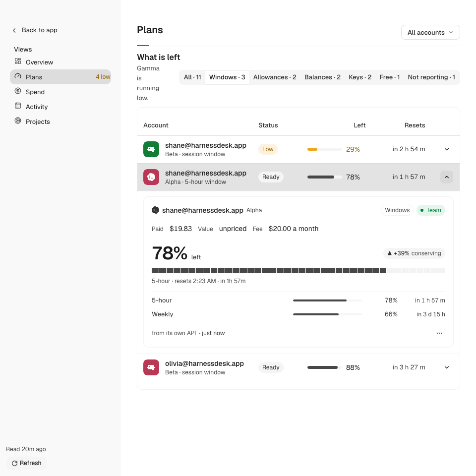
  </picture>
<details>
<summary>Activity By hour</summary>

<picture>
    <source media="(prefers-color-scheme: dark)" srcset="docs/images/app/dashboard-hour-dark.png" />
    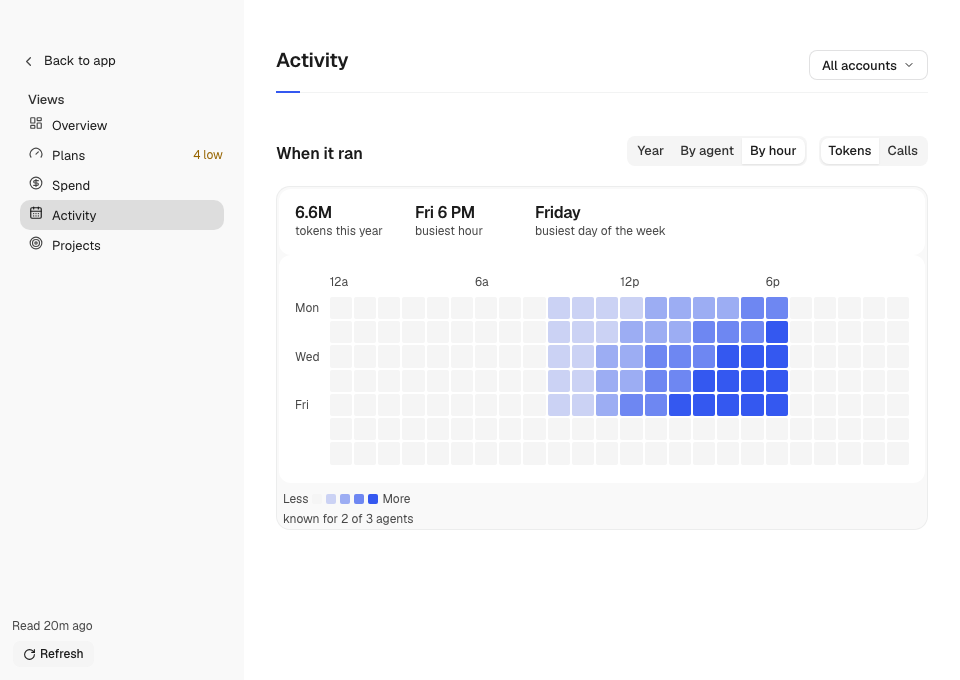
  </picture>

</details>
</td>
</tr>
</table>

## Also included

- **[Hand-off](docs/multi-agent.md#2-hand-offs-passing-the-baton)** — pass a conversation to another agent with a packet it can pick up.
- **[A browser the agent drives](docs/browser-control.md)** — open pages, click and read the console beside the conversation.
- **[Repository tools](docs/interface.md)** — history, branches, changes and worktrees beside the work.
- **[Agents](docs/agents.md)** — reusable briefs, ceilings and preferred Seats; nine built-in roles to start from.
- **Plugins.** Twelve built in, and their tools reach every agent: each one gets an MCP server carrying its 73 built-in plugin tools. [Docs →](docs/extending.md)
- **[Library](docs/interface.md#settings)** — skills and MCP servers across installed agents, and which ones load each.
- **[One policy, one audit log](docs/architecture.md)** — the same rules whichever agent asked.

## Getting started

**Download.** The signed, notarized app for macOS 13+ — Apple silicon or Intel — is on the
[v0.4.0 release](https://github.com/HarnessDesk/HarnessDesk/releases/tag/v0.4.0), and it updates itself from there.
Bring a coding agent: for Codex, `brew install codex` or `npm i -g @openai/codex`, version 0.145.0 or later.
What has landed here since that release is listed under `Unreleased` in [CHANGELOG.md](CHANGELOG.md).

**Build from source** to contribute — Node 22.19+ and pnpm 10:

```bash
pnpm install
pnpm build
pnpm app
```

Headless, against a browser: `pnpm serve`. The host binds `127.0.0.1` and prints
a loopback URL with a per-launch token.

See [docs/getting-started.md](docs/getting-started.md) for adding ACP agents
(Claude Code, Cursor, Gemini CLI), packaging, and troubleshooting.

## Supported agents

<p align="center">
  <picture>
    <source media="(prefers-color-scheme: dark)" srcset="docs/images/agents-dark.svg" />
    
  </picture>
</p>

<p align="center">…and any agent that speaks ACP. <a href="#what-each-agent-can-actually-do">What each one can actually do →</a></p>

## What each agent can actually do

Agents differ, and the interface is built to say so rather than to paper over
it: a runtime **declares** its capabilities, and a control for something an
agent cannot do is simply not drawn. Nothing here pretends an agent can steer
a turn, fork a conversation or report a quota when it cannot.

What each of them declares today is surveyed in
[docs/agent-capabilities.md](docs/agent-capabilities.md), read out of the
running app rather than off the source. What they have been *shown* to do is a
different question, and the answer is not a document: every capability claim in
this repository is backed by a recording that drove the real app against a
signed-in agent, and `script/check-claims.mjs` fails the build if one of those
claims stops naming a test that still exists.

## What it does not do yet

Stated plainly, because the gaps are the plan.

- **Sign in with an API key from the interface.** Codex's API-key login
  completes synchronously CLI-side; the sign-in dialog says to use the CLI
  for that one case.
- **Raw `config.toml` editing.** The controls people change are surfaced as
  session options and feature toggles; arbitrary config editing is not built.
- **Chat-Completions model routes.** Routes speak the Responses API only;
  a bridge was evaluated against a captured request and declined
  (see [the gateway decision](docs/decisions.md#other-models-reach-codex-through-a-gateway-never-a-fork)).
- **Remote crash reporting.** Crash capture is local and ships in the
  diagnostics bundle; nothing is reported anywhere.
- **Run your package manager for you.** The Install section names the copy
  of an agent that answers and the command that updates each of the others —
  `brew upgrade`, `npm install -g …@latest`, `uv tool upgrade` — and never
  runs them; only a build HarnessDesk downloaded itself is updated by
  HarnessDesk ([runtimes.md](docs/runtimes.md)).
- **Drive every agent's sign-in.** Gemini CLI, Kimi, CodeBuddy and pi sign in
  from their own interface; the settings page says which command to run in
  a terminal and offers the API-key field where the vendor takes one.

## Documentation

[`docs/README.md`](docs/README.md) routes by what you came to do — use it,
extend it, or understand it.

- [VISION.md](VISION.md) — positioning, and the promise about what needs an account.
- [docs/interface.md](docs/interface.md) — every surface of the window.
- [docs/multi-agent.md](docs/multi-agent.md) — Teams, hand-off, `/race`, boards, and channels.
- [docs/flows.md](docs/flows.md) — declaring a Team’s policy: roles, rounds, rules, and preview before start.
- [docs/cli.md](docs/cli.md) — the bundled command line.
- [docs/usage-dashboard.md](docs/usage-dashboard.md) — Paid, Value, activity and coverage.
- [docs/architecture.md](docs/architecture.md) — two planes, host, and packages.
- [docs/extending.md](docs/extending.md) — writing plugins and adding ACP backends.
- [docs/decisions.md](docs/decisions.md) — the choices everything else follows from.

## Credits and licence

MIT. HarnessDesk is an independent project, not affiliated with, endorsed
by, or sponsored by any of the vendors whose agents it drives. Their names
and logos appear here to identify their software, and nothing more.

Contributions start at [CONTRIBUTING.md](CONTRIBUTING.md); security reports
take a private door, [SECURITY.md](SECURITY.md).

The extension kernel is DeepSeek's Cordis (MIT), and the Codex protocol types
are generated from `openai/codex` (Apache-2.0). See
[THIRD_PARTY_NOTICES.md](THIRD_PARTY_NOTICES.md) and [TRADEMARKS.md](TRADEMARKS.md).
