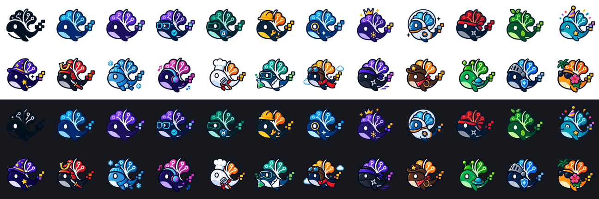

# HarnessDesk avatars

Twenty-four whales, cut from two generated sheets. The first three are the house mark in
a colour and nothing else; the other twenty-one are wearing a job, so a row of agents or
a board of seats can be told apart at a glance rather than by reading three names.



| Name | Who it is |
| --- | --- |
| `black` | The mark, no costume — light surfaces only, see below |
| `blue` | The mark in Blueprint's blue |
| `violet` | The mark in violet |
| `reviewer` | Glasses, and the check it just signed off |
| `guardian` | A shield with a lock in it |
| `builder` | Hard hat, wrench, and a spark |
| `scout` | A magnifier over the eye |
| `lead` | A crown, and the little graph it is directing |
| `astronaut` | Helmet, visor, orbit badge |
| `ninja` | Red headband and shuriken |
| `sprout` | Leaves growing out of the circuit brain |
| `party` | Hat, confetti, and a star |
| `wizard` | Starred hat and a star-tipped wand |
| `samurai` | Gold kabuto crest, red scarf, katana |
| `winter` | Knit beanie, scarf, and falling snow |
| `dj` | Headphones, and the notes coming out of them |
| `chef` | Toque, spatula, and a neckerchief |
| `scientist` | Goggles, lab coat, and a flask that is doing something |
| `pilot` | Leather cap, goggles, a scarf, and the clouds behind it |
| `shinobi` | The other ninja: purple headband, and moving |
| `cowboy` | Hat with a star, bandana, and a lasso |
| `alien` | Antennae, and a ringed planet |
| `knight` | Visored helm and a blue shield |
| `beach` | Sunglasses, hibiscus, and a palm tree |

The order above is the order they were drawn in, which is the order the preview reads in;
the folders list them alphabetically. `ninja` and `shinobi` are the same job from two
different sheets — red and purple — and either is a fine answer to "the fast one".

## These are not the mark

They are the mark's family — the same whale, the same circuit brain, the same five
pixel squares trailing off the tail — but they are drawn as stickers, with outlines, an
eye highlight and a rounder body. `assets/brand/svgs` holds the mark itself, and it is
what identifies *the product*: the app icon, the menu bar, the README, the site. These
identify *somebody using it*. A surface that reaches in here for a logo has picked the
wrong folder.

## Sizes

Three, every one of them a transparent PNG, and none of them upscaled — 384 is the
resolution the sheets drew one whale at, and the other two are reductions of it.

| Folder | For |
| --- | --- |
| `384/` | The master, and any large face: a picker tile, a profile card, a settings header, print |
| `128/` | The working size. Covers every avatar the app draws — 22, 24, 30, 36 and 44 px — at @3x |
| `64/` | The same, at @2x, for a list that renders hundreds of rows |

Three and not four: an intermediate 256 would have added 2.4 MB to a 14 MB repository to
save a browser a 1.5× reduction it does perfectly well on its own. Anything larger than
384 is a re-cut from `source/`, not a checked-in file.

Draw them square with a 6px corner rather than a circle: the app's avatars are squared
tiles, and a chat where the avatar column disagrees with the account chips reads as two
products.

## The black one on a dark surface

`black` is the mark with no colour on it and no outline to hold it, so on a dark surface
it goes: only the grey circuit traces come back. That is the mark's own rule — black on
light, white on dark — except that this set has no white whale to pair it with, because
a white sticker with a navy outline is a different drawing, not a recolour. On anything
dark, reach for `blue` or any of the twenty-one wearing a job.

Every other face survives both surfaces on the strength of its navy outline, `chef`
included: a white whale on white is only a problem when nothing draws its edge.

## What "cut" means here

A sheet arrives as one 1536×1024 image with twelve whales on it, and three problems:

- **A haze.** 3% of a sheet carries an alpha of 1 to 7 — invisible on any surface, and
  enough to make every bounding box the size of its whole cell. It is thresholded away
  before anything is measured.
- **No grid.** The twelve are laid out roughly 4×3 but not on an exact pitch, and the
  two sheets do not share one, so the cells are found by looking for the runs of fully
  transparent columns and rows.
- **Twelve sizes, twice.** No two whales were drawn the same size, and the second sheet
  did not agree with the first. Each is scaled and centred on *its own body* — the rows
  and columns carrying at least 30% of that cell's peak, which is the whale and never a
  crown, a snowflake or a cloud — so all twenty-four leave at one optical size, with the
  furniture free to push into the margin instead of shoving the face down. Twenty of
  them land within 0.3% of that size. Nothing is ever cropped to make it fit: a whale
  whose furniture would clip is scaled down until it doesn't, which is why `chef` (−8%),
  `party` (−5%), `pilot` and `alien` (−3%) sit a little smaller than the rest.

Every tile is 384 square, art no closer than 10px to an edge.

## Regenerating

```bash
pnpm run avatars
```

Reads every sheet in `source/` and rewrites all four size folders and `preview.png`.
Needs ImageMagick 7 (`brew install imagemagick`); the PNGs are checked in, so no build
depends on having it. The script measures each sheet rather than carrying hand-typed
rectangles, so a regenerated sheet with the whales in slightly different places still
cuts — it only insists on 4×3 cells and twelve names per sheet, in grid order, left to
right and top to bottom. A third sheet is four lines: drop the file in `source/`, add it
to `SHEETS` with its twelve names.

Resize with a plain `-resize`, as the script does. ImageMagick's documented
`-alpha associate … disassociate` pair does not round-trip in this build: it leaves the
colour premultiplied, which is a dark halo around every whale on a light surface, and on
a reduction it flattens the alpha channel away completely. Measured against compositing
the sheet onto the surface *first* and then cutting — the answer a resize should agree
with — the pair is 4% off and a plain resize is 0.14%. All seventy-two files were checked
that way on white and on dark; the worst is 0.8%, at 64px, where a six-fold reduction
and a blend genuinely do not commute.

## Provenance

Both sheets were generated, not drawn, on 2026-08-31, and they are checked in at
`source/avatars-sheet-1.png` and `-2.png` exactly as they arrived. They are the source
of truth: everything in the size folders comes out of `script/cut-avatars.mjs` reading
them, and nothing here has been retouched by hand.
