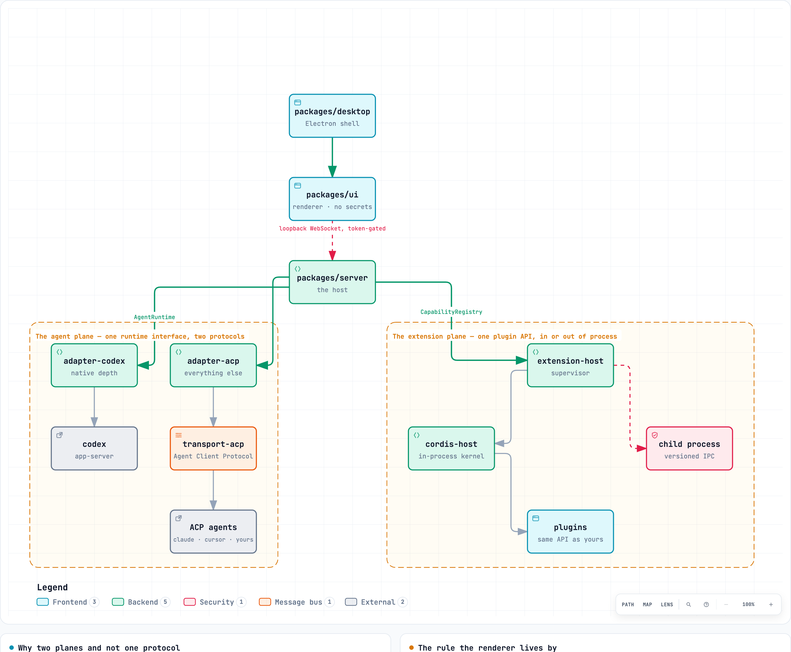
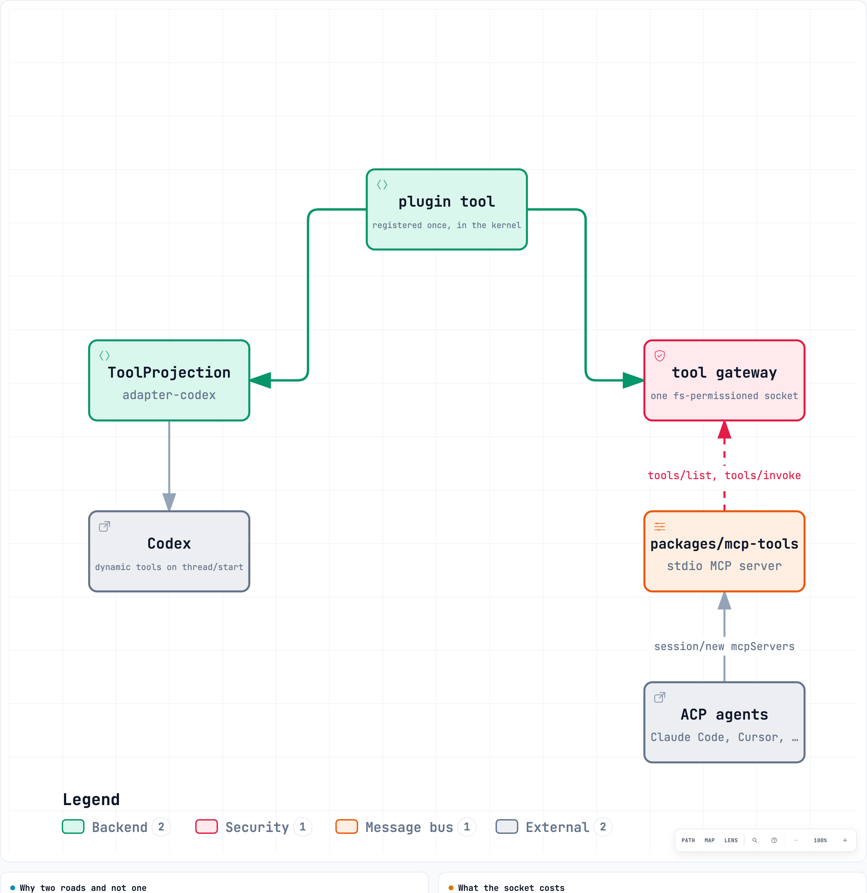

# HarnessDesk architecture

*The system as built, read off the code on 2026-09-12. When this and the code
disagree, the code is right and this is a bug.*

HarnessDesk is a macOS desktop app that drives coding agents it does not own.
It has three primitives — **agents**, **extensions**, and **workspaces** — and
two extension axes that are kept apart on purpose.

## The two planes

|  | Question | Answer | Boundary enforced by |
| --- | --- | --- | --- |
| **Agent plane** | Who does the work? | An `AgentRuntime` per agent: Codex natively, everything else over ACP | `pnpm layering` — Codex types never leave `packages/adapter-codex` |
| **Extension plane** | What can they do? | Plugins on a Cordis kernel, projected into each agent's own tool dialect | `pnpm layering` — Cordis never leaves `packages/cordis-host` |

They are orthogonal, and that is the whole point: a plugin registered once is
usable by every agent, and an agent added once can use every plugin. Collapsing
them into one protocol would give up both properties.

  <picture>
    <source media="(prefers-color-scheme: dark)" srcset="diagrams/architecture-dark.png" />
    
  </picture>

> Generated from [`diagrams/architecture.architecture.json`](diagrams/architecture.architecture.json),
> which is the thing to edit and the thing a reviewer reads — a diagram that
> only exists as a picture cannot be reviewed. The same source renders an
> interactive version, [`diagrams/architecture.html`](diagrams/architecture.html):
> searchable, traceable, with light and dark and export built in. **GitHub
> shows a committed `.html` as source rather than rendering it**, so that one
> is worth opening locally rather than clicking here.
>
> Both come from `node script/diagram-export.mjs` and
> `docs/diagrams/README.md`.

## The packages

Eighteen packages make up the repository:

| Package | Role | Allowed imports |
| --- | --- | --- |
| `packages/protocol` | Domain vocabulary, wire methods, validators | Zero dependencies |
| `packages/desktop` | Electron shell, Keychain broker, packaging | `server`, `claude-acp`, `cursor-acp` |
| `packages/ui` | Renderer: Zustand store, slot layout, panels | `protocol` (browser context only, no `node:*`) |
| `packages/server` | Host process: sessions, git, approvals, wire | `protocol`, adapters, `cordis-host`, `plugins`, `extension-host`, `agent-inventory`, `responses-gateway`, `mcp-tools` |
| `packages/adapter-codex` | Native Codex adapter for `codex app-server` | `protocol`, `codex` |
| `packages/codex` | Generated Codex JSON-RPC protocol client | Zero dependencies |
| `packages/adapter-acp` | ACP adapter driving stdio peers | `protocol`, `transport-acp` |
| `packages/transport-acp` | ACP line framing and transport | Zero dependencies |
| `packages/claude-acp` | Bundled Claude Code ACP bridge | `@zed-industries/claude-code-acp`, `@anthropic-ai/claude-agent-sdk`, `@agentclientprotocol/sdk` |
| `packages/cursor-acp` | Bundled Cursor ACP bridge for `cursor-agent` | Zero runtime dependencies |
| `packages/adapter-testkit` | Conformance suite for any `AgentRuntime` | `protocol` |
| `packages/cordis-host` | In-process extension kernel, capability gates | `protocol`, `@deepseek-ai/cordis` |
| `packages/extension-protocol`| Versioned IPC contract for child plugin host | `protocol` |
| `packages/extension-host` | Supervisor for untrusted plugin child process | `protocol`, `cordis-host`, `extension-protocol` |
| `packages/plugins` | Twelve built-in plugins | `protocol`, `cordis-host` |
| `packages/mcp-tools` | Stdio MCP bridge for plugin tools to ACP | Zero dependencies (connects to unix socket) |
| `packages/responses-gateway` | Per-route loopback proxy for model routing | Zero dependencies |
| `packages/agent-inventory` | Standalone cross-agent skill and MCP scanner | `protocol`, Node built-ins |

## The agent plane

`packages/protocol` is the vocabulary every other package speaks: sessions,
turns, items, approvals, options, capabilities. It depends on nothing.

An adapter turns one agent into an `AgentRuntime`. Three ship:

| Adapter | Drives | Notes |
| --- | --- | --- |
| `adapter-codex` | `codex app-server` over stdio JSON-RPC | The deep one. `packages/codex` is the generated protocol client; `pnpm codex:protocol` regenerates it and `pnpm codex:drift` checks it. Dynamic tools, review, compaction, memory, undo, MCP, skills, plugins, rate limits. |
| `adapter-acp` | Any Agent Client Protocol peer, over `transport-acp` | Claude Code, Cursor, Gemini CLI, DeepSeek Harness and ~40 others. Configured in `~/.harnessdesk/agents.json`. |
| `adapter-testkit` | Nothing — it is the conformance suite | Every adapter passes it. Depends on the protocol and nothing else. |

Two ACP bridges ship in this repository because the published ones were not
enough:

- **`claude-acp`** — a thin layer over `@zed-industries/claude-code-acp` that
  forwards reasoning effort and remembers it per session.
- **`cursor-acp`** — a real bridge onto `cursor-agent --print
  --output-format stream-json` (the npm `cursor-agent-acp` is a stub that
  ends every turn immediately). It decomposes Cursor's model catalogue into
  families × dimensions, exposes Max mode as a toggle, and keeps a session
  index so conversations survive the process.

**DeepSeek Harness joins here too, not deeper.** Its SDK protocol streams
richer events than ACP but has no cancel and no approvals, so a native adapter
would buy depth by losing the stop button and the one approval surface —
[the DSH decision](decisions.md#deepseek-harness-joins-over-acp-and-its-plugins-stay-in-its-own-profile) records the
measurement and names the upgrade path. (It runs on
[`@harnessdesk/dsh-acp`](https://github.com/HarnessDesk/dsh-acp), an ACP server
mounted as a Cordis plugin in its profile that replays full transcripts.)

**The machine decides which copy runs.** The row in `agents.json` is the
fallback; before every start the host finds every copy of the agent on the
machine (PATH as the login shell sees it, vendor install directories, and the
desk's own staged downloads), asks each for its version, and runs the newest
that meets the agent's floor, or the one the person pinned
([the install decision](decisions.md#the-row-is-the-fallback-the-machine-decides-which-copy-runs)). Binary distributions
from the public ACP registry are verified against registry digests, staged
atomically, and deleted when removed (`packages/server/src/acp-registry.ts`).

**Capabilities are negotiated, not hard-coded.** Each adapter fills in a
`RuntimeInfo` — what it can do, what it is called, how it signs in — and the
interface renders that ([the capability decision](decisions.md#capabilities-are-negotiated-not-normalised)).
Full depth on Codex's app-server when Codex is selected, full ACP everywhere
else, one code path. The UI never names a runtime: every user-visible string
about an agent comes from `RuntimeInfo.presentation`, and a brand name in a
component fails `pnpm layering`.

**HarnessDesk never runs the agent's commands.** Codex and every ACP agent
already ship a sandbox — Seatbelt, Landlock, an ACL. Duplicating it would mean
two policies, one of them weaker. HarnessDesk permanently declines ACP's `fs`
and `terminal` client capabilities: execution belongs to the agent. Because
ACP agents expose no command execution for the interface, terminals beside a
conversation are hosted by any ready runtime with sandboxed process support
(`runtime.processes` in `adapter-codex`), or refused in the requested agent's
name when none is available.

## The host

`packages/server` owns everything that must not live in a browser:

- **Sessions and events.** One registry, fanned out to every connected client;
  the host keeps its own copy of each session so a reload rebuilds without
  asking the backend to replay. An agent restarting under an open conversation
  — a catalogue refresh when the window regains focus, a stored key changing —
  drops the live handle but not the transcript, and the next thing said in that
  conversation reopens it (`resumeSession`, free of tokens). Only an agent that
  is *down*, or one that keeps nothing to resume from, refuses — and then it
  says which, rather than asking for a resume the interface does not offer.
- **Transcripts** (`transcripts.ts`) — the host records what the backend does
  not keep. Codex's own protocol says it "explicitly do[es] not persist all
  agent interactions, such as command executions"; Cursor keeps nothing
  readable; ACP replay is lossy. The host's copy is what a reopened
  conversation shows, enriched with tokens remembered across restarts.
- **Approvals and the permission engine** — one policy, applied before any
  backend's own question reaches the user, and one append-only audit log
  (`audit.ndjson`).
- **The message queue** ([message-queue.md](message-queue.md)) — what the user
  typed while a turn was running, sent one message per turn when it ends. It
  belongs here because no backend has the concept, every one of them refuses
  input mid-turn in its own way, and the host is the only place that sees
  `turn/completed` for all of them. A turn that ended badly holds the queue
  rather than firing it. Like approvals, it sits beside the session rather than
  inside it, so an adapter re-emitting a whole `Session` cannot erase it.
- **Git and worktrees** — status, diffs, hunk staging, and the managed
  worktrees a conversation can run in (`worktrees/`).
- **Terminals** — PTYs that survive a client reload, with scrollback.
- **Team rooms and shared boards** ([multi-agent.md](multi-agent.md)) — multi-agent
  coordination in `team/`: shared intent boards, non-overlapping file claim
  enforcement, and attributed, quarantined inter-agent messages with loop guards
  and delivery tracking.
- **Spend ledger and usage** — token counts, cache hit ratios, and vendor
  rate-limit windows calculated across backends (`packages/server/src/ledger/`,
  `packages/server/src/usage/`).
- **Background tasks** ([background-tasks.md](background-tasks.md)) — the
  agent's own long-running work, relayed from whichever runtime keeps a
  registry of it and held here so a reload does not lose sight of a job that
  is still going. Held, never owned: the runtime is the only thing that can
  say what is still alive.
- **Credentials** — the broker (`credentials.json`); values are encrypted with
  the OS keystore by the Electron shell and never reach the renderer.
- **The tool gateway** (`tool-gateway.ts`) — see the extension plane.

The wire is a token-gated loopback WebSocket. `packages/protocol/src/wire.ts`
declares every method with its params and result, `wire-validators.ts` checks
every inbound frame before the host sees it, and one module under
`packages/server/src/methods/` answers each method — `git.ts` for `git/*`,
`team.ts` for `team/*`, and so on. The renderer's only route to anything is
this socket.

Adding a method is those three steps, and the compiler holds the third twice
over. Each module `satisfies MethodsUnder<its prefixes>`, so a method declared
under `git/` and not handled fails to build in `git.ts` — the file where the
handler belongs — and the assembled table in `methods/index.ts` is typed by
every declared method name, so nothing can be left out of the whole and a
result that disagrees with its declaration does not build either. Handlers
see the host through `HostContext` (`methods/context.ts`), a closed list of
what a method may reach, which is what lets one be exercised against a
hand-built context with no socket, runtime or state directory behind it
(`packages/server/test/methods.test.ts`); `host-flow.test.ts` then runs one
flow across several domains through the context the host really builds.

State lives in `~/.harnessdesk/` (overridable by `HARNESSDESK_HOME`):
`state.json` (workspaces and UI preferences), `agents.json` (the ACP registry
and fallback commands), `credentials.json`, `usage.sqlite` (the spend ledger),
`transcripts/`, `plugins/`, `worktrees/`, `logs/` (`host.ndjson`),
`audit.ndjson`, `run/` (`tools.sock`), `accounts.json`, `archive.json`,
`names.json`, `team/`, `acp-registry.json`, and `downloads/`.

## The extension plane

A plugin is a manifest and an `apply` function. It receives **capabilities**
(`ctx.fs`, `ctx.http`, `ctx.shell`, `ctx.browser`, `ctx.editor`, `ctx.team`,
`ctx.ios`, `ctx.android`), never primitives, and each consults the permission
gate at the point of use. Built-in plugins are held to their manifests too —
that is the only way the model stays exercised. See [extending.md](extending.md).

What a plugin contributes: **tools**, **hooks** (`preToolUse`, `postToolUse`,
`preTurn`, `postTurn`), **context** (automatic, or a composer chip — see
[extending.md](extending.md)), **commands**, and **UI blocks** in
declared slots.

Twelve plugins are built in: git, files, search, task list, team, checkpoints,
guardrails, web, browser, iOS simulator, Android, tests.

### How one plugin tool reaches every agent

This is the part that makes "a plugin's capability reaches every agent" true
rather than aspirational:

  <picture>
    <source media="(prefers-color-scheme: dark)" srcset="diagrams/plugin-tools-dark.png" />
    
  </picture>

> Source: [`diagrams/plugin-tools.architecture.json`](diagrams/plugin-tools.architecture.json).
> Interactive: [`diagrams/plugin-tools.html`](diagrams/plugin-tools.html) — open it
> locally; GitHub shows a committed `.html` as source.

Three rules the live runs taught, all load-bearing:

1. **Resolve by name at call time, never by a pinned id.** Reloading a plugin
   reissues contribution ids; a Codex turn holding an old id called the wrong
   tool.
2. **Namespace the child host's ids.** The in-process kernel and the child
   plugin host both number contributions `c1, c2, …`; the supervisor prefixes
   the child's with `child:` and strips it on dispatch.
3. **The bridge's path belongs to whoever spawns it, not to us.** The MCP
   server rides to the agent in `session/new` and the *agent* starts it, so the
   `{command, args, env}` we hand over has to work from a process we do not
   control. In a packaged app that means three things at once: `mcp-tools` ships
   (it is a dependency of `@harnessdesk/server`, so electron-builder packs it),
   it is `asarUnpack`ed and named where it landed rather than through the
   archive, and the env carries `ELECTRON_RUN_AS_NODE=1` — because `execPath` is
   then the Electron binary, which runs a script only when told to. Miss any one
   and every ACP agent is handed a server that cannot start. When the bridge is
   genuinely absent the host says so once and offers no server at all.

### Process isolation

Installed plugin code runs in a supervised child process
(`packages/extension-host`) behind a versioned IPC contract
(`packages/extension-protocol`). A plugin calling `process.exit` kills only
that process; a spinning plugin is killed from the healthy side; hooks in a
dead host fail closed. Built-in plugins run in-process on the same API.

## The renderer

`packages/ui` is one store (`state/store.ts`) holding an immutable snapshot,
a pane layout, and a slot registry. Plugin UI arrives as data (`UiBlock`) and
is rendered by a published component — plugin code never runs in the renderer.

Agent output is untrusted and goes through `lib/sanitize.ts` before it is
rendered.

Pure logic lives in `lib/` and is unit-tested away from React: `handoff.ts`
(the cross-agent packet), `trace.ts` (what an agent is doing right now),
`turn-summary.ts` (what a turn amounted to), `projects.ts` (sessions grouped
by repository), `context-usage.ts`, `limits.ts`, `diff.ts`, `images.ts`.

The interface those pieces build is described in [interface.md](interface.md).

## Across agents

These only exist because no vendor owns the desk:

- **Hand-off.** No vendor can adopt another's thread, so what travels is a
  packet — goal, where it stands, files changed, open plan, branch and commit —
  built at send from the source conversation and dropped as a chip on a draft
  in the target agent (`lib/handoff.ts`), exercised across every source, target
  and payload in the packaged app.
- **Rooms and team boards** ([multi-agent.md](multi-agent.md)). Multiple agents
  collaborating on one repository. The host coordinates intent claims, prevents
  overlapping file edits, and routes attributed, quarantined messages across
  conversations with loop guards.
- **Skill and MCP inventory** (`packages/agent-inventory`, Settings › Library).
  Scans skills and MCP server definitions across all installed agents without
  booting them. Translates configurations across agent dialects via a canonical
  specification, generates unified diff previews, takes automatic file backups,
  and records every change in `audit.ndjson`.
- **One history, one search** across every backend, grouped by repository so
  a project is one row whichever agent worked in it.
- **One permission policy and one audit log.**
- **One spend ledger** across every plan and vendor.
- **Gateway accounts** — an account of an agent that pays its own way, through
  the same loopback gateway: the models stay the agent's own, and the
  credential stays in the broker
  ([agents.md](agents.md#gateway-accounts)).
- **Model routes** — a backend's conversations against another
  Responses-speaking endpoint, through a per-route loopback gateway
  (`packages/responses-gateway`) that holds the key in its own process
  ([the gateway decision](decisions.md#other-models-reach-codex-through-a-gateway-never-a-fork)).

## The rules that keep it this shape

`pnpm verify` runs them all. The layering gate (`pnpm layering`,
`script/check-layering.mjs`) enforces the structural boundaries that keep
second runtimes and kernels adapters rather than rewrites:

1. **`agent-inventory` stands alone.** It imports Node built-ins and
   `@harnessdesk/protocol`, nothing else. No server, no Cordis, no Electron.
   The scanner must be able to spin off without the desk.
2. **Codex types never escape `packages/adapter-codex`.** No other package —
   server, ui, protocol, cordis-host, testkit, extension-*, acp-* — may import
   `@harnessdesk/codex` or `@harnessdesk/adapter-codex`. The one designated
   wiring exception is `packages/server/src/bootstrap.ts`.
3. **Cordis never escapes `packages/cordis-host`.** Only `cordis-host` touches
   `@deepseek-ai/cordis`; everything else reads `CapabilityRegistry` or wire
   methods.
4. **`extension-protocol` is pure.** It depends on `@harnessdesk/protocol` and
   nothing else, keeping the child host IPC contract independently reviewable.
5. **The extension plane stays out of the renderer.** `packages/ui` never
   imports `cordis-host`, `extension-host`, or `extension-protocol`. Plugin
   UI arrives strictly as serialized data over the wire.
6. **Adapters never import adapters.** `adapter-codex`, `adapter-acp`, and
   `transport-acp` share code only through `protocol` or common packages,
   never sideways.
7. **No Node built-ins in the renderer.** `packages/ui` runs in browser
   context; touching the machine or filesystem belongs in the host.
8. **Keystore access is broker-only.** Keystore APIs (`safeStorage`, `keytar`)
   are confined to the Electron main process in `packages/desktop`.
9. **UI text is runtime-neutral.** Brand names never appear in rendered UI
   strings; components read `RuntimeInfo.presentation`. Components also never
   test backend IDs (`runtime.id === 'codex'`); features gate on
   `runtime.capabilities` ([the capability decision](decisions.md#capabilities-are-negotiated-not-normalised)).

See [AGENTS.md](../AGENTS.md) for the maintainer rules and
[extending.md](extending.md) for how to add a runtime adapter or plugin.
