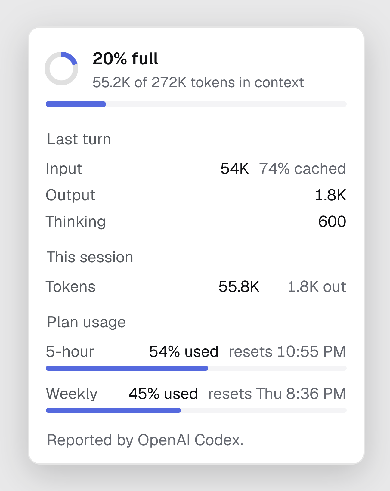
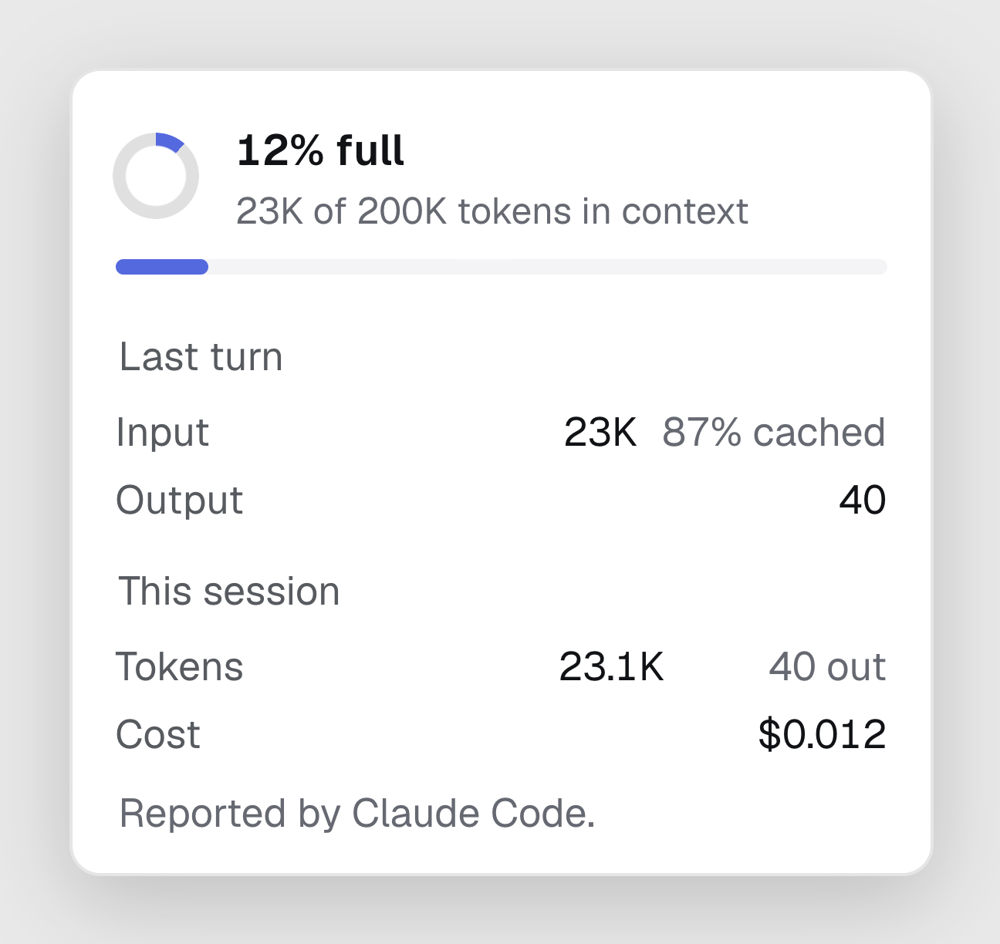
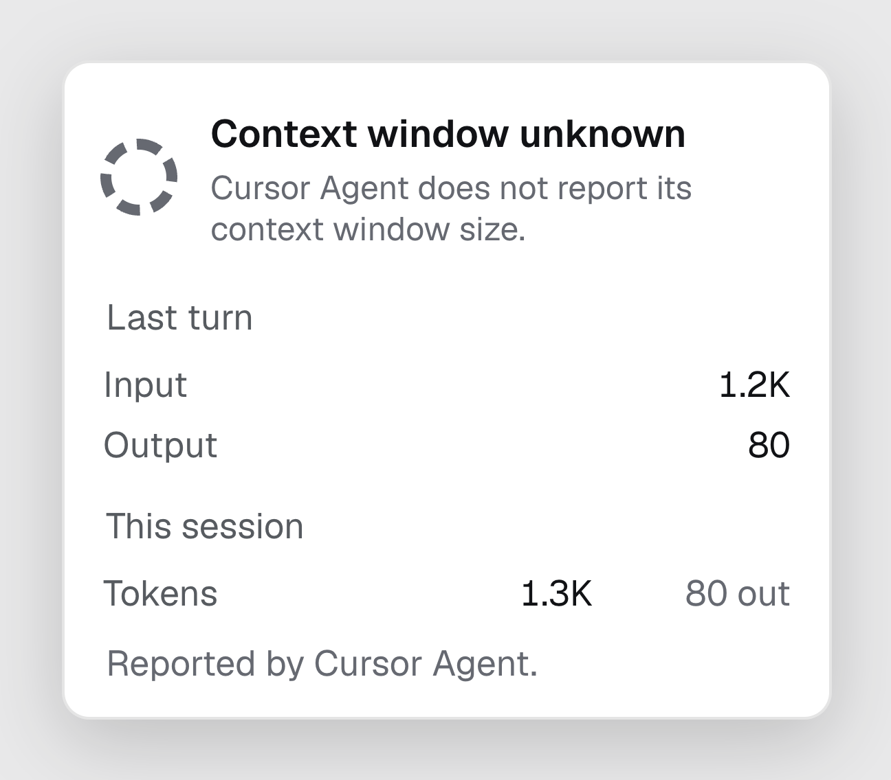
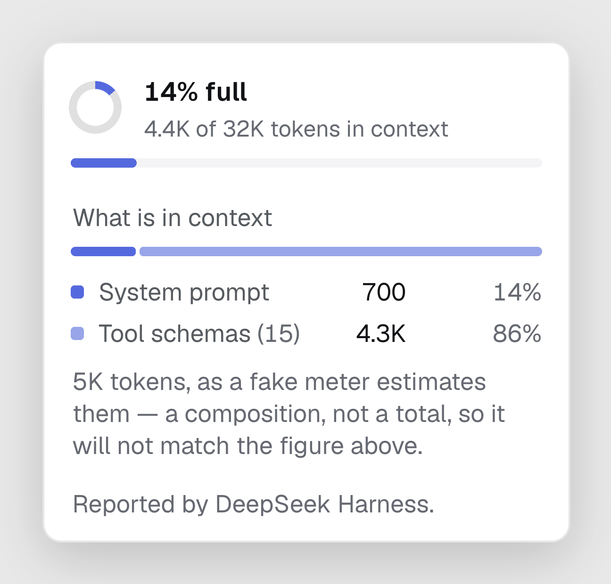

# Context usage: the ring beside the model

*Designed and built 2026-08-22.*

## What it is

A small ring in the composer toolbar, left of the model name, that fills as
the conversation fills the model's context window. Hovering it says how full;
clicking it opens a panel with the numbers behind it — what is in context,
what the last turn cost, what the session has spent, and (for metered agents)
how much of the plan's usage allowance is left.

When your conversation grows long, the agent has to fit within the model's
context window. As the window fills, runtimes compact history, summarize
earlier turns, or truncate past context to make room for the next turn. When
that happens, the agent can start behaving differently — losing track of
earlier constraints, forgetting details from twenty turns ago, or speaking
in broader strokes.

The ring is your early warning:
- **Accent** (under 70%): context is healthy.
- **Warning** (70% to 90%): the window is mostly spent. Context compaction
  or history trimming will happen soon.
- **Danger** (above 90%): compaction, truncation, or turn refusal is
  imminent. When an agent compacts the conversation, the ring visibly drops
  back down on the next turn because earlier turns were compressed into a
  shorter summary.

It is the same control Claude Code's desktop app, Codex's TUI and Cursor each
draw in their own way. Here it is drawn once, from the protocol, so it looks
the same above a Codex conversation as above a Claude Code one — and it says
only what that agent actually reported.

## Why it is built this way

### The question the ring answers is "how full", not "how much"

Token totals are a bill; context fill is a warning. A session that has spent
2M tokens across forty turns may have 30K in context; one that pasted a log
file may be at 90% after a single turn. What you need to know before sending
the next message is the second number, so that is what the ring shows. The
totals are still there, a click away.

### The runtime does the arithmetic, not the renderer

`SessionUsage` already carried `total`, `last` and `contextWindow`. It now
also carries `contextUsed` — tokens in the model's context as the runtime
reports them — and `cost` when the runtime prices the session.

How "in context" is computed differs per agent and is the adapter's business:

| Agent | Where it comes from | `contextUsed` |
| --- | --- | --- |
| Codex | `thread/tokenUsage/updated` | `last.totalTokens − last.reasoningOutputTokens`, which is Codex's own `tokens_in_context_window` |
| Claude Code | the Agent SDK's `assistant` messages (`message.usage`) and `result` (`modelUsage[model].contextWindow`, `total_cost_usd`) | `input + cache_creation + cache_read` of the latest top-level assistant message, which is what Claude Code's own status line reports |
| DeepSeek Harness | ACP `usage_update` (`used`, `size`) | `used` directly reported by the runtime's token meter |
| Cursor | `result.usage` | not reported — Cursor's CLI gives per-turn `inputTokens`/`outputTokens` and no window size |

A renderer that knew these rules would be naming runtimes through arithmetic.
It reads `contextUsed / contextWindow` and draws.

### Nothing is estimated

An agent that does not report a window size gets a ring with a dashed track
and no fill, and the panel says so in the agent's name. Counting characters
and dividing by four would give every agent a number, and the number would be
wrong exactly when it mattered — near the limit, where tokenisers disagree
most. The turn tail has always followed this rule; the ring does too.

### The composition is reported, never derived

The ring says *how full*. A second question follows immediately — *full of
what* — and only the process that assembled the request can answer it. The
model returns four aggregates; the wire carries one total. Anything a client
computed here (characters over four, message text it happens to have seen)
would produce a number for every agent and the wrong number for all of them.

So `SessionUsage.breakdown` is a `ContextBreakdown` the runtime sent or it is
null, on the same terms as `contextWindow`. DeepSeek Harness is the first
runtime to fill it, and the route is instructive: HarnessDesk did not compute
anything, it read a projection the harness already publishes.

| Agent | Source | What it reports |
| --- | --- | --- |
| DeepSeek Harness | `contextBreakdown` projection from `@deepseek-ai/dsh-token-meter` | system prompt, tool schemas, messages — plus the exact tool-schema count off `request/header` |
| Claude Code | `Query.getContextUsage()` on the SDK control channel | not read yet; the SDK we pin predates the call |
| Codex | — | its protocol reports token *kinds* (cached, reasoning), never prompt segments |
| Cursor | — | reports neither a window nor a composition |

**`approximate` is load-bearing.** DeepSeek Harness prices its segments with a
fixed density estimate while `contextUsed` is anchored to what the provider
charged. The two are different measurements, and in the first live capture the
segments summed to 11,561 against an anchored 10,842. The harness says so
itself; the flag carries that statement to the renderer instead of dropping
it, and the renderer honours it three ways:

- the segments are **their own bar**, never slices of the ring;
- each share is of the *segments*, not of the window — against a 1M window
  every part rounds to 0%, and "most of this is tool schemas" is true whichever
  estimator priced them;
- **no free-space row.** It would be `window − segments`, which mixes the two
  units, and it would be the one figure on the panel nobody measured.

The one exact number is the count of tool schemas, read off the request
envelope. "Tool schemas (15)" is the part of that row a reader can act on.

**Read defensively.** `_meta` is by definition the slot where anyone may put
anything, so `contextBreakdownOf` drops a segment with no positive token count
or no id, and a payload with nothing left is no breakdown at all. An absent
`approximate` reads as *approximate*: an agent that has not thought about the
question has not earned the claim that its numbers are exact.

### ACP carries it without an extension

ACP 0.14 has an unstable but schema'd `session/update` of kind `usage_update`
(`{used, size, cost?}`) and an optional `usage` on the `session/prompt`
response (`{totalTokens, inputTokens, outputTokens, cachedReadTokens?,
cachedWriteTokens?, thoughtTokens?}`). HarnessDesk's adapter consumes both;
HarnessDesk's two bridges emit them. Any ACP agent that adopts the same
unstable fields gets the ring with no HarnessDesk change.

ACP has no slot for the *composition*, so that travels in `_meta` —
`usage_update._meta.harnessdesk.contextBreakdown`, namespaced per ACP's own
convention for extension data and read structurally, so an agent on a
different bridge version, or a third party that adopts the shape, is
understood without a change here. An agent that sends none renders exactly as
it did before.

The Claude bridge observes the SDK stream by wrapping the session's
`query.next` — the base class drains that iterator in `prompt`, and the
wrapper tees each message. Sub-agent messages (`parent_tool_use_id` set) are
skipped for context fill: they run in their own context. The turn's `usage`
is the sum of the turn's assistant messages — the one figure that is
unambiguous whether the SDK's `result.usage` turns out to be per turn or
cumulative.

## The control

**Trigger.** A 16px ring, conic-gradient over a masked disc (CSS, no
`<svg>` — the icon rule applies). Fill colour follows the fill: accent to
70%, warning to 90%, danger above. Title when context is known: "Context
window 66% full — 171K of 258K tokens". When the window is unknown (Cursor):
"1.3K tokens this session — Cursor Agent does not report its context window".
Absent until the session has any usage; a fresh conversation has nothing to
say.

**Panel** (drops up, aligned right, like the controls beside it):

1. *Context window* — the ring at 28px, "66% full", "171K of 258K tokens in
   context", and a linear bar in the same tone. When the size is unknown:
   the dashed ring and "*Agent* does not report its context window size."
2. *What is in context* (between 1 and 3 for runtimes that report it) — its
   own bar, a row per segment with its share and (for tool schemas) its count,
   and a note naming who priced it and saying plainly that an approximate
   composition will not match the figure above.
3. *Last turn* — input (with the cached share or cache verdict), output,
   thinking (reasoning). Only rows with a value.
4. *This session* — total tokens (with an "out" count hint), cost when the
   runtime prices it, and delegated tokens (shown as a percentage share of
   the session) when work was handed to child agents.
5. *Plan usage* — one row per rolling window from `RateLimits.windows`
   (label, percent left, reset hint), through the same `describeLimits` the
   sidebar footer uses. Drawn as what remains — "76% left" and "resets in 2h"
   — with a bar filling to the remaining percentage. Only for the active,
   metered runtime.
6. A footer line naming who reported it: "Reported by Codex."

Every figure on the panel comes from `session.usage` or `snapshot.limits`.
The panel holds no state of its own.

## What each agent actually reports

Measured on 2026-08-24 by driving the desktop app against a fake of every
agent — one turn each, then reading `session.usage` and photographing the
panel. Fakes, because the shape of the answer is what is under test and a
fake spends no credits; each one goes through the same adapter the real agent
does, so what reaches the panel is the real mapping.

| | **Codex** | **Claude Code** | **Cursor** | **DeepSeek Harness** |
|---|---|---|---|---|
| Source | `thread/tokenUsage/updated` | SDK stream + `result` | `result.usage` | ACP `usage_update` |
| Fill | 55.2K / 272K | 23K / 200K | — *dashed* | 4.4K / 32K |
| What "used" means | `last.total − reasoning` | `input + cache_create + cache_read` | *not reported* | `used` from the meter |
| Window from | `modelContextWindow` | `result.modelUsage` | *never sent* | `size` on the update |
| Last turn | in / out / **thinking** | in / out, **% cached** | in / out | — |
| Session total | ✅ | ✅ | ✅ | *fake sends none* |
| Cost | — | ✅ `$0.012` | — | ✅ *when priced* |
| Composition | ❌ *impossible today* | ❌ *available, unwired* | ❌ *nothing to read* | ✅ **segments** |
| Plan usage | ✅ 5-hour + Weekly | — | — | — |
| Survives re-open | ✅ *once fixed, below* | ✅ | ✅ | ✅ *breakdown too* |
| Survives a restart | ✅ | ✅ | — *no transcript to survive* | ✅ |

Each panel below is the real one, photographed in the app with the rest of the
window hidden.

**Codex** — the only agent with plan usage, and the only one reporting
thinking tokens separately. No composition: it cannot say what the context is
made of, and the ring shows raw used/size rather than Codex's own
baseline-adjusted percentage.

**Claude Code** — the only agent that prices the session, and the highest
cache share. The composition it *could* report (`Query.getContextUsage()`,
free, no turn) is not wired up yet.

**Cursor** — the dashed ring. It sends turn tokens and never a window, so the
panel says so in a sentence and still shows the rows it does have. Nothing is
guessed to fill the gap. (cursor-agent 2026.08.31 added cache read and write
splits to turn usage, allowing the cache chip to populate when reported).

**DeepSeek Harness** — the composition, on its own bar. The shares are of the
segments (14 + 86 = 100), the footnote names who priced them and says plainly
that the 5K measured will not match the 4.4K fill above, and there is no
free-space row.

Read down the columns and the design justifies itself. Four agents give four
different answers to "how full is it", and not one of them is a number the
renderer could have computed: Codex nets out reasoning tokens against a window
it names per model, Claude Code adds three cache figures together, DSH's meter
reports a figure compaction moves, and Cursor declines the question entirely.
The only honest way to draw one ring over all four is to let each runtime do
its own arithmetic and render whatever comes back — which is why the fill is
`contextUsed / contextWindow` and nothing else, and why Cursor gets a dashed
ring and a sentence instead of a guess.

Three things the survey settled that the code had only asserted:

- **Cursor's dashed ring is the feature working.** "Context window unknown"
  plus a plain sentence naming the agent, with the token rows it *does* send
  still shown below. An agent that says less loses the ring, not the panel.
- **DSH's composition obeys its own rules under real rendering.** The panel
  drew `System prompt 700 · 14%` and `Tool schemas (15) 4.3K · 86%` — shares
  of the segments, summing to 100, on their own bar, with the footnote saying
  the 5K it measured "will not match the figure above" (the fill was 4.4K).
  No free-space row was synthesised. The adapter dropped the zero-token
  segment and the one with no id, and the composition survived a later
  `usage_update` that carried no `_meta`.
- **Plan usage is Codex-only, correctly.** It is gated on the *active*,
  metered runtime, so the rolling windows never appear under an agent whose
  allowance they are not.

### The gap this survey found, and closed

**Codex usage did not survive re-opening a conversation.** Switch to another
session and back, and the ring disappeared until the next turn; the other
three came back intact. It was not the store — it was that nothing ever kept
the number. `AcpSession` returns `usage: this.#usage` from its read path
(`packages/adapter-acp/src/runtime.ts`), so any read of an ACP session carries
the last usage forward, whereas `packages/adapter-codex/src/session.ts` had no
usage field at all: Codex usage existed only as the transient `usage/updated`
event mapped from `thread/tokenUsage/updated`. A read rebuilt the session
without it, and there was nothing to restore.

Fixed where the survey pointed, in the shape ACP already had. `CodexSession`
keeps the last `SessionUsage`: `noteUsage` on `thread/tokenUsage/updated`,
routed from the runtime's notification handler beside the settings and name
updates, and `readSession` carries it onto the `Session` it returns. That is
`AcpSession`'s read path written in Codex's vocabulary. Nothing is recomputed
on the way — `mapUsage` already builds the whole record, and the renderer still
reads `contextUsed / contextWindow` and nothing else.

### The second half: nothing survived a restart

Fixing Codex exposed that the survey had only measured half the question. Every
adapter holds its usage on the **live session handle** — `AcpSession.#usage`,
and now `CodexSession.#usage` — and a handle is exactly what a restart takes
away. Re-opening a pane was fine for three agents because the handle was still
there. Quit the app and come back, and *all four* returned a blank ring, because
no backend answers a read with the tokens it reported earlier: `thread/read`
carries no token fields at all, ACP has no such request, and a `session/load`
replays messages, not meters.

So the durable half belongs to the host, not to four adapters. `TranscriptStore`
already writes a file per conversation after every event and folds it back
through `enrich` on every read — it exists because backends forget their own
steps, and tokens are one more thing they forget. It now carries the last
`SessionUsage` alongside the turns. One place remembers, one place restores, and
no adapter learned anything new.

Two rules keep that honest.

- **The runtime is never argued with.** A stored figure is applied only when
  the read carried none. The host is filling a silence, not correcting an
  answer.
- **A stale figure is not drawn.** The stored number is true as of the last
  turn the host watched, so `enrich` restores it only when the backend comes
  back ending on that same turn. Carry a conversation on in Codex Desktop or
  the Claude CLI and the read ends somewhere else — the number then describes
  a context that no longer exists, and it is dropped rather than drawn. This
  is the dashed-ring rule again: a wrong number near the limit is worse than
  no number.

`mergeRead` gets the same treatment for the in-process case, where an agent
re-registers under a session the host is already holding — after a crash or an
upgrade — and announces it with no tokens on it. A read that says nothing about
tokens is silent, not empty, so what was already heard stands.

What is still lost is only what was never knowable. A conversation this host has
never watched has no record here and no tokens from the backend, so its ring
stays out until its next turn. And Cursor keeps nothing to restore *to*: its
bridge cannot replay Cursor's history, so a restarted Cursor conversation comes
back with an empty transcript, and a token panel floating above no messages
would be the only thing on screen nobody could check.

### Measured again, in the app, 2026-08-26

Same rig as the survey — all four agents faked in one isolated home, each
through its real adapter — driven twice: switch panes away and back, then quit
the app entirely and re-open each conversation cold.

| | **Codex** | **Claude Code** | **Cursor** | **DeepSeek Harness** |
|---|---|---|---|---|
| After a pane switch | 55.2K / 272K | 23K / 200K | *dashed, rows intact* | 4.4K / 32K |
| After a full restart | 55.2K / 272K | 23K / 200K | *conversation empty* | 4.4K / 32K |

Codex re-opening intact is the first fix; the restart column is the second.
Cursor's cell is the bridge, not the ring: `cursor-acp`'s `session/load`
re-opens the chat id and replays nothing, so the pane comes back with no turns
at all — and with no last turn to match, the guard above declines. An empty
transcript and no ring is the consistent pair; a ring over an empty pane would
not be.

## Cache health, and why a hit ratio is not one

A cached input token is billed at a fraction of an ordinary one; a token
written *into* cache is billed above one. Between a warm turn and a cold turn
of the same size there is a real bill — which is why Claude Code 2.1.251 made
per-session cache health a first-class `/cost` reading: hit ratio, misses,
re-cached tokens, warm or cold.

This desk had a "% cached" chip long before that, and it was hits over input.
That number cannot be read as cache health, because it has no knowledge of
misses:

| Turn | Reads | Writes | What the chip said | What actually happened |
| --- | --- | --- | --- | --- |
| small first turn | 0 | 2K | `0% cached` | fine — nothing to cache yet |
| cold restart | 0 | 180K | `0% cached` | 180K re-cached, at a premium |

Two very different bills, one chip. Both halves were available and neither was
read: `packages/adapter-acp` received `cachedWriteTokens` on ACP's usage shape
and dropped it, and `packages/adapter-codex` never read the
`cacheWriteInputTokens` its own vendored `TokenUsageBreakdown` has always
carried.

**The rule: the absence of a write count is a state of its own.** A runtime
that reports both halves gets a verdict — `warm` (reads dominate, ≥90%), `cold`
(writes dominate, ≤40%), or `partial`. A runtime that reports only hits gets
`unknown`: the chip shows the share it can vouch for, and its hover line says
the rest cannot be said from here. Nothing is inferred from a missing field,
and no missing field becomes a zero.

The denominator is the *cacheable* input — reads plus writes — not the whole
input. Uncached input that was never a cache candidate is not a miss, and
counting it as one makes every turn look colder than it was.

**A running total is only knowable when every turn in it was.** The session's
running cache write total carries forward only while the chain of turns is
unbroken. One turn silent about cache writes makes the session's write total
unknown from then on, and it does not come back — otherwise a session that
reported 50 writes once and then went quiet claims an exact 50 for the whole
conversation.

`packages/ui/src/lib/cache-health.ts`, pinned by `cache-health.test.ts`, whose
first case is the `unknown` one — so the honest reading cannot regress into a
confident zero.

## What a session delegated

`SessionUsage.delegated` is what agents this session handed work to spent. It
is **a share of `total`, never an addition to it**: the runtimes that attribute
child spend have already folded it into their own counts — Codex 0.151 counts
nested sub-agent usage toward the root goal's budget, and Claude Code's
`modelUsage` is cumulative over the process with helper models included.
Carrying it separately lets the panel *split* a figure it must not re-sum.

Absent for every runtime that cannot attribute it, which is most of them. See
[multi-agent.md](multi-agent.md#8-delegation-and-what-it-costs) for where the figure comes from.

**It is a session figure, and only a session figure.** The turn tail sums the
delegation rows on that turn instead (`packages/ui/src/lib/turn-summary.ts`,
`delegatedIn`), because this one shares its scope with `SessionUsage.total` and
pairing it with `SessionUsage.last` reports one turn's hand-off against another
turn's tokens.

**A delegated count can be a floor.** `TokenUsage.outputExact` is false when the
output half was still a streaming placeholder when it was last counted — Claude
Code's `message_start` says 1, and a top-level turn gets the true figure back
when it ends while a delegated child never does. The interface softens those to
`≥`; absent means exact, which is the ordinary case.

## Where the code is

- `packages/protocol/src/session.ts` — `SessionUsage` (`contextUsed`, `cost`,
  `delegated`, `breakdown`), `ContextBreakdown`, `ContextSegment`, `TokenUsage`.
- `packages/adapter-codex/src/mapping/session.ts` — `mapUsage` (nets out
  reasoning tokens, maps cache write input tokens).
- `packages/adapter-codex/src/session.ts` — `CodexSession.usage` keeps the last
  usage; `noteUsage` updates it.
- `packages/adapter-codex/src/runtime.ts` — dispatches `thread/tokenUsage/updated`
  into `noteUsage`, carries `usage` onto `readSession`.
- `packages/server/src/transcripts.ts` — the durable half: `Stored.usage`, and
  `restorableUsage` for the two rules that gate restoring stored usage.
- `packages/protocol/src/reduce.ts` — `mergeRead` keeps held usage when a read
  is silent about tokens.
- `packages/transport-acp/src/index.ts` — ACP `usage_update`, `AcpUsage`,
  `AcpUpdateMeta`, and prompt response `usage`.
- `packages/adapter-acp/src/runtime.ts` — `AcpSession.#usage`, `contextBreakdownOf`,
  `#recordTurnUsage` (unbroken cache total chain), and `usage_update` handling.
- `packages/claude-acp/src/bridge.ts` — `#observe` wraps `query.next`, extracts
  context fill and costs.
- `packages/cursor-acp/src/bridge.ts` — `result.usage` → prompt response; maps
  turn input, output, and cache split.
- `packages/claude-acp/src/delegation.ts` — child agent token tracking and
  attribution.
- `packages/ui/src/lib/context-usage.ts` — `describeContext`, `compositionOf`,
  `formatTokens`, `formatTokensWithFloor`, `formatCost`, `WARN_AT`, `ALARM_AT`.
- `packages/ui/src/components/ContextUsage.tsx` — the `ContextUsage` popover,
  `Ring`, `Composition`, and `WindowRow` (showing percentage left).
- `packages/ui/src/lib/cache-health.ts` — `cacheHealthOf`, `CacheHealth`,
  `CacheState` (`warm`, `cold`, `partial`, `unknown`).
- `packages/ui/src/lib/turn-summary.ts` — `delegatedIn` for turn-level delegation
  tokens.

## Decisions recorded

- **Placement: composer toolbar, not the header or sidebar.** It is a fact
  about the message you are about to send, like the model and the effort; it
  sits with them. Each pane has its own composer, so two agents side by side
  each show their own fill.
- **A cache chip that cannot say "cold" does not get to say "warm" either.**
  The honest state for a runtime that reports only hits is `unknown`, and it
  reads as a share rather than a verdict. The alternative — treating a missing
  write count as zero — makes every such agent look permanently warm, which is
  the same failure as the baseline below, in the other direction.
- **No baseline subtraction.** Codex's TUI subtracts a 12K "baseline" so a
  fresh session reads 100% free. The ring shows raw used/size; the numbers
  beside it are the ones the runtime sent, and the two should agree.
- **The old `UsageMeter` in the conversation header is gone.** It divided
  the session *total* by the window — a figure that passes 100% after a long
  conversation and means nothing at all — and it sat in the header, away from
  the decision it informs.
- **Loaded sessions no longer start blank — but nothing is read out of the
  agent's own store to do it.** The Claude bridge still replays history from
  the transcript file rather than the SDK stream, so the agent itself reports
  no tokens on a load. What fills the gap is HarnessDesk's own record of what
  it watched, which is agent-agnostic and needed no per-agent parser. Reading
  the last usage back out of Claude's JSONL — or Codex's rollout — would be
  one more thing to keep in step with someone else's format, for a number the
  host already had.
