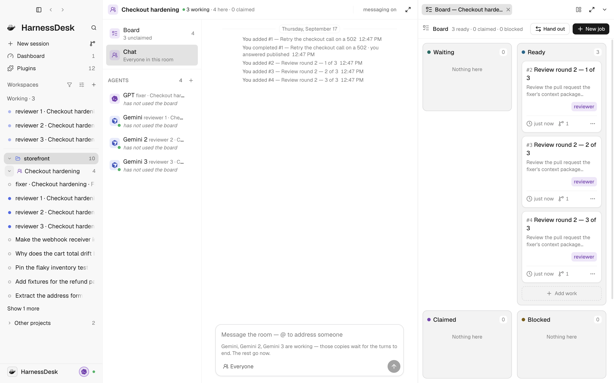

# Flows

A room is a shared board with a **human referee**: somebody decides who does
what, moves work between agents, reads results, and takes the irreversible
steps. A **flow** is that referee's policy written down instead of performed —
a named set of roles, the rules that move work between them, and the seeding
prompt each role is handed — so a team of agents can run a full loop (do the
work → have it reviewed → act on the verdict → repeat until it passes) with the
person choosing exactly which steps stay theirs.

It configures the third way of cooperating in
[docs/multi-agent.md](multi-agent.md) §1. It is not a fourth.

---

## Where a flow lives

```
.harnessdesk/
  flows/
    fix-and-review.yml
    race.yml
```

In the repository it serves, which is a decision rather than a detail. A flow
there is versioned with the code it governs, reviewed like code, diffed when it
changes, and shared by everyone who clones — which is the difference between a
team habit and a team tool. It also means a flow can be **proposed in a pull
request**, which is the right way for a team to change how its agents work.

A flow can also be started from text that was never written to disk. The file
is the shareable form.

**Across projects.** A flow serves the repository it sits in, and somebody with
five repositories will want one `review-pr.yml` rather than five copies. Today
that is a copy, or a symlink, and the engine does not care which: it reads the
text and never asks where it came from. The library plane is the obvious place
for a shared one and is deliberately not being reached for yet — a flow names
seats, and a seat that exists on one machine and not another is exactly the
kind of sharing that has to be designed rather than assumed.

---

## The model, in one paragraph

A **role** is who does a kind of work. A **round** is N sibling cards of one
role, opened together, where N is that role's `count`. A **rule** fires when a
round finishes, reads its outcomes, and opens a round of another role that
*depends on* the one that ended — which is how the finished round's context
packages reach the new one, because the board already hands a claimant
everything its dependencies left behind. A round that matches no rule ends the
run.

That makes this a **statechart** — states, transitions, guards — and not a
pipeline. n8n, Node-RED and Zapier are data-flow graphs: a payload travels
along edges through transforming nodes, and the graph is a DAG. Here a node is
a round of work held by a role, an edge is a rule with a guard, and it loops:
review sends work back to fix, which comes back to review.

---

## The file

```yaml
# Anything after a # is a comment, and the file is yours to write by hand.
name: Fix and review
description: One fixer, three reviewers, and the merge stays yours.

# What the person fills in when they start it. Every {{slot}} in a template
# is one of these or a built-in (below).
inputs:
  work:
    label: What to fix
    default: ""

# Seconds one `await_work` call blocks before it answers "nothing yet". A seat
# loops on that answer inside its one turn, so this is how often it says so —
# not how long it may wait. Optional; 240 by default.
wait: 240

roles:
  fixer:
    kind: agent                       # agent | person | check
    seat: cursor=gpt-5.3-codex/xhigh  # runtime[=model][/effort][+thinking]
    count: 1                          # how many cards a round of this opens
    permission: publish               # read | publish | merge
    outcomes: [published, cannot]     # the only words it may answer
    order: |
      What this role is for, in your words. The loop scaffolding and the git
      rules are generated around it, so this is only the brief.

  reviewer:
    kind: agent
    seat: cursor=gemini-3.8-flash/high
    count: 3
    permission: read
    outcomes: [approve, request-changes]

  referee:
    kind: person                      # a step the human takes
    outcomes: [merged, dropped]       # answered from the card's own menu

seed:
  role: fixer
  title: "{{work}}"
  detail: |
    {{work}}

rules:
  # Tried in file order; the FIRST match fires. So the unhappy branch is
  # written first: one reviewer asking for changes sends the work back however
  # many approved.
  - id: review-it
    on: fixer
    when: { every: published }
    then:
      role: reviewer
      title: "Review round {{round}} — {{n}} of {{count}}"

  - id: fix-again
    on: reviewer
    when: { any: request-changes }
    then: { role: fixer, title: "Answer round {{round}}'s reviews" }

  - id: hand-to-the-person
    on: reviewer
    when: { every: approve }
    then: { role: referee, title: "Merge it — every reviewer approved" }

# Where a visual builder keeps node positions. The engine never reads it.
layout:
  fixer: { x: 40, y: 40 }
```

### Roles

| key | what it is |
| --- | --- |
| `kind` | `agent` seats a conversation. `person` opens a card addressed to you. `check` runs a command. |
| `seat` | `runtime[=model][/effort][+thinking]`, or a **list** of them — one per card of the round, which is how a race runs two different models. Required for `agent`, refused for the others. The effort words are the runtime's own; one it does not offer is refused before any seat opens. |
| `count` | How many cards a round of this role opens. Defaults to the number of seats listed. |
| `permission` | `read`, `publish` or `merge`. See below. |
| `outcomes` | The only words this role may answer. The engine refuses anything else. |
| `order` | The brief, as a block scalar. |
| `isolate` | `true` gives each card of the round a worktree of its own, on a branch of its own. |

**`check` is what makes a flow trustworthy rather than merely automated.** It
seats nobody, costs nothing, and cannot be talked round:

```yaml
  tests:
    kind: check
    run: pnpm verify
    cwd: .              # relative to the room's project unless absolute
    timeout: 1200       # seconds; running over reports `otherwise`
    exits: { 0: pass }
    otherwise: fail
```

A flow whose only gates are opinions is one to be suspicious of. A check's
command is the one thing a flow file makes happen on your machine, so the dry
run prints every one of them verbatim and nothing runs until you press start.

### Permissions

The standing order handed to a seat is **generated** from its role's legacy
`permission`, and re-rendered from the role every time. Flow syntax is unchanged
in this phase: it still accepts `read`, `publish` and `merge` and does not have a
`grant` key.

- **`read`** — keeps its established meaning: it maps to `edit` on the four-level
  ceiling ladder, so the seat may edit and commit in its checkout but may not
  push, merge, reset or force. It remains the default.
- **`publish`** — may branch, commit, push **its own branch**, and open a pull
  request. Still refuses merge, the default branch, reset, rebase, amending
  published history, force, and deleting anything it did not make. A card that
  appears to ask for one of those must be released as blocked rather than
  interpreted generously.
- **`merge`** — everything above plus merging what a card names.

Flow seats are *asked*, not claimed as runtime-held. Their level and hold are
shown as explicit chips in the dry run and on the running seat. While the flow
runs, the desk's own tools enforce the translated ceiling even though the
runtime itself may only have been asked to respect it.

An `agent` role with `merge` is flagged by the dry run, because **autonomy is
opt-in per step, never per room**. A flow whose every step is an agent is a
flow its author chose; it must never be the path of least resistance.

### Guards

Two quantifiers, deliberately:

```yaml
when: { every: published }                # every card answered one of these
when: { any: request-changes }            # at least one did
when: { every: [approve, accept] }        # a list is "one of"
# no `when:` at all                       # always
```

That is enough for every loop this has needed, and resisting a general rule
engine is what keeps "can this rule ever fire?" and "does this loop have an
exit?" exactly answerable.

### Slots

Every template — a title, a detail, a role's order — may carry `{{slots}}`.
The built-in ones are `flow`, `run`, `room`, `repo`, `role`, `round`, `n` and
`count`; everything else must be declared under `inputs`. A slot nothing fills
is an error the dry run reports rather than a gap an agent reads as a typo.

A rule's `then` template gets two more, for **the round that just finished**:
`{{from}}` (its role) and `{{answered}}` (how many cards it had). They are
there because `count` is the round being *opened*, and an author writing the
card that reads the finished round means the other number — "Judge
{{count}} attempts" on a one-seat judge rendered as "Judge 1 attempts" in a
live run, and "All {{count}} reviewers approved" on a one-person referee
rendered as "All 1 reviewers approved". Both were hand-written and both looked
right in the file. Using either on the `seed` is an error: nothing finishes
before it.

---

## Dry run

Dry run **spends nothing** — no seat is opened, no request is billed, no card
reaches a board, and a check's command is printed rather than run — and it
prints:

- every seat the flow would open, and what **opening** it costs — one turn
  each, since a seat is opened and handed its order in a single turn — together
  with its translated ceiling and whether that limit is held or asked;
- every check command, verbatim;
- a trace of the loop against outcomes you supply, so both the approve path
  and the request-changes path are visible from one file;
- **validation**: every role a rule names exists, every template's slot
  resolves, no rule can never fire, and no loop lacks an exit.

The last two are exact rather than sampled. Both quantifiers depend only on
which outcomes are *present* in a round, so the space to search is the
non-empty subsets of what a role declared, capped at the round's size. A run
ends when a round matches no rule, so a flow terminates when every role the
seed can reach can reach a role with an answer no rule claims — and anything
else is reported with the roles it is stuck between.

A flow with an error offers no way to start it.

---

## Running one

Start a room (**New → A room**), name it, and choose a flow. The dry run is
shown before the button that runs it.

<p align="center">
  <picture>
    <source media="(prefers-color-scheme: dark)" srcset="images/app/flow-dark.png" />
    
  </picture>
</p>

Every seat it would open, what opening them costs, and a trace of the loop —
before the button. A flow with an error offers no way to start at all.

Once it runs, the room narrates what the engine did and the board shows the
round it opened, each card wearing the role it is addressed to:

<p align="center">
  <picture>
    <source media="(prefers-color-scheme: dark)" srcset="images/app/flow-board-dark.png" />
    
  </picture>
</p>

In that picture the fix card was answered by the person — the board's own
referee verb, which the channel says in as many words — and everything after
it is the engine: one round of three reviewers, opened because a rule said so,
each card addressed to a role no other seat can claim.

What then happens, in order:

1. **Every seat is opened first**, before any card exists — a seat still
   opening when its card appears is a card nobody can take. Each is opened with
   the model and effort the seat asked for and then **read back**: a runtime
   drops a pick it declines rather than failing.
2. Each seat joins the room, is given its role on the board, and is handed
   **one standing order** — the whole job inside one turn, because a second
   message is a second billed request.
3. The seed round opens. From there the loop runs itself.

While it runs, the board is the board: cards carry the role they are addressed
to, a finished card carries the word it answered, and a card addressed to a
`person` role offers that role's own words instead of "Mark done". The person's
answer may carry a context package of its own, exactly as an agent's does —
their step is a step, so what they say reaches the round that depends on it.

**A run holds the flow it started with, frozen.** Editing the file under a
running flow changes the next run and never this one — a run whose rules
changed halfway has cards open under a policy that no longer exists. To change
a running flow: stop it, edit, start again. Stopping keeps the cards as the
record and tells every seat to stand down.

A room runs one flow at a time. Two would open cards into one board and neither
could tell which were its own. For the same reason, a desk that cannot read the
runs it keeps starts none until it can: it could not tell whether a room is
already running one. The refusal names the folder and the reason.

---

## What a run costs

One turn per agent seat to open it. That is the number the dry run shows, and
it is **the entry fee, not the price**.

A seat lives inside that one turn, which is what makes the loop possible on a
plan that bills by turn — but living inside a turn is not the same as being
free. Every step of `wait → claim → work → finish → wait` is a model round
trip that re-sends the accumulated context, and on usage-based pricing each
one is billed. Measured on the first live runs of this feature, one fix and
one round of three reviews cost:

| seat | tool calls, in one turn |
| --- | --- |
| fixer (Codex 5.3, extra-high effort) | 46, and 26 on the second run |
| reviewer (Gemini 3.8 Flash, high) | 31, 34, 38 |

**What is not the lever: effort.** It changes how many reasoning tokens a
round trip spends, and on Cursor a turn at `xhigh` is billed the same one
request as any other. The effort choices are the runtime's, not this format's
— Cursor's Codex offers `default, low, high, xhigh` and no `medium` — and a
seat naming one it does not offer is refused before anything is opened.

**A re-armed seat is put back on its model first.** A bridge that restarts
holds no session state, so a conversation it reopens comes back on the agent's
own default — measured after a desk restart, a re-armed Gemini seat billed as
`default`, Cursor's Auto. A flow whose reviewers quietly become Auto cannot say
who did the work, so the seat's picks are re-applied and read back before its
order goes out, and a seat that comes back on something else is said so.

**What is the lever: how often a seat is made to think.** A seat whose turn
ends while its run is going is handed its order again — but only when there is
a card it can take, which includes one it is *holding*: a seat that stopped
mid-card has the most urgent work there is. Re-arming a seat to an empty board costs a turn and buys
nothing, and it is what a model that closes its turn after finishing a round
invites: three reviewers did exactly that in one live run and each burned its
whole allowance inside a minute. A seat with nothing to do is left down, and
the round that needs it is what wakes it.

 After each answer a
waiting seat calls `await_work` again, so a short block is a seat paying to be
told nothing. The block is therefore clamped to what the agent will actually
hold a tool call open for and **named in the standing order**: left to guess
it, two seats chose ten seconds, which is six round trips a minute to do
nothing.

**What is still unexplained.** Cursor's own usage events carry a
`billing_mode` of `BILLING_MODE_SEAT` (flat, one per prompt) or
`BILLING_MODE_TOKEN` (priced by tokens), plus `is_token_based_call` and
`max_mode`. The seats in the first runs here billed token-based — fractional
rows — while standing workers on the same account, same models, same minute
billed flat. `max_mode` was false on every seat. Which of the two a call gets
is decided by Cursor's server; nothing in the client sets it, so this is
recorded as measured and not explained.

## What makes a seat wait for free

`await_work` is a team tool that blocks until the caller's board has a card it
can take. Nothing is spent *while* it blocks — the board is in the same
process and a waiter is woken by the write that made its card claimable, so
nobody polls and no tokens move. That is what lets a seat live inside **one
turn** for as long as the desk is up.

What it costs is one round trip per *answer*, which is why the block wants to
be as long as the agent will hold it. It is clamped per runtime to a measured
ceiling — Cursor's MCP client times a tool call out at exactly 60 seconds — and
the number is written into the standing order, because a seat left to guess
guesses low.

The answer hands back the cycle number to pass next time. That is not
decoration: two seats in an earlier hand-rolled version of this ended their
turns saying, in as many words, that the harness had stopped accepting the
identical blocked call. Varying the call is the fix, and the model never has to
remember a number.

`stand down` is the only answer that may end a seat's turn, and the flow engine
is the only thing that says it.

---

## The two primitives this needed

Everything else composes from a board that already worked.

- **`Intent.role`** — a card addressed to a role, claimable only by a member
  holding it. Before it, `claim_next` took the lowest-numbered claimable card
  whatever it was, so a reviewer would do the fix and the fixer would review its
  own pull request; the only workaround was separate rooms, and an agent's
  `add_intent` reaches its own room and no other, so the loop could not close
  itself and a person had to carry every card across by hand. A card with no
  role is claimable by anyone, exactly as every card is today.
- **`Intent.outcome`** — the one word a rule branches on. `note` is still the
  human line and the context package is still the contract; without a
  machine-readable result, "did all three approve?" was answered by matching on
  signature text.

A third rule came out of building it: a card addressed to a role is not
claimable by a member already holding an addressed card. Nothing had stopped
the first reviewer to ask from taking all three cards of a round while the other
two waited on work that was already gone.

---

## The file format, for a visual builder

A drag-and-drop canvas is the next piece of work and a separate change. Two
decisions in this format exist for it:

- **`layout:` is reserved and ignored.** Node positions have to live somewhere,
  and a format with nowhere to put them forces a canvas to invent a second file
  or to change this one under everybody's committed flows. It is inside the
  file rather than a sidecar so that one file is what a reviewer reads and a
  `git mv` takes the positions with it.
- **Every rule has a stable `id`.** A canvas has to address a node across an
  edit. A rule that omits one is called `<on>-<position>` and warned about,
  because moving it then changes its name.

### What the format accepts

A deliberately small slice of YAML: maps, lists, plain and quoted scalars,
block scalars (`|`, `|-`, `>`, `>-`), one-line flow collections (`[a, b]`,
`{a: b}`), and comments. Anchors, aliases, tags, multiple documents and tabs
are **refused by name, with the line**. A flow that is quietly mis-read is a
room of agents doing the wrong thing unattended, so everything outside the
slice fails loudly rather than being half-supported.

---

## Agents and Seats (v2)

Everything above is the legacy grammar (`permission:`, `count:`, one
runtime spec per seat). A flow written with `uses:` and `grant:` instead of
`seat:`/`order:`/`permission:` is read on the current, second-generation
format — mixed old and new fields in one role, or one document, refuses with
both locations rather than guessing which the author meant.

```yaml
version: 2
name: "Fix and review"
inputs:
  task: { label: "Task" }
roles:
  fixer: { kind: agent, uses: [implementer], isolate: true, grant: edit, independentOf: [] }
  verify: { kind: check, run: "pnpm verify", exits: { "0": pass }, otherwise: fail, timeout: 900 }
  reviewer: { kind: agent, uses: [code-reviewer], grant: read, independentOf: [] }
seed: { role: fixer, title: "{{task}}" }
rules:
  - { id: to-verify, on: fixer, then: { role: verify, title: "Check the fix" } }
  - { id: to-reviewer, on: verify, when: { every: [pass] }, then: { role: reviewer, title: "Review the fix" } }
messaging: board-only
wait: 240
budget: { rounds: 3, without-progress: 2 }
```

A role's own file no longer carries an Agent's brief, answers or ceiling —
those come from the resolved Agent named in `uses:`, the same one Settings ›
Agents lists. `uses:` a list of Agents, or `seats:` a list of seat specs
(`runtime=model/effort+`), never both — a scalar Agent plus a seat list opens
one card per seat, a list of Agents plus zero or one seat opens one per
Agent, and an explicit `count:` must agree with whichever list sets the
round's width. A seat's actual ceiling is `narrower(Agent's own ceiling,
this role's grant)`; an omitted `grant:` is `read`.

**Independence** (`independentOf: [build]`) is judged on the vendor behind
each Seat, as the runtime's adapter reads it from the agent's own
configuration — Codex's `config.toml`, profiles and project `.codex`,
Claude Code's settings files and environment, Gemini CLI's `.env` files and
settings. Anything that could point an agent at another provider or base
URL, a gateway account, or an agent the desk has no reader for, makes the
vendor unknown, and an unknown vendor is never taken for an independent
one: the step is refused a seat and the run stalls with the reason. A
runtime's name decides nothing. A project's own files arrive with a clone,
so they are read bounded and without blocking, a regular file only, through
a link at no point below the project; anything that cannot be read that way
is unknown.

**A Seat's card** is claimed for it as the Seat opens, and the Seat reads its
Agent's brief in a turn of its own. A Seat that asks for work inside that turn
is handed its card there and may finish it there; the card's own order is left
*prepared* and sent, once, only when that turn ends — well or in an error —
with the card still open, never into a turn that is running: an agent refuses
a second message while it works, and a run does not stall on that refusal. A
restart keeps a prepared order as it is. The run's rounds follow the board: a
card finished inside the brief's turn closes its round like any other.

**A Goal's board has one writer**: the Team engine's copy. Agents' verbs, a
person's answers and the Goal's own claims and releases all change that copy,
and it is saved as it stands when the save runs, so what is saved is never
older than what is shown, two changes to one card are one sequence, and a
card has one holder. A completion or a person's answer is told to the agent,
and to the run, only once it is saved; one whose save fails is put back and
refused. A wrap holds the board before it reads it: from then on nothing is
added to it, and a card added just before is on the board the wrap reviews,
so the wrap is refused rather than leave it out. Once a Goal is wrapped its
document's dispositions are final; a card an earlier build let in after the
wrap read the board is set aside, saying so, when that wrap finishes.

**A run is bounded.** `budget: { rounds: 3, without-progress: 2 }` is how
far a run may go before it stops for a person: closed rounds in all, and
closed rounds in a row that brought no new evidence. Each is a whole number
from 1 to 100; a file that names none gets those two numbers, frozen when a
run starts, and a save writes them out. Every closed round counts — repair,
check and person rounds too — and progress is what the desk observed that it
had not seen before: a confirmed finding, a new diff, a changed check, CI or
review result. Two repairs of one finding rejected in turn stop the run as a
design problem. A run saved before budgets existed keeps running as it was.

**Findings are a ledger.** A reviewer raises each finding with
`raise_finding` against a candidate it was offered; the writer claims a
repair with `repair_finding` at its committed head; only the Agent that
raised it confirms or withdraws it, from a later review card. A claimed
repair stays blocking until then. The first review of a subject freezes
the blocking set; a later ordinary finding is advisory, and a later
regression or security finding waits for a person. A ready rule also waits
while an admitted blocker is unresolved. A review round with several
reviewers is blind until it closes: no reviewer reads another's card,
context, findings or messages through the desk. A later review is handed a
packet — the findings still in question and the exact delta since the last
review — pinned before its Seats open, and a delta that cannot be read in
full stops the run instead.

**Checks fan out.** A check with no explicit `cwd` opens one card, and
records one fact, per predecessor subject — each competitor's own isolated
checkout — rather than picking one of them for an aggregate command. Naming
`cwd:` explicitly keeps the old one-aggregate-card behaviour, resolved
relative to the Goal's own checkout, with every subject still visible to the
command through the bounded `HARNESSDESK_FLOW_CONTEXT` JSON (never an
arbitrary environment map). Each card's checkout and revision are journaled
when its round opens; a retry runs there or, if that checkout's head has
moved since, stalls and says so. A writer whose checkout has uncommitted
changes stops the round before any command runs.

**Evidence guards** read what the desk already observed, never a message or
an agent's own claim. A guard judges *subjects*: the revisions of the
nearest cards back along the finished round's dependencies whose grant lets
them change files and whose Agent does not produce reviews — never a judge's
or reviewer's own checkout, even one granted edit. A fact
speaks for a subject when it is filed on a card of that walk (the finished
round's own, the rounds between, or the subject's own), names the subject's
current revision, is fresh, and was observed on this desk. So
`evidence: [{ check: "pnpm verify" }]` is satisfied by the check card's own
fact at the writer's head, `{ review: "picked" }` by the judge's structured
review naming one candidate revision (and it narrows several candidates to
that one), and `{ diff: true }`, `{ ci: green }` and `{ pr: open }` by what
the desk observed on the writer's branch. A diff is the card's own committed
work, measured from where the card began — the commit its holder's checkout
was at when it took the card, which the claim records: the non-merge commits
on the checkout's first-parent line since then that its own record of HEAD
(the reflog) says were made there — committed, amended, picked, reverted or
applied with `git am` — rather than brought in by a pull. A commit written with
`commit-tree` and moved in with `update-ref` leaves no such record, so it is not
counted. So it holds for a step that commits straight onto the
project's default branch (a role neither isolated nor told to branch), the
step's commits stay its own after it pushes them, a pull is not its work, a
merge brings nothing of its own, and a Seat that takes a second card is
measured from that card's start. A checkout that keeps no reflog sets aside
what the remote's copy of its branch held when the card was taken (the claim
records that too), which keeps a push and cannot tell a later pull apart.
What git cannot say is whose commit it is: on a checkout several Seats share,
every commit made in it while the card was held counts — `isolate: true`
gives a step a checkout of its own. A card whose claim recorded no start is
measured from where its Seat opened, else against the base branch its branch
came from. The dry run says "A committed change in
the checkout since this step began". A diff that turns out empty is an
explicit failure, not a wait. The last observation of each
question decides; a guard whose fact has not landed yet *waits*, and every
durable append of a new fact wakes it; one contradicted by a fresh, explicit
failure is a *no-match* a later fallback rule may still take. Neither is
silent: a run waiting on evidence says in its status which rule waits and for
what, and a run that ends because no rule applied says which guarded rule did
not and why. A writer whose checkout has uncommitted changes waits rather than
being left out. A card
may name what authorized it — `{{evidence.review.at}}`, say — and a field
the facts do not settle to one value stops the run before any card is
added.

**The catalogue** a project's Flows section and `/race` both read is layered
— a project's own `.harnessdesk/flows`, then this Mac's, then the ones that
ship — the nearer file always winning, broken or not, with what it shadows
listed rather than hidden. *Update…* converts an old project file in place:
every Agent it names becomes a real file, then the flow file itself is
replaced, previewed as one whole diff before either write, journaled so a
partial result (Agent files written, flow file not yet) can be continued
rather than repeated. A role that had no `order:` becomes an Agent whose
brief is the sentence the old engine gave it — "You are the *role*. The cards
say the rest." — so a flow that ran before *Update…* still seats every role
after it. *Customize…* copies a shipped or your-Mac file into
the project verbatim, no conversion — a project flow is then edited in
place, through the normal editor, not through this dialog again.

**`/race`** is UI input to an ordinary file, not a second execution path: it
asks for one Agent and two explicit, isolated seats, substitutes them into
the effective `comparison` catalogue entry's own designated Agent role (a
plain `layout: { race: <role id> }` marker, never an engine-read execution
type), and previews and starts that complete source exactly the way any
other flow does. `packages/server/flows/` ships eight such starting points —
`comparison`, `fan-out`, `independent-review`, `staged-relay`,
`investigation`, `alignment`, `mechanical-contest`, `review-pr` — as ordinary,
editable files over the same three step kinds; no shape's id ever reaches the
engine.

## Findings, budgets and blind rounds

A round that reviews raises **findings** — attributed claims recorded once,
never a second copy of the same thing. `raise_finding`, `repair_finding`,
`decide_finding` and `list_findings` are the four verbs a Seat has for this;
the desk resolves which Seat, which card and which revision from the calling
conversation itself, never from anything the request names. A repair is a
*claim* until a later review of the same finding confirms it — `repaired`
without `confirmed` is never shown as "Verified" — and a confirmed finding
never reopens; a regression is a new, linked finding instead.

**A review round with more than one card is blind until it closes.** No
sibling reads another sibling's findings, its review, or anything it posted,
through any desk route — the board, `get_context`, `list_findings`, the
channel — while the round is open, and neither can it post to a bound pull
request: `pr_review`, `pr_comment` and `issue_comment` all refuse for an
embargoed Seat and the conversation it delegated to. A reviewer's own
verdicts and repairs recorded in the round are left out of a sibling's reads
too, not only what it raised, and a reviewer in an open blind round adds no
card to the board and takes no card but its own — a card is read by every
member at once. Once every reviewer's
card has durably completed, the round's whole batch — every finding, every
review, one comment each — is decided and journaled together, then sent one
comment at a time; a person watching mid-round sees how many reviewers have
finished, never a claim that the others agree.

**A later review of the same series is handed a delta, not a transcript**: the
repairs claimed since its last review, what is still unresolved, and the exact
two-tip diff between the revision it judged and the subject's committed head
now — pinned before the reviewer is seated, so a verdict at a head that moved
since is refused rather than judging the wrong thing.

**`budget: { rounds: N, without-progress: M }`** bounds a review loop: `N`
closed rounds in all, `M` in a row that brought no new evidence — a confirmed
finding, an observed diff interval, a changed check or CI result, a review at
a new revision. Absent, a new-format flow gets three rounds and two without
progress; a run already saved keeps whatever it started with, even across a
restart. Two rejected repairs of one finding stop the run early, at any round,
because that is a design problem rather than a patch loop.

Stopping is never silent, and never final. A run that hits its ceiling, its
idle limit or a rejected repair loop stalls with the reason on the Goal's
findings status, and a person chooses from there: **another round** (one
transition past the stop, consumed once — a repair *and* a review may need two
presses, not one), **merge anyway** (records the exact unresolved blocker IDs,
the head, and the reason, `by: 'person'`, then hands off to the existing merge
action with its own expected-head precondition — this never edits a check,
CI, review or finding to passing, and never merges by itself), or **drop**
(stops dispatch and keeps every partial answer, claim and lane; nothing here
deletes the Goal). A stopped run's decision is bound to the exact stamp the
person read it at, so a resubmission of that same stamp replays the outcome
already reached rather than either double-spending a round or refusing a
lost-answer retry outright; a different action under a stamp already used is a
genuine conflict and refuses. The check and the action are one step in the
run's own queue, so two submissions of one read never both apply. Merge anyway
asks only for a bound pull request, not for posting to be on. A Goal that is
wrapped, being wrapped or from a backup takes no decision at all; a person may
also decide a single finding themselves from its history — withdraw it, or
accept or reject a repair once one is claimed — with a reason, recorded as a
person's verdict.

Posting is on by default the moment a Goal is bound to a pull request — bound
by host-observed evidence, never by a URL anyone typed — and off for a Goal
with none, kept entirely on the desk. A person may turn it off for a bound
Goal too. A posting that paused (the pull request moved, a comment was edited
by hand, the pull request could not be read) or whose answer was lost waits on
the Goal's Findings pane for a person: **post again** reads the pull request
back first — one exact copy is recorded where it is and never sent again,
several are left for the person to look at, and none, with the person having
asked, is the one fresh attempt — and **skip** records, with the person's
reason, a gap the receipt carries. Rounds kept on the desk before a pull
request was bound are posted only when a person previews exactly what would
go and confirms it. When a wrap finds a posting still unsettled after working it to its
end, it refuses to finish until the person says `publicationGaps: 'record'`,
which writes each one into the receipt as a gap rather than silently dropping
it. A wrap's receipt freezes every finding the Goal owned and any override a
person recorded, by id — a later Goal can carry an unresolved one forward by
reference, same id, same original Seat, the source receipt untouched.

`packages/server/flows/review-pr.yml` is the shipped shape this section
describes: a fixer, two independent reviewers, a mechanical check, and a
person referee gated on the pull request the review actually judged still
being open. It is an ordinary file, edited like any other — nothing in the
engine reads its name.

## Triggers

A flow is started by a person pressing a thing, or by a project's own
committed declaration doing it on their behalf. The ladder:

```
Run manually  →  PR opened / pushed  →  Issue labelled / closed / commented  →  Schedule  →  Webhook
```

The first four rungs exist. A project names them in `triggers.yml`, in its
`.harnessdesk` folder — a pull request, an issue, or an interval, what each
firing opens, how firings group into one Goal, and a bounded budget — and
that declaration runs nowhere until a person arms it on their own machine,
with the exact flow, Seats and commands it would run shown first. Arming,
history and the machine's own pause and daily cap are covered in
`docs/multi-agent.md`'s Intake section; nothing here changes how a person-started
flow works. A webhook or an inbound message source is still undecided: Intake
reads only host-validated facts it polled itself, and any future source enters
that same boundary rather than a listener of its own.

---

## What lands on top of this

- **Jury** — blind cross-agent review lands above, not instead of, the
  findings ledger this section describes: raising, the blind round and its
  budget are built; a jury's own idea, *normalising several findings into one
  consensus or disagreement*, is not — this ledger deliberately makes no
  semantic guess that two reviewers meant the same thing. A jury **is a
  flow**, not a second engine: a round of N reviewer steps plus a view over
  the same records.
- **Landing Queue** — deciding the order several agents' branches land in.
  It needs exactly the dependency and outcome machinery here, and needs it
  sound.
- **Evidence Pack / Change Receipt** — a run is the natural unit a receipt is
  cut from, so every run already emits a durable, machine-readable record:
  started, seated (with the seat as the desk describes it), each round opened,
  each outcome, each check and what it exited with, and how it ended. Rendering
  it is not this feature's job.
