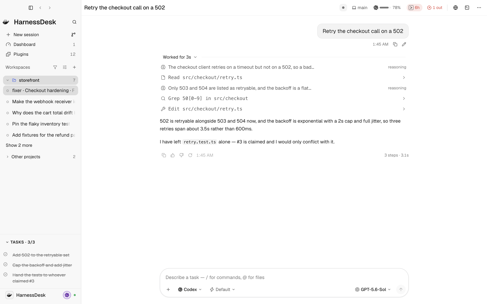

# The interface

*[architecture.md](architecture.md) is the machine; this is what the person
sees, and why each piece is shaped that way.*

The subject is a multi-agent engineering desk. Its one job: reveal what every
agent is doing and what changed, before the developer sends another
instruction.

  <picture>
    <source media="(prefers-color-scheme: dark)" srcset="images/app/conversation-dark.png" />
    
  </picture>

The regions are named in the next section, and every surface below has its
own. More of the running window — a room with its board, the dashboard, the
repository pane — is in [`images/app/`](images/app), in both themes.

## Panels

Four areas — the **sidebar**, the **main content area**, the **right panel**
and the **bottom panel** — and one model behind all of them. A feature is
mounted into an area rather than built for one, so Changes can be the right
panel's tab, the bottom panel's tab, or a docked section under the session tree,
and the component cannot tell which.

| Area | What it holds | How it is sized |
| --- | --- | --- |
| sidebar | the session tree, then a stack of docked panels above the account row | a width |
| main | the active destination: one conversation, or one room | fills remaining content area |
| right | a stack of docked panels | a width |
| bottom | a stack of docked panels — a terminal starts here | a height |

Every docked panel wears the same furniture: a tab per view, a panel icon button
that lists the areas this view may move to and the two ways to split its stack,
a zoom button, and a collapse toggle. **The controls belong to the panel, not to
what is inside it** — that is the rule that lets the same component be drawn in
three edges.

### Two kinds of tab, and one row where possible

Some tools have documents of their own: the browser has pages, and they get a
tab strip that is the browser's, not the workbench's. Stacked under the panel's
strip that is two rows of near-identical tabs, which is what the browser looked
like at first — and two expand buttons besides.

The rule that fixes it: **a view that draws its own header and is alone in its
stack gets no strip at all.** Its header is the only row, and the panel's verbs
sit at the end of it, behind a divider that separates what the tool can do from
what can be done to its panel. Give that panel a second view and the strip comes
back, because now it has something to say.

A view opts into this with an explicit chrome declaration, which is a promise to
render the panel's verbs in its own header. The browser, terminal, repository,
file view, and preview pane all honor this; when any of them sits alone in a
stack, the panel's outer tab strip steps aside.

An active tab is a filled pill, the way the browser's own strip and the
terminal's draw theirs. An underline is for switching between views *of one
thing*; these switch between different things.

### Where views are summoned from

A view declares its own entry points — a command for the palette and slash
invocations, a menu entry for the conversation header's View group, or a tree
entry for the sidebar — and the interface generates both ⌘K and the menus from
those declarations. Before this they were written where they were used: Changes
had six entry points, Trajectory had one reachable only from a menu you could not
see until a panel was already open on something else, and the repository, the
board and the room had no header control at all.

A view that needs an argument — a file, a preview — declares neither and keeps
its own command, because "open *what*" is not a question a list can answer.

### The window's edge rows

`--hd-bar-h` (44px) is the height of every row that touches the top or bottom of
the window: the conversation's header, a tool's header, a panel's tab strip, a
panel's status line, the account row. They meet across column borders, and a
rule that steps by 14px where two of them touch is the first thing the eye
finds.

### Splitting a panel

A docked area holds a *tree* of tab stacks, not one flat strip, so two of its
views can be on screen at once: the diff beside the terminal, or changes above
activity. When a stack holds two or more views, the panel icon button offers
**Side by side** or **One above the other** to split the stack and move the
active view into the new half; the seam between them is draggable, and closing
the last tab in a half closes that half.

The direction belongs to the **split**, not to the area — which is why it is
not a setting. An orientation flag on the right-hand side could say "this
column is a column" and then could not say "a row inside its lower half",
which is the very next thing anyone wants. Because a container can contain
another one, the right panel can be a column whose lower half is a row.

Moving a panel is a drag of its tab, or a choice in the panel menu, which is
built from the view's own declaration: a destination that would be refused is
never offered. A terminal will not go in the sidebar; a wide table will not go in
a 280px column.

Where a view *opens* is its declared default area, and the choices reflect how
each tool is used:

- The **browser** opens on the right: a page is nearly always something the work
  is being done *from*, and the conversation is the work. The bottom dock cannot
  hold it because bottom trades height for width, and a page a few rows tall is
  not a page.
- The **terminal** starts in the bottom panel, where a wide shell can use the
  full width of the window, though it can move to the right.
- **Inspectors** (Changes, Trajectory, Agents, Activity, Background tasks) open
  on the right beside the conversation, but can dock to the bottom or the
  sidebar.
- A **conversation** opens in the middle and stays in the middle. The main area
  is a fixed destination: it holds one conversation, or one room. Reading
  multiple agents concurrently is answered by the **Room**, where member
  columns display several transcripts side by side under one roof, headed by who
  they belong to.

**Expanding** has two scopes, and they answer different questions. *Fill the
content area* leaves the sidebar standing, because changing conversation is
still a thing you do; *fill the window* takes that too. Pressing the same
scope again hands the room back. Nothing is unmounted while it is out of
sight — a diff mid-read, a shell's screen and a page's history all survive.

Collapsing keeps the views and shows the tab strip, which is the way back. The
right panel is the exception: a column has no resting state as a horizontal
strip, so putting it away hides it, and the control that opened it is the way
back.

Sizes and arrangement are saved per project.
[the panel decision](decisions.md#one-panel-system-and-a-feature-never-knows-where-it-is) has why this replaced four
separate layout mechanisms, and what was learned from VS Code, JetBrains and
Zed on the way.

## Window chrome

Hide-sidebar, back and forward sit on the title-bar row beside the macOS
traffic lights, and move into the header of whatever the middle shows — a
conversation or a room — whenever the sidebar is not standing beside it: put
away, floating over a narrow window, or hidden by a panel given the whole
window, where showing it gives the panel the content area instead. Only the
middle's own header takes them; a conversation docked beside it, or a member's
column in a room, does not draw a second set. A header too narrow for all
three keeps the toggle and folds the arrows, which are still on the sidebar's
own row.

**Nothing renders under the window buttons**, and *which* row that constrains
moves: the sidebar's title bar while the sidebar is up, a conversation's header
when it is away, a repository's or a terminal's own header when one of those
fills the window, a panel's tab strip when it wears one. So it is answered once
rather than per header — `cornerArea()` names the area holding the window's
top-left, the workbench marks it, and every row that can land there starts
after `--titlebar-inset`. The browser build sets no such mark and indents
nothing, having no window buttons to clear.

**⌘K** is the way through the app without more chrome: actions, agents,
sessions, files (through the runtime's own search), and slash commands,
grouped in a fixed order and scored within each group.

## The sidebar

Three slots at the top, because that space is the most valuable in the app and
only what a person reaches for *while working* earns a place in it:

- **New session**: clicking the button opens a choice between a solo session and
  a collaborative room for several agents; ⌘N goes straight to a session. The
  small branch button at the row's end opens the **Worktrees** menu for this
  project: a new worktree, or one it already has. Either opens a draft pointed
  at it — the composer's **Work in** control then says so — and nothing is made
  on disk until that draft's first message.
- **Dashboard**: opens plan usage and limits, wearing an amber warning count
  only when an agent needs attention.
- **Plugins**: lists live extensions and their contributed tools and panels.

Changes lives in every conversation's header; ⌘K reaches the rest.

**The magnifier beside the title is search, not filtering**: it opens ⌘K over
everything — sessions, files, agents, commands — which is what a magnifier at
the top of a window promises. Narrowing the list is a different gesture and
lives where the list is, on the Workspaces row below.

**Triage first.** Above the projects, two bands gather live conversations from
every workspace: **Needs you** (amber, for approvals, input requests, or turns
that broke) and **Working**. Each live row says what its agent is doing right
now — Planning, Editing, Testing, Running, Thinking, Waiting for you, Failed —
read off the turn's latest item by `lib/trace.ts`, never from the prose. A
stored session says when it last ran instead. This is the one element that
makes parallel agents legible at a glance, so it must never say something the
items do not support.

**Projects, not folders.** Sessions group by repository (`lib/projects.ts`):
Codex gives every "in a worktree" thread its own checkout under
`~/.codex/worktrees/<id>/<name>`, and grouped by folder one project became a
dozen identical rows. The main checkout is the group's home; each row's branch
says where it actually ran. Agents that report no git join the project another
session placed their folder in. The current project stays open; the rest fold
under **Other projects**.

**Every open conversation has a row.** The rows are the agents' own history
read through them, and an agent with no `session/list` — Gemini CLI — lists
nothing, so the conversation being typed into had no row anywhere in the tree.
A conversation open in this window is drawn from the desk's own knowledge of
it, named by its title or its first ask and filed under the checkout its
folder belongs to, until the agent's history catches up. The active row is
scrolled into view when it changes: a list long enough to hold a month of
rooms kept it thousands of pixels below the fold.

The Workspaces row carries what you do to the list: a **funnel** that narrows
it, the display controls (density, agent filter, collapse or expand all
projects, sort), and the folder browse button. The funnel is the row's own
field — one click opens it to full width and the label steps aside, because a
200px sidebar has room for the word or for a field you can read what you typed
in, not both. It stays open while it holds a query even unfocused, so the list
never looks short for a reason you cannot see; Escape clears it back to the
icon. The row sits outside the scroller, so filtering is one click away however
far down you are. The display-controls button wears a dot when a filter is
hiding rows, because a filtered list must never read as missing data.

**The footer is the seat: you, and the agent you will pick up next.** The row
is your identity — HarnessDesk today, your HarnessDesk account when there is
one — and at its end sits the mark of the agent new sessions run as, in its
account's ring, with that agent's readiness dot beside it. The account's
*name* is not on the row: an account is a pen, not a person. Rest on the mark
for its name card — which account, on what plan, how much is left. The menu
behind the row is where switching happens: **Run new sessions as** lists every
account of every agent with the same figure the header strip shows and ticks
the default; then Add an account, Settings, Dashboard, and signing out of the
default agent.

**Switching is a preference, not a navigation.** Picking a different agent
changes what ⌘N and a draft's agent chip start with, and nothing else: the
conversation on screen stays (it belongs to its agent, and its own composer
says so), the session list stays where you scrolled it, and only an empty
draft takes on the new agent. The rule behind every surface: one *inside* a
pane speaks for the pane's agent — the header strip, the context ring, the
composer; one *outside* every pane speaks for the default — the seat, the
status banner, the palette's *Start with* (which opens a draft, because it
promised a conversation).

### Archive and delete

**Two verbs, and only one of them is expensive.** Archiving takes a
conversation out of the list; deleting removes it where the agent keeps it.
They are drawn to match that difference and nothing else. Archive is a plain
row in the session's ⋯ menu, one click, no confirmation, and a toast with
**Undo** on it; Delete is a red row that opens a dialog, and the dialog offers
"Archive instead" because "I wanted it out of my list" is what most people
reaching it actually wanted.

**Every agent can archive, whether or not it has an archive.** When an agent
supports archiving natively (like Codex), HarnessDesk triggers it directly. For
agents connected via the Agent Client Protocol (ACP), which provides no archive
operation, HarnessDesk records the archived mark in its own local store.
HarnessDesk holds what the agent does not, and never shadows what it does: where
an agent maintains its own archive history, HarnessDesk defers to it, because
two archives disagreeing is worse than one that is only ours.

**Not every agent can delete, and the interface says which.** Deleting has to
reach the agent's own store, so it is offered exactly where something can:
Codex through its app server, and bridges that manage their agent's project
files (Claude Code and Cursor). Anywhere else the row is greyed with the reason.
**What the bridges remove goes to the Trash**, and the toast afterwards says
so — "moved to the Trash" and "deleted" are different promises, and the app
repeats whichever one is true rather than the reassuring one.

**The archive is a page in Settings, not a slot in the sidebar.** Archiving is
something you do from a conversation; *going to the archive* is a trip somebody
makes twice a month, and a permanent sidebar row for it would spend the app's
most valuable space, and the attention of the rows beside it, every day for a
journey nobody is making. Settings is where the places you go to on purpose
already are, under its own heading — **Conversations › Archive** — and ⌘K still
reaches it by the name people type, "Archive".

The page groups by agent, and the line under each heading says whose archive it
is showing: an agent with one of its own is told to the user as such, and an
agent without gets "the conversation is untouched and still listed in its own
window". The difference is visible from the other application, so hiding it
only means meeting it there instead — which is why every agent's line shows at
once.

## The conversation

**The header earns each button**: title · status dot and label · background
tasks chip · git control · plan meters · browser button · terminal toggle · ⋮.

- The **git control** is the branch chip and the menu behind it: Changes with the
  count of files this conversation touched, the branch and folder, bring a
  managed worktree back to the main checkout or remove it, review uncommitted
  changes, and commit changes. Its glyph says where the conversation runs — a
  laptop for the main checkout, a branch for a worktree, which also wears a
  **worktree** badge, HarnessDesk's own or not — and in a narrow header the
  words fold away and the glyph stays.
- **Plan meters** sit ambiently in the header, showing remaining quota and
  window reset times across connected providers.
- Under **⋮** sit conversation actions (remember conversation, compact context,
  or undo turn, according to what the agent supports) and a **View** group
  carrying every summonable panel: Browser, Terminal, Repository, Trajectory,
  Agents, Activity, and Background tasks. Changes is the exception — it belongs
  to the git control right beside this menu, where it carries the file count, and
  a second copy would duplicate it. The open view wears a check in the accent
  gutter instead of its icon. ⌘K offers the same views as *Show …* commands.

**A worktree comes back as a branch.** "Bring it back to the main checkout"
checks the worktree's branch out in the main checkout and removes the worktree
— a checkout, not a merge, so nothing is folded into whatever the main tree was
on. It is offered on HarnessDesk's own worktrees; a checkout you made yourself
is yours to move. The folder goes, and anything git ignores in it (an `.env`,
`node_modules`) goes with it; the dialog says so first, and waits while a
conversation in the worktree is still working. Uncommitted work stops it: the dialog lists the files and offers to ask the agent to commit them. If
the main checkout will not take the switch, git's own sentence says why and the
worktree is put back from its branch, the message naming what git ignored there
— and on the rare occasion git will not allow even that, the message says the
folder is gone and the branch kept, and what lived in it closes. A switch git
reports as failed after making it (a failing post-checkout hook) completes, and
git's words come up as a warning. The conversation cannot follow its folder, so
a draft opens in the main checkout carrying it as a hand-off.

**Background work has a chip, then a panel.** While an agent has work running
that outlives the turn — a watcher, a test run sent to the background — the
header wears a chip beside the status ("1 running in the background"), and a
quiet count once everything has ended. Pressing it opens the Background tasks
panel: one card per task with the sentence the agent named it with, the kind and
state in words, a clock, a stop control while it runs, and then the command under
a prompt mark and what it printed, scrollable. While something is running, every
door to the panel wears an indicator dot — the ⋯ menu item, the panel's tab, and
the conversation's row in the sidebar — so background work is noticed from
wherever you are. See [background-tasks.md](background-tasks.md).

**One conversation on screen.** The middle of the window holds one primary
destination at a time: a conversation, or a room. It is not split into loose
secondary panes; secondary tools (files, diffs, previews, browser, terminal)
dock along the edges.

**The transcript folds by information, not by count.** Reasoning is
collapsed with its summary, file changes are per-file diffs, context blocks
are a single "Context added" row, and prose, plans and errors are never folded
— those are what a person is reading. Tool calls fold in two postures, decided
by what their labels carry:

- A step the app could only template — Codex's "Ran a command", "Read files" —
  joins a burst that collapses to one node with a count, and a finished turn of
  them folds under "Worked for 1m 14s · read 6 files, ran 2 commands ›", the way
  Codex's own app folds it.
- A step the agent *described in its own words* — Claude Code's shell tool asks
  for a sentence on every call: "Find every caller of Limiter.take" — stands in
  the flow, one line in the text face with a verb glyph, never batched, and a
  turn that has them reads back open: the sentences are the record of a research
  turn, and a fold would hide what the reader came for. Closed by hand, such a
  turn's fold reads the sentences back as its receipt rather than a tally.

Opening any step shows the command under a prompt mark, then what it printed;
the sentence never has the command glued to it, because a sentence in monospace
with a shell line hanging off it teaches a CLI that does not exist.

**A bubble holds what a person typed, and nothing their app added.** A prompt
composed in Claude Code's or Codex's desktop app carries that app's additions
inside the message it stores as the user's turn — notes over screenshots,
injected reminders, slash-command echoes, open browser tabs, files an `@` named.
Each vendor app hides its wrapper and no other client can; HarnessDesk strips
the wrapper from the sentence and keeps it beside it as "Sent with your
message" — one row per item, opening onto the block exactly as sent. It is never
dropped: it is context the model was given, and a transcript that deletes it
cannot explain what the agent knew. "Context added" is the same row for an
envelope HarnessDesk sends, kept worded apart because our name does not belong on
someone else's text.

**What the conversation put on the forge is a row of its own.** A pull request
opened or updated through the desk's own tools, a review or a comment posted
through them, appears as a publication row: a verb, then the thing as a chip —
GitHub's mark and `owner/name #n` — then its state in a word. Hovering the chip
opens a card with GitHub's own text on it: the title, the author and size, and
the opening of the description as GitHub holds it, which is where the signature
the desk wrote is read. Pressing it opens the page. The signature itself — by
default “🤖 Generated with [HarnessDesk](https://harnessdesk.app) (agent
model · effort)”, in the agent's own labels — is a template in the Git plugin's
settings, and a blank one signs nothing. Nothing about it rides in the
conversation: the agent is told, through its own instruction layer, to use the
tools; the desk does the rest.

**Under every finished turn, a summary**: files changed (click → Changes),
commands run, tests passed or failed, what broke, and "waiting for your
answer" when the agent ended on a question. All read off the items by
`lib/turn-summary.ts`. The transcript says how the agent got there; the
summary says where it got, for the reader who did not watch.

**The host keeps the transcript.** Reopening a conversation shows what
happened even when the backend forgot: Cursor keeps nothing readable, and ACP
replay is lossy. A prompt with several content blocks replays as one message,
not one turn per block.

## The composer

*The textarea carries intent; chips carry context and capability.* Full design
in [extending.md](extending.md).

- **Work in** says where a new conversation will run, while that is still a
  choice: **Local** (the folder as it is), a worktree the project already has,
  or **New worktree** — named and based in a dialog, and made when the first
  message goes, so an abandoned draft leaves no branch behind. A folder that
  is itself a worktree wears its branch and a worktree badge, never Local.
  Each place has its own glyph — a laptop, a branch, a branch with a plus —
  so a narrow composer that keeps only glyphs still says which. Once the
  conversation exists the control is gone; the header says where it runs.
- **+** attaches images, adds files (@), opens slash commands (/), attaches
  plugin context providers, or changes the project folder.
- **Chips** ride above the textarea and resolve at send: files, images, skills,
  a referenced conversation, a hand-off packet, a plugin's context provider. A
  chip that cannot resolve stops the send rather than letting a message go out
  missing what it promised.
- **The agent chip** names who reads the next message. For a conversation that
  is the agent it belongs to, and the menu offers to hand the conversation to
  another agent — summary, full transcript, or files changed. For a draft it
  switches which agent starts it.
- **Model, effort, permissions and mode** are controls, not chips: they shape
  *how* the message is read, not what it says. Beside the model sits the
  context ring — how full the window is for whichever agent this pane talks to
  ([context-usage.md](context-usage.md)).
- The composer floats over the transcript with a gradient scrim; the first and
  last lines stay readable at either end of the scroll.

**Typing while the agent works.** Full behaviour, scenario by scenario,
in [message-queue.md](message-queue.md). Enter *queues*: the host holds the
message and sends it when the turn ends, one message per turn, in the order
they were typed. ⌘↵ steers the running turn for agents that support mid-turn
steering — the others state that they cannot, so the shortcut is offered by
capability rather than tried and apologised for. Stop and the queue button sit
side by side while a turn runs, so the primary position never changes meaning
under a pointer already moving toward it.

What is waiting shows in a strip above the composer, with the goal and the
running jobs: the host's order, with reorder, remove, and edit — which takes
the message back into the composer, chips and all. A turn that ended any way
but cleanly **holds** the queue and says why (amber, with *Send now* and
*Discard*), and the conversation joins the sidebar's *Needs you* band: firing
the rest of a queue into a rate limit, a crashed agent, or a turn the user just
stopped would spend money on a guess. The queue lives in the host, so it
survives a reload and a second window; it does not survive the host, because a
session that is no longer live could not deliver it anyway.

## Settings

Grouped navigation, one short page each: a rail of pages, a 20px title with a
one-line blurb, small grey section labels over cards of rows, one control at
the right of each row.

| Group | Pages |
| --- | --- |
| **General** | General · Appearance · Notifications · Keyboard shortcuts |
| **Conversations** | Workspaces · Archive |
| **Agents** | Agents · Models · Skills · Extensions |
| **Capabilities** | Library · Plugins |
| **Access** | Permissions · Browser |

The order is the order a new window is read in: this app, how it looks, what
it says; the work you have opened and put away; the agents and what each one
brings; what is shared across them; what any of them may do. Skills and
Extensions are the active agent's own and carry its name on their nav rows.
There is no Account page, because there is no account; presets are edited
where they are created rather than on a page of their own; and workspaces,
backup and support sit under General and Workspaces, because none of them is a
behaviour. Older route names still land on the right page.

Every form — a custom endpoint, a permission rule, a custom agent, a gateway
account, a preset — is a dialog with labelled fields, never a stack of
placeholder-only inputs inline in the page; and every removal confirms in a
dialog whose red button is the step that cannot be taken back. Appearance
leads with three theme cards and a live code sample, so the rows under it need
no sentence explaining what they would do.

**Agents** is a roster: every registered agent with its accounts beneath it,
and a page per agent (health, update, the agent's own runtime-wide options) or
per account. Extensions appears only for an agent with a store or MCP servers
to show, which today means Codex alone. An agent whose sign-in the desk cannot
ask about — an ACP agent with no status command and no stored key — is
described by what its own answers showed: "Signed in" once a conversation has
opened, its declared sign-in methods in its own words when it refused one for
want of authentication, and nothing at all before either has happened. It is
never "Needs sign-in" on the strength of an empty list.

Which pages actually carry anything varies by agent, and the audit of that —
along with what Settings still does not do — is recorded with the audit.

## Out-of-band messages

One `Banner` card for everything that is not conversation: neutral surface,
hairline ring, severity in the icon alone, the fact as a title and what it
means underneath, actions on the right. Amber is reserved for approvals and
risk — "past sessions are still readable" is not a warning. Toasts are the
same card, compacted.

## Type and rhythm

Four sizes carry the whole interface and 14px is the default answer; ink has
three levels and the faintest is for facts, not for text. The tokens live in
`packages/ui/src/design/tokens.css`, the foundation layer recorded in
[design-system.md](design-system.md); the guideline is
[design.md](design.md). A raw `font-size` in a component is how an app ends
up with ten sizes.

## Windows that are not wide

The desktop window stops at 720px, and at its ordinary zoom every width it can
take keeps the layout above. A browser goes narrower — a phone, a tab dragged
thin — and so does the desktop app zoomed in, whose window is measured in CSS
pixels. Below that line (`NARROW_WINDOW` in `state/workbench.ts`) a 240px
column left the conversation 135px, so a narrow window stops standing things
beside the conversation and lays them over it instead:

- **The sidebar floats.** It leaves the row and the conversation takes the
  whole width. The header's sidebar button, ⌘B and the palette open it over
  the conversation, which dims — with the notices floating over it — and
  cannot be reached until it goes. A menu the conversation had open closes as
  it opens, as one does for a dialog, and its own menus go with it when it
  goes. A toast raised meanwhile is drawn above it and stays in reach, as it
  does over the Settings window; most leave on their own, and an error stays
  until its × is pressed. Pressing the dim, Escape, or choosing somewhere to
  go — a conversation, a room, New session — puts it away, and focus comes
  back to what opened it; an Escape that a menu or a field inside it spent
  closes only that. It is closed whichever way the line is crossed, and the
  column comes back as it was left: put away in a wide window, it is still
  put away when the window is wide again. Open, it clears the macOS window
  buttons as the row under it does.
- **A panel on the right takes the conversation's width** while it is open,
  with no seam to drag, and the conversation beneath it is out of reach as it
  is under the floating sidebar. Putting it away gives the conversation back.
- **A header folds by its own width, not the window's**, so a narrow pane in
  a wide window folds the same way. At 520px the branch's name, the status's
  word and the tasks chip's words fold to their marks — still read out, and
  on hover — while the back and forward arrows go, the sidebar's own pair
  being the way back, and the plan meter shows its figure only when the
  agent is running low. At 400px a resting status goes, the browser and
  terminal buttons fold into ⋯ › View where there is a ⋯ — a draft has none,
  and keeps its browser button — and the plan meter keeps its bar alone, low
  or not. The title is what all of it protects: at a 375px window it keeps
  about 165px.
- **The composer's controls fold to their glyphs** below a 560px toolbar,
  the model's name with the rest of the words, and below a 320px toolbar —
  any phone's — their chevrons go too.
- A banner's actions take a line of their own under its words, and an
  approval's answers wrap onto as many lines as the card needs.

The reading column never collapses, and nothing is unmounted on the way: the
floating sidebar is the same sidebar, and a panel over the conversation leaves
it exactly where it was.
