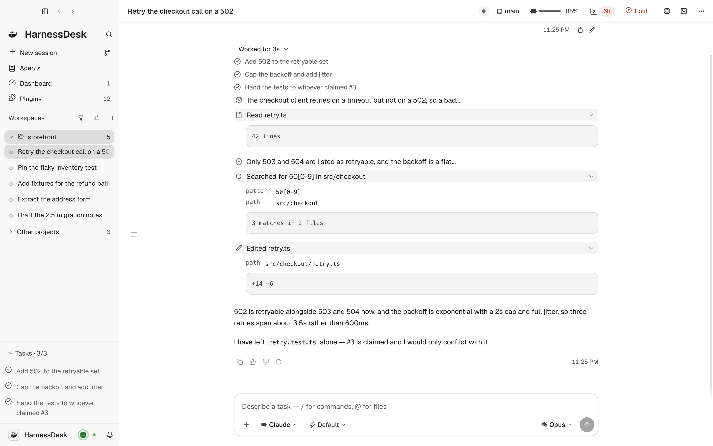

# The interface

*[architecture.md](architecture.md) is the machine; this is what the person
sees, and why each piece is shaped that way.*

The subject is a multi-agent engineering desk. Its one job: reveal what every
agent is doing and what changed, before the developer sends another
instruction.

  <picture>
    <source media="(prefers-color-scheme: dark)" srcset="images/app/conversation-dark.png" />
    
  </picture>

The regions are named in the next section, and every surface below has its
own. More of the running window — a room with its board, the dashboard, the
repository pane — is in [`images/app/`](images/app), in both themes.

## Panels

### Insight

Cost beside a wrapped receipt and project usage are accounting views, not a
verdict on an Agent. They name source, age and qualification beside each
number. Unknown is visible; it is not styled as free. Historical partitions
(Goal, Agent and Seat) are alternate views of one total,
never contributions to add together.

Four areas — the **sidebar**, the **main content area**, the **right panel**
and the **bottom panel** — and one model behind all of them. A feature is
mounted into an area rather than built for one, so Changes can be the right
panel's tab, the bottom panel's tab, or a docked section under the session tree,
and the component cannot tell which.

| Area | What it holds | How it is sized |
| --- | --- | --- |
| sidebar | the session tree, then a stack of docked panels above the account row | a width |
| main | the active destination: one conversation, or one room | fills remaining content area |
| right | a stack of docked panels | a width |
| bottom | a stack of docked panels — a terminal starts here | a height |

Every docked panel wears the same furniture: a tab per view, a panel icon button
that lists the areas this view may move to and the two ways to split its stack,
a zoom button, and a collapse toggle. **The controls belong to the panel, not to
what is inside it** — that is the rule that lets the same component be drawn in
three edges.

The title bar can also put the right panel away without emptying it: its toggle
then carries a badge for the number of views waiting there. A split that would
leave either half below its minimum size stays disabled and tells you the size
it needs and the size this panel has.

### Two kinds of tab, and one row where possible

Some tools have documents of their own: the browser has pages, and they get a
tab strip that is the browser's, not the workbench's. Stacked under the panel's
strip that is two rows of near-identical tabs, which is what the browser looked
like at first — and two expand buttons besides.

The rule that fixes it: **a view that draws its own header and is alone in its
stack gets no strip at all.** Its header is the only row, and the panel's verbs
sit at the end of it, behind a divider that separates what the tool can do from
what can be done to its panel. Give that panel a second view and the strip comes
back, because now it has something to say.

A view opts into this with an explicit chrome declaration, which is a promise to
render the panel's verbs in its own header. The browser, terminal, repository,
file view, and preview pane all honor this; when any of them sits alone in a
stack, the panel's outer tab strip steps aside.

An active tab is a filled pill, the way the browser's own strip and the
terminal's draw theirs. An underline is for switching between views *of one
thing*; these switch between different things.

### Where views are summoned from

A view declares its own entry points — a command for the palette and slash
invocations, a menu entry for the conversation header's View group, or a tree
entry for the sidebar — and the interface generates both ⌘K and the menus from
those declarations. Before this they were written where they were used: Changes
had six entry points, Trajectory had one reachable only from a menu you could not
see until a panel was already open on something else, and the repository, the
board and the room had no header control at all.

A view that needs an argument — a file, a preview — declares neither and keeps
its own command, because "open *what*" is not a question a list can answer.

### The window's edge rows

`--hd-bar-h` (46px) is the height of every row that touches the top or bottom of
the window: the conversation's header, a tool's header, a panel's tab strip, a
panel's status line, the account row. They meet across column borders, and a
rule that steps where two of them touch is the first thing the eye finds. Their
contents share `--hd-bar-gap` and `--hd-bar-pad`, and the words in them — a
title, a wordmark — sit at `--hd-bar-ink`, which is that padding plus what a
control composes around its own label.

### Splitting a panel

A docked area holds a *tree* of tab stacks, not one flat strip, so two of its
views can be on screen at once: the diff beside the terminal, or changes above
activity. When a stack holds two or more views, the panel icon button offers
**Side by side** or **One above the other** to split the stack and move the
active view into the new half; the seam between them is draggable, and closing
the last tab in a half closes that half.

The direction belongs to the **split**, not to the area — which is why it is
not a setting. An orientation flag on the right-hand side could say "this
column is a column" and then could not say "a row inside its lower half",
which is the very next thing anyone wants. Because a container can contain
another one, the right panel can be a column whose lower half is a row.

Moving a panel is a drag of its tab, or a choice in the panel menu, which is
built from the view's own declaration: a destination that would be refused is
never offered. A terminal will not go in the sidebar; a wide table will not go in
a 280px column.

Where a view *opens* is its declared default area, and the choices reflect how
each tool is used:

- The **browser** opens on the right: a page is nearly always something the work
  is being done *from*, and the conversation is the work. The bottom dock cannot
  hold it because bottom trades height for width, and a page a few rows tall is
  not a page.
- The **terminal** starts in the bottom panel, where a wide shell can use the
  full width of the window, though it can move to the right.
- **Inspectors** (Changes, Trajectory, Agents, Activity, Background tasks) open
  on the right beside the conversation, but can dock to the bottom or the
  sidebar.
- A **conversation** opens in the middle and stays in the middle. The main area
  is a fixed destination: it holds one conversation, or one room. Reading
  multiple agents concurrently is answered by the **Room**, where member
  columns display several transcripts side by side under one roof, headed by who
  they belong to.

**Expanding** has two scopes, and they answer different questions. *Fill the
content area* leaves the sidebar standing, because changing conversation is
still a thing you do; *fill the window* takes that too. Pressing the same
scope again hands the room back. Nothing is unmounted while it is out of
sight — a diff mid-read, a shell's screen and a page's history all survive.

The **sidebar gives way first** when the window cannot fit its column, a
400px reading column and the drawn right panel at its committed width. The
sidebar floats through the same button, ⌘B and palette path as in a narrow
window. The right panel then covers the main area only when fewer than 400px
would remain beside it. At 720px with a 280px panel, the sidebar is away and
the conversation keeps 439px beside the panel; at 700px it keeps 419px, and
from 680px down the panel covers it. Dragging the right seam also preserves 400px
for main while the sidebar column stands. Zoom still takes its existing area.

Collapsing keeps the views and shows the tab strip, which is the way back. The
right panel is the exception: a column has no resting state as a horizontal
strip, so putting it away hides it, and the control that opened it is the way
back.

In the terminal, Tab belongs to shell completion. Press Escape, then Tab within
1.5 seconds to move focus to the panel controls; Tab without Escape stays in
the terminal. A lone Escape is sent to the shell immediately. Because the
Escape-then-Tab chord is reserved briefly, a shell binding for Escape-Tab
(such as readline's completion binding) cannot use that chord during the
window.

Sizes and arrangement are saved per project.
[the panel decision](decisions.md#one-panel-system-and-a-feature-never-knows-where-it-is) has why this replaced four
separate layout mechanisms, and what was learned from VS Code, JetBrains and
Zed on the way.

## Window chrome

Hide-sidebar, back and forward sit on the title-bar row beside the macOS
traffic lights, and move into the header of whatever the middle shows — a
conversation or a room — whenever the sidebar is not standing beside it: put
away, floating over a narrow window, or hidden by a panel given the whole
window, where showing it gives the panel the content area instead. Only the
middle's own header takes them; a conversation docked beside it, or a member's
column in a room, does not draw a second set. A header too narrow for all
three keeps the toggle and folds the arrows, which are still on the sidebar's
own row.

**Nothing renders under the window buttons**, and *which* row that constrains
moves: the sidebar's title bar while the sidebar is up, a conversation's header
when it is away, a repository's or a terminal's own header when one of those
fills the window, a panel's tab strip when it wears one. So it is answered once
rather than per header — `cornerArea()` names the area holding the window's
top-left, the workbench marks it, and every row that can land there starts
after `--titlebar-inset`. The browser build sets no such mark and indents
nothing, having no window buttons to clear.

**⌘K** is the way through the app without more chrome: actions, Agents to
start as, runtimes, sessions, files (through the runtime's own search), and
slash commands, grouped in a fixed order and scored within each group.

**⌘[ and ⌘] step back and forward** through what the middle has shown — a
conversation or a room — and `/back` and `/forward` are the same pair in the
palette and the composer. The header's arrows do the same thing and fold away
in a header under 520px, which a wide window reaches as soon as a panel is
docked and the sidebar is away; the keys do not depend on that room. While a
browser pane is the one you are working in, the same two keys step that
page's history instead, as its other browser keys do. A file editor answers
the pair too — there they outdent and indent — and while it has focus it keeps
them: a chord the surface you are working in has already answered is not the
window's to run a second time. Nothing that merely holds focus claims them,
so the composer, a filter box and an empty desk all still navigate.

## The sidebar

The sidebar column has three parts: a **header** with the title bar, brand and
everything-search, then New session and three navigation rows; one scrolling
**content** area for the list controls and conversations; and a **footer** for
docked panels, notices and the seat.

**New session** starts a draft in the current project with the default agent,
in one click, just like ⌘N. The always-visible ⌄ beside it opens **More ways to
start**: New Team… (⌘⇧N), New worktree… and any existing worktree. A
worktree choice points the draft at that checkout; nothing is made on disk
until its first message. New Team opens a searchable shape picker, then one
form for the task, roles and optional Done when. Just a Team opens a shared
board without fixed steps. Change returns to the picker and keeps the draft.

**Agents**, **Dashboard** and **Plugins** each have a full row under New
session: the same icon, label and trailing badge grammar as the conversation
list. Their labels truncate with the rest of the row when space is short; they
remain visible at the sidebar's 200px minimum. Agents shows its in-force count
when the roster has been read, Plugins shows the live plugin count, and
Dashboard shows an attention count only while an agent needs attention. A row
fills when its destination window is open.

The magnifier beside the brand says **Search everything (⌘K)** and opens the
search palette across sessions, files, agents and commands. The funnel beside
**Projects** filters the conversation list by title. Its field is named **Filter
this list**, with the placeholder **Filter by title**. While a query is active,
a **Filtered** chip stays beside Projects and its × clears the query, so a
short result list cannot read as missing data. The title, list filter and
conversation history all remain in the same sidebar column.

**State belongs to the row.** A running conversation wears a small neutral
spinner, still under reduced motion; its hover names the activity read from the
turn's latest item — Planning, Editing, Testing, Running or Thinking. A conversation waiting for an approval,
a held queue or an answer says **Needs you** beside its own title. Neither state
moves it into a separate band. Stored conversations say when they last ran on
hover instead.

**One row per Team.** Each active Team sits inside its project, one indent step
beside the project's loose conversations. A running Team wears the same neutral
spinner; **Needs you** is its only state label. Its Seats fold underneath,
collapsed initially and one further indent step in; the chevron reveals them without opening the Team.
A Seat conversation stays under its Team, including when pinned or waiting.
Opening a Seat conversation elsewhere reveals its project and Team, including
when the Seat works in another checkout. A later deliberate fold stays folded
until another conversation activation. Unread output does not hide a Team's
running spinner; Needs you takes precedence over it.
Wrapped Teams and their conversations leave the sidebar and remain on **Teams**.

**Pinned** is a plain section above the projects, shown only when it has loose
conversations. Pins keep their chosen order and stay out of their project.
Running or waiting changes the row's state without moving it. Project overflow
counts include only loose conversations still shown there.

**Projects, not folders.** Sessions group by repository (`lib/projects.ts`).
The sidebar lists conversations started or continued in HarnessDesk. It reads
the desk's local index, fifty at a time, and loads another page on reaching the
end. An agent filter pages that agent's accounts, and **Load more conversations**
also reaches the next page when the rows do not fill the column. Each project shows its first ten conversations with **Show more** below;
project folds are remembered. Team conversations live under their Team's row.

Clones with the same remote and linked worktrees share one project. A checkout
you opened leads; among several, the one worked in first keeps the name.
Each conversation's branch still says where it ran. Agents that report no git
join the project another session placed their folder in. The current project
stays open; the rest fold under **Other projects**.

A folder that no longer exists is not listed as a project. Its conversations
are kept and stay findable through search and the archive; a pinned conversation
still appears in Pinned with its gone-folder mark. One line counts the gone
folders, and its menu can forget them without deleting their conversations.

A conversation is named by its title or the first thing you asked, passing
over an agent's summary of its compacted history. A Team's Seat with no words
of yours to name it is called by its job and Team, such as
**Implementer · Fix the retry bug**.

Trailing marks and actions share one inset rail. A state label is quiet coloured
text, without a pill, ending on the available rail beside the title; only the
title truncates. The label's visible right edge aligns with the session dot's
right edge, inside the trailing
control's larger hit target. Hover, focus or an open menu folds that row’s
label to its state dot and puts its actions on the rail, without taking more
title space. At narrow row widths a count beside a
state label hides first, returning when there is room. A narrow Seat row folds
its state to the compact mark to keep its title readable. A room and each of its
members reveal their actions independently.

The conversation list has one Tab stop: it enters at the active conversation,
or the first row when none is active, and the next Tab leaves the list. Use ↑ / ↓
to move through its visible rows, including project headings, rooms, members
and overflow rows; Home and End go to the first and last visible rows. On a
project, room or **Other projects** row, → expands it (or moves to its first
child) and ← collapses it (or returns to its parent). Enter or Space opens a
conversation or toggles a group; on **Show more** it reveals another page and
moves to the first new row. Type a title prefix to jump to a matching row.
Shift+F10 or the ContextMenu key opens the focused row's actions; Escape
returns focus to that row. Large project lists mount rows as keyboard focus
reaches them and keep the focused row in view.

**Every open conversation whose folder is still there has a row.** The desk
records its conversations even when an agent keeps no history of its own.
A conversation open in this window is named by its title or its first ask and
filed under the checkout its folder belongs to, or under its Team. The active row is
scrolled into view when it changes: a list long enough to hold a month of
rooms kept it thousands of pixels below the fold.

The **Projects** row also carries display controls: **Sort projects** opens
Recency and Name, **Density** opens Comfortable and Compact, and **Show agents**
opens All agents and one row per agent. Collapse all and Expand all follow after
a separator, with the unavailable action's reason on its title. The folder
browse button stays beside them. The funnel
is the row's own field — one click opens it to full width and the label steps
aside, because a 200px sidebar has room for the word or for a field you can
read what you typed in, not both. It stays open while it holds a query even
unfocused; Escape clears it back to the icon. The row and list scroll together,
while the header actions remain reachable. The display-controls button wears a
dot when a filter is hiding rows, because a filtered list must never read as
missing data.

Project actions are grouped as starts, folder tools, arrangement and project
removal. Pin or Unpin sits beside a **Move** flyout for Move up, Move down or
Back to automatic order. Copy path shows a home-shortened path and copies the
absolute path. Conversation actions are Rename and Pin, then Open on the right,
Branch from here and Copy, then Archive and Remove from HarnessDesk. Delete everywhere follows below a
separator; its disabled reason stays on the tooltip.

**The footer holds the docks, notices and seat: you, and the agent you will pick up next.** The seat row
is your identity — your profile's face and name, which are the house mark and
"HarnessDesk" until you choose otherwise, and your HarnessDesk account when
there is one — and at its end sits the mark of the agent new sessions run as,
in its account's ring — or a dashed, empty ring when no one is signed in to
it — with that agent's readiness dot beside it. The account's *name* is not on
the row: an account is a pen, not a person. Rest on
the mark for its name card — which account, on what plan, how much is left.
The menu behind the row opens on you, and pressing that row opens your
profile. Then comes switching: **Run new sessions as** lists every account of
every agent, one line each — its name, and the same figure the header strip
shows — and the default is the filled row. The address and plan behind a name
are on the name's tooltip and on the mark's card. An agent with more than one
account is a heading — its mark and its name, not a choice — with its accounts
under it, each one line on the heading's name column after a small ring in the
account's own colour (folded, the default is one row wearing its mark); an
account known only by the agent's name is called by its gateway instead. Where
two accounts share a name, a second word on the line tells them apart: the
agent, between two agents' single rows, or the address's domain under one
heading. An agent that has answered that nobody is signed in is not listed
(choosing it would start nothing) unless it is the default; it waits behind
**Add an account**, whose chooser is where signing in happens. The menu-bar
item still lists it, because there the row is itself the way to sign in.
**Usage remaining** appears only where something is metered — its windows and
when each resets, nothing else — and then come Settings and signing out of the
default agent. Dashboard is not in this menu: it is in the sidebar's nav, on
everything, and the Usage verb on an account's card opens its Plans view,
scoped to that one agent.

**Your profile is a name and a face, and nothing else, because nothing else is
shown.** Settings opens on it — your face and name head the rail, above every
group, the way a Mac's own settings open on their owner — and the page is its
own preview: the head follows the name as you type it. The faces are the app's
own icon in six colourways, from `assets/brand/faces`, and then the house
mark's family, twenty-three whales from `assets/avatars`; the whale drawn in
black is left out because a dark surface swallows it, and the default is the
mark itself, drawn in the theme's own ink. Whichever you wear is also what the
Dock wears, and clearing it puts the app's own icon back there. A face is a squared tile
everywhere you appear, so its footprint never changes when the face does.
Clearing the name puts "HarnessDesk" back, picking the first face puts the
mark back, and **Reset to default** puts back both. It stays on this Mac.
What an avatar stores is its id — a short
string every copy of the app draws the same — which is what an account will
sync. The same face marks your own messages in a room, where the header still
says "You".

**Switching is a preference, not a navigation.** Picking a different agent
changes what ⌘N and a draft's agent chip start with, and nothing else: the
conversation on screen stays (it belongs to its agent, and its own composer
says so), the session list stays where you scrolled it, and only an empty
draft takes on the new agent. The rule behind every surface: one *inside* a
pane speaks for the pane's agent — the header strip, the context ring, the
composer; one *outside* every pane speaks for the default — the seat, the
status banner, the palette's *Start with* (which opens a draft, because it
promised a conversation).

A saved Agent wears the robot; a sub-agent wears the robot with a ↳ badge
at the bottom-right, and its title names the parent conversation. Runtimes
has a server glyph; runtime rows keep their own brand faces. When two or more
accounts of the same runtime are signed in, their faces carry unique account
initials from 24px up (two letters when initials collide). Smaller faces keep
the account tint and a title naming the account. Top-right is reserved for
attention counts. A face that totals several accounts carries no initial.

### Archive, Remove and Delete everywhere

Archive keeps a conversation and its search while taking it off the sidebar.
Remove from HarnessDesk forgets the desk's copy and leaves the agent's files
alone. Both are one click, followed by a toast with Undo. Remove's toast lasts
about eight seconds; its body is kept during that window, then dropped. A running
conversation is stopped before removal. The Remove tooltip says whether the
agent keeps its own copy or HarnessDesk holds the only readable record.

Delete everywhere is a secondary, separated item. It is enabled only when the
agent can move its files to the Trash. The confirmation names the conversation,
says it moves to the Trash and the agent can no longer resume it, and offers
Move to Trash and Keep. A running conversation's confirmation also says it
will stop first. The result toast says Moved to the Trash.

**Worktrees follow the conversation.** Archive removes its clean managed
worktree; Remove waits until Undo ends, and Delete everywhere removes it after
the agent accepts. A branch always stays. Uncommitted work, ignored content,
a detached checkout or another active conversation keeps the checkout. Archive shows **Worktree kept**
on the row's label, with counts on hover. **Discard worktree…** names what will
be lost and asks again if that inventory changes. A detached checkout is kept
even after confirmation: create or check out a branch at its current commit
before discarding its folder. Returning to the conversation
puts the worktree back from its branch; if the branch is gone, it opens in the
main checkout and says so.

Wrapping a Team archives its idle conversations too. A working member stays,
and the receipt counts how many stayed.

**Every agent can archive, whether or not it has an archive.** When an agent
supports archiving natively (like Codex), HarnessDesk triggers it directly. For
agents connected via the Agent Client Protocol (ACP), which provides no archive
operation, HarnessDesk records the archived mark in its own local store.
HarnessDesk holds what the agent does not, and never shadows what it does: where
an agent maintains its own archive history, HarnessDesk defers to it, because
two archives disagreeing is worse than one that is only ours. A quiet archived
conversation releases its live agent handle when the agent can resume it.
Archiving leaves working turns, approvals, queued messages and running tasks
live; their handles rest after the work becomes quiet.
Reopening restores the conversation from the agent's history. Personal
conversations also release after ten quiet minutes; working turns, approvals,
queued messages and running tasks keep them live, and so does a conversation
the agent has taken no message in, which it could not reopen: a first message
it rejected, or only a warning, does not count as one.

**The deletion destination is declared before the click.** An agent that erases
its record for good keeps Delete everywhere greyed, with a tooltip directing
you to delete it there. An unavailable agent or one with no delete operation
keeps its reason on the tooltip too. Menu rows have no second line.

**The archive is a page in Settings, not a slot in the sidebar.** Archiving is
something you do from a conversation; *going to the archive* is a trip somebody
makes twice a month, and a permanent sidebar row for it would spend the app's
most valuable space, and the attention of the rows beside it, every day for a
journey nobody is making. Settings is where the places you go to on purpose
already are, under its own heading — **Conversations › Archive** — and ⌘K still
reaches it by the name people type, "Archive".

The page reads the local conversation index, groups by agent, and the line under each heading says whose archive it
is showing: an agent with one of its own is told to the user as such, and an
agent without gets "the conversation is untouched and still listed in its own
window". The difference is visible from the other application, so hiding it
only means meeting it there instead — which is why every agent's line shows at
once.

### Imported History

Settings › Conversations › History lists metadata imported from an agent's
settings page. The command palette also reaches History by name. Agent and
project filters, title search and Show hidden narrow a windowed list; an
Archived chip records the agent's archive state. Opening a row previews it in
the main pane. Sending a message adds it to the sidebar. Its row menu offers
Hide from HarnessDesk with Undo, leaving the agent's files alone, and Delete
everywhere with the shared Trash confirmation. Unsupported deletion stays
greyed with its reason on hover; hidden rows omit Hide.

An importable runtime's page has a History section: Import history, a running
count with Cancel, or the imported count and last scan with Rescan, Browse and
Remove imported. Failed imports expose their reason on hover and can be
retried. Remove imported keeps the agent's own files and conversations
continued here. Opening History or returning focus rescans imported agents;
the host limits completed rescans to once a minute.

## The conversation

**The header earns each button**: title · status group · browser button ·
terminal toggle · ⋮. The status group puts the ceiling, status, background work,
branch and plan readings on one chip ground. Hover or keyboard focus names every
reading in one card, including words folded away in a narrow pane. Working and
other agents’ limits stay neutral; an approval, failure or this conversation’s
low or spent allowance takes a tone while it needs attention. Working has a
square light that stays distinct when reduced motion stops its pulse. The context ring
stays beside the model in the composer, with its own usage card.

- The **git control** is the branch chip and the menu behind it: Changes with the
  count of files this conversation touched, the branch and folder, bring a
  managed worktree back to the main checkout or remove it, review uncommitted
  changes — in a conversation of its own, which opens, while this one waits in
  the sidebar as it was — and commit changes. Its glyph says where the conversation runs — a
  laptop for the main checkout, a branch for a worktree, which also wears a
  **worktree** badge, HarnessDesk's own or not — and in a narrow header the
  words fold away and the glyph stays.
- **Plan meters** sit ambiently in the header, showing remaining quota and
  window reset times across connected providers.
- Under **⋮** sit conversation actions (remember conversation, compact context,
  or undo turn, according to what the agent supports) and a **View** group
  carrying every summonable panel: Browser, Terminal, Repository, Trajectory,
  Agents, Activity, and Background tasks. Changes is the exception — it belongs
  to the git control right beside this menu, where it carries the file count, and
  a second copy would duplicate it. The open view wears a check in the accent
  gutter instead of its icon. ⌘K offers the same views as *Show …* commands.
- **Save as an Agent…** is in ⋮ too: a name, what it is for and a ceiling,
  with the seat this conversation is on as the Agent's first; it is written to
  you or to the project and its brief opens in the editor
  ([agents.md](agents.md)).

**A conversation seated as an Agent is headed by it.** The header and the
sidebar row lead with the Agent's name — once, while the conversation's title
is still that name — the composer's agent chip names the Agent and the seat it
took, and the name card adds an *Agent* band: what it is for, its ceiling
(*Read only* or *Read only · asked, not enforced*), where it came from, the seat and every seat passed over, and
*The brief has changed since this started* once its file has moved on.

The same ceiling vocabulary appears on six governed-seat surfaces: the
conversation header, Agent name card, members popover, board holder, flow dry run and
Agent roster. The chip is neutral whether the limit is held or asked — most
runtimes have no control that holds one, so `asked` is the ordinary state, not
a warning. A held ceiling names the level (*Read only*, *Edit*, *Publish* or
*Merge*); an asked ceiling adds *asked, not enforced*. Those words and a hover
explanation make colour unnecessary either way.
The roster keeps two facts distinct: the Agent file's declared level and the
effective would-be seat after the seating grant narrows it. A plain conversation
has no ceiling chip.

**A worktree comes back as a branch.** "Bring it back to the main checkout"
checks the worktree's branch out in the main checkout and removes the worktree
— a checkout, not a merge, so nothing is folded into whatever the main tree was
on. It is offered on HarnessDesk's own worktrees; a checkout you made yourself
is yours to move. The folder goes, and anything git ignores in it goes with
it — the dialog **names those entries**, because `git status` counts none of
them and a category ("such as an `.env`") is not something a person can copy
out; a file git never had is said apart from a folder that can be built again.
It waits while a conversation in the worktree is still working. Uncommitted work stops it: the dialog lists the files and offers to ask the agent to commit them. If
the main checkout will not take the switch, git's own sentence says why and the
worktree is put back from its branch, the message naming what git ignored there
— and on the rare occasion git will not allow even that, the message says the
folder is gone and the branch kept, and what lived in it closes. A switch git
reports as failed after making it (a failing post-checkout hook) completes, and
git's words come up as a warning. The conversation cannot follow its folder, so
a draft opens in the main checkout carrying it as a hand-off.

**Removing a worktree names what goes with it.** "Remove this worktree…" reads
the checkout first and lists every uncommitted file before it will discard one,
and lists what git ignores there on the same footing: the branch is kept either
way, but the folder goes and an `.env` in it goes with the folder.

**Background work has a chip, then a panel.** While an agent has work running
that outlives the turn — a watcher, a test run sent to the background — the
header wears a chip beside the status ("1 running in the background"), and a
quiet count once everything has ended. Pressing it opens the Background tasks
panel: one card per task with the sentence the agent named it with, the kind and
state in words, a clock, a stop control while it runs, and then the command under
a prompt mark and what it printed, scrollable. While something is running, every
door to the panel wears an indicator dot — the ⋯ menu item, the panel's tab, and
the conversation's row in the sidebar — so background work is noticed from
wherever you are. See [background-tasks.md](background-tasks.md).

**One conversation on screen.** The middle of the window holds one primary
destination at a time: a conversation, or a room. It is not split into loose
secondary panes; secondary tools (files, diffs, previews, browser, terminal)
dock along the edges.

**The transcript folds by information, not by count.** Reasoning is
collapsed with its summary, file changes are per-file diffs, context blocks
are a single "Context added" row, and prose, plans and errors are never folded
— those are what a person is reading. Tool calls fold in two postures, decided
by what their labels carry:

- A step the app could only template — Codex's "Ran a command", "Read files" —
  joins a burst that collapses to one node with a count, and a finished turn of
  them folds under "Worked for 1m 14s · read 6 files, ran 2 commands ›", the way
  Codex's own app folds it.
- A step the agent *described in its own words* — Claude Code's shell tool asks
  for a sentence on every call: "Find every caller of Limiter.take" — stands in
  the flow, one line in the text face with a verb glyph, never batched, and a
  turn that has them reads back open: the sentences are the record of a research
  turn, and a fold would hide what the reader came for. Closed by hand, such a
  turn's fold reads the sentences back as its receipt rather than a tally.

A seated Agent’s brief starts as one closed **Agent brief** row in its
conversation and in Side by side. Opening it shows the headings, lists and
full standing order; other housekeeping notices stay on their plain rows.

Opening any step shows the command under a prompt mark, then what it printed;
the sentence never has the command glued to it, because a sentence in monospace
with a shell line hanging off it teaches a CLI that does not exist.

**A bubble holds what a person typed, and nothing the desk composed.** The
wrapper's shape cannot prove who wrote it: a person can paste the same text.
Newly sent messages record the exact boundary of the desk-composed prefix, so
only blocks inside that boundary fold beside the message as "Context added".
Wrappers the agent's own app adds are peeled by its adapter and fold as
"Sent with your message"; they have no desk-composed record.
The block stays available exactly as sent because it
is context the agent received; an identical wrapper beyond the recorded
boundary stays in the person's words. Its first typed line also names the
conversation, even when that line is a pasted wrapper.

**What the conversation put on the forge is a row of its own.** A pull request
opened or updated through the desk's own tools, a review or a comment posted
through them, appears as a publication row: a verb, then the thing as a chip —
GitHub's mark and `owner/name #n` — then its state in a word. Hovering the chip
opens a card with GitHub's own text on it: the title, the author and size, and
the opening of the description as GitHub holds it, which is where the signature
the desk wrote is read. Pressing it opens the page. Settings › Plugins › Git
has Description, Review and Comment signature templates. Their placeholders
are listed once above the settings rows; a blank value turns that kind off.
The default signature names the Team role and the agent's own model and effort
labels. The first review round in a Run is 1; later reviews count only earlier
review rounds in that Run, and the signature omits round 1. Outside a Team the
role and round drop out. A description keeps the latest seat for each role and
agent pair, up to eight pairs, so a fixer's update preserves the writer's credit.
Adding a ninth drops the earliest-added pair, even if it was updated later. Comments carry their
signature on the first visible line, descriptions on the last. Nothing about it
rides in the conversation: the agent is told, through its own instruction
layer, to use the tools; the desk does the rest. Text a person writes
themselves carries no signature.

**Under every finished turn, a summary**: files changed (click → Changes),
commands run, tests passed or failed, what broke, and "waiting for your
answer" when the agent ended on a question. All read off the items by
`lib/turn-summary.ts`. The transcript says how the agent got there; the
summary says where it got, for the reader who did not watch.

**The host keeps the transcript.** Its local database stores the complete
record, and backups keep it restorable. Reopening a conversation shows what
happened even when the backend forgot: Cursor keeps nothing readable, and ACP
replay is lossy. A prompt with several content blocks replays as one message,
not one turn per block. When the agent can name its source file, an unchanged
record opens from the local copy; a changed record is read again and folded
into it. If that record is gone or cannot be read by the agent, the transcript
says **HarnessDesk’s copy** in one quiet line at the top.

The search palette searches your messages and the agent's answers. **Include
tool output** adds output from tools and commands, with those hits marked
**Tool output**. Reasoning stays outside search, and the choice is remembered
on this viewer.

## The composer

*The textarea carries intent; chips carry context and capability.* Full design
in [extending.md](extending.md).

- **Work in** says where a new conversation will run, while that is still a
  choice: **Local** (the folder as it is), a worktree the project already has,
  or **New worktree** — named and based in a dialog, and made when the first
  message goes, so an abandoned draft leaves no branch behind. A folder that
  is itself a worktree wears its branch and a worktree badge, never Local —
  and from one the menu also offers **Main checkout**, the place the branch
  came from, which is not a checkout HarnessDesk cut and so was missing from
  the list of worktrees entirely. A place whose folder the app has proof is
  gone is greyed there with the agent's own words, rather than dropped.
  Each place has its own glyph — a laptop, a branch, a branch with a plus —
  so a narrow composer that keeps only glyphs still says which. Once the
  conversation exists the control is gone; the header says where it runs.
- **+** attaches images, adds files (@), opens slash commands (/), attaches
  plugin context providers, or changes the project folder.
- **Chips** ride above the textarea and resolve at send: files, images, skills,
  a referenced conversation, a hand-off packet, a plugin's context provider. A
  chip that *fails* to resolve stops the send rather than letting a message go
  out missing what it promised. Three things that look the same are not: a
  provider that does not apply to this conversation is never offered; one whose
  plugin has gone takes its chip off the draft and says so, rather than refusing
  every send; and one that is here with nothing to add is left off the message
  and named.
- **The agent chip** names who reads the next message. For a conversation that
  is the agent it belongs to, and the menu offers to hand the conversation to
  another agent — summary, full transcript, or files changed. For a draft it
  switches which agent starts it. A conversation seated as an Agent names the
  Agent here, and the seat it took, even on a desk with one runtime.
- **Model, effort, permissions and mode** are controls, not chips: they shape
  *how* the message is read, not what it says. Beside the model sits the
  context ring — how full the window is for whichever agent this pane talks to
  ([context-usage.md](context-usage.md)). When an agent enables a model setting
  itself, its reported state appears in the model control’s hover text and as
  a chip beside the model name in its menu. This status comes only from the
  agent’s report; an effort level or model name never supplies it. Reports
  are observations and are left out of saved preset preferences.
- The composer floats over the transcript with a gradient scrim; the first and
  last lines stay readable at either end of the scroll.
- **A conversation that cannot be read returns its pane to a fresh draft.**
  The error still says why it could not open; the next message starts a new
  conversation in the draft's chosen folder rather than addressing the one
  that failed. Words and chips entered while it was opening stay available
  through Restore in the fresh composer's notice. While it opens, typing stays
  available and Send waits for the conversation to load. Restore keeps newer
  text and chips available to swap back in the destination composer's list,
  including a fresh draft or another conversation. A transcript already loaded
  stays available when reopening fails.
- **A conversation whose folder has been deleted has no composer**, because
  there is nowhere for a message to go. In its place the pane states the fact
  in the agent's own words and offers *Open a copy in another folder*, which
  carries the conversation across as a hand-off packet and starts the copy in
  the open folder — the one the composer's *Work in* control names, and which
  you can point elsewhere before sending. The transcript above it
  is whole and stays readable — the host serves its own copy when the agent
  cannot — so this is a read-only conversation, not a broken one. The sidebar
  row wears a mark for the same state, on the right rail beside the worktree
  glyph: one deleted worktree usually takes several conversations, and the mark
  is what says so before the click.

**Typing while the agent works.** Full behaviour, scenario by scenario,
in [message-queue.md](message-queue.md). Enter *queues*: the host holds the
message and sends it when the turn ends, one message per turn, in the order
they were typed. ⌘↵ steers the running turn for agents that support mid-turn
steering — the others state that they cannot, so the shortcut is offered by
capability rather than tried and apologised for. Stop and the queue button sit
side by side while a turn runs, so the primary position never changes meaning
under a pointer already moving toward it.

If adding a message to the running turn fails — the turn ended, the connection
was lost, or the agent timed out — its words and chips stay in that
conversation's Restore list. The failure reason stays beside them, including
after reopening the view. Restore brings the message back to the composer and
keeps any newer draft available in the same list.

What is waiting shows in a strip above the composer, with the goal and the
running jobs: the host's order, with reorder, remove, and edit in place. If an
edit cannot be saved because the original was already sent, the changed words
remain in a Restore list beside that conversation's composer. A turn that ended any way
but cleanly **holds** the queue and says why (amber, with *Send now* and
*Discard*), and the conversation's sidebar row says *Needs you*: firing
the rest of a queue into a rate limit, a crashed agent, or a turn the user just
stopped would spend money on a guess. The queue lives in the host, so it
survives a reload and a second window; it does not survive the host, because a
session that is no longer live could not deliver it anyway.

### Cursor model controls

Cursor Agent’s Max mode reflects the flag saved after the turn. **Auto Max**
says Cursor enabled it, without changing your choice for the next turn. A
choice made while the turn runs takes precedence over that turn’s report.
Max mode belongs to Cursor Agent; another agent’s “max” effort is a reasoning
level and does not declare this status.

## Settings

**Conversations › Storage** shows the database, snapshots, cached previews and
managed worktrees as single-line rows with counts and sizes. Worktree sizes say
**Measuring…** until the background read finishes. Kept worktrees of removed or
deleted conversations stay reachable here through **Discard worktree…**, with
change counts on hover and the same inventory confirmation as Archive.

**Clean up inactive conversations** offers 30, 60 or 90 days and **Review…**.
The review lists clean checkouts and their space, and lists unsaved or ignored
checkouts separately, each in path order. They are included only after a separate
discard choice reveals their inventory. The confirm names how many worktrees go.
Conversations and branches stay; reopening recreates the checkout. Open, pinned and running
conversations and their shared worktrees stay. A toast counts removals and space
freed; refused checkouts and their reasons remain in the review dialog.
**Clear cached previews** asks first and explains that previews are read again
from the agent next time. Live and full conversation bodies remain.

Grouped navigation, one short page each: a rail of pages, a 20px title with a
one-line blurb, small grey section labels over cards of rows, one control at
the right of each row. The rail starts with you — your face and name, above
every group — and that row opens your profile.

| Group | Pages |
| --- | --- |
| **General** | General · Appearance · Notifications · Keyboard shortcuts |
| **Conversations** | Workspaces · History · Archive |
| **Agents** | Runtimes · Models · Skills · Extensions |
| **Capabilities** | Library · Plugins |
| **Access** | Permissions · Browser |

The order is the order a new window is read in: this app, how it looks, what
it says; the work you have opened and put away; the agents and what each one
brings; what is shared across them; what any of them may do. Skills and
Extensions are the active agent's own and carry its name on their nav rows.
There is no Account page, because there is no account — the profile is
yours, not an account's; presets are edited
where they are created rather than on a page of their own; and workspaces,
backup and support sit under General and Workspaces, because none of them is a
behaviour. Older route names still land on the right page.

The Library’s List view compares Skill (or Server), State and Loaded by in
three labelled columns. Descriptions wrap, a warning names a needed fix, and
only agents that load the entry appear as faces; Matrix and the entry’s sheet
keep the per-agent detail. Skills omit repeated generic marks. Built-in plugins keep their own glyphs;
the generic plugin glyph is omitted only when the list has no mapped glyphs.
Model efforts are words beside the description, and endpoint, key and preset
removals live in their row’s actions menu. Keyboard shortcuts show one keycap
per key, with the four focus-tile shortcuts grouped as 1 – 4.

Every form — a custom endpoint, a permission rule, a custom runtime, a gateway
account, a preset — is a dialog with labelled fields, never a stack of
placeholder-only inputs inline in the page; and every removal confirms in a
dialog whose red button is the step that cannot be taken back. Appearance
leads with three theme cards and a live code sample, so the rows under it need
no sentence explaining what they would do. Faces, the one row that keeps a sentence, sets the
shape of every agent's and person's face, square or round. The sentence is
there because the label cannot say that an account's ring and a thing's tile
keep their own shape.

**Agents** is a top-level window of its own, opened from the sidebar or ⌘K: the
open project's own Agents, yours, and the ones that ship. Its overview names
the folder each section reads; each row is an Agent's name and what it is for,
with its ceiling and the seat it would take here, or *Can't seat here* and why.
A row opens the Agent's page, and *On this Mac* on that page is where this
machine's seats for it are chosen. A legacy or missing ceiling flag leads to
that page's **Ceiling → Update…** action. Its dialog offers only compatible
choices, previews the exact one-line file diff, and requires an author-controlled
write; a changed file is refused. Built-ins must be customized first. See
[agents.md](agents.md).

An Agent's page also shows its Skills and Servers as an editable allowlist —
an empty one reads "Runtime defaults", never "None" — with **Edit…**
previewing the exact `skills:`/`mcp:` diff before it writes, and **Review &
Approve…** showing the exact bytes a runtime would load before a person
approves them once for that repository, Agent, runtime build and ceiling. The
review wraps long commands and preserves their line breaks. Large reviews
scroll inside the dialog body, with the question and Approve/Keep buttons
remaining on screen so the whole command can be read before consent. The Agent's
Notes section reads and clears `NOTES.md` beside its file: private
working context, never system instructions. A Seat's own name card and the
Library's Agent filter both read back what a Seat's runtime build actually
loaded, by that Seat's own immutable id — "declared, not loaded" and "not
recorded" are shown as different facts, never folded into one another.

**Settings › Permissions › Ceilings** shows the same four ceiling levels and
whether each is enforced for every installed runtime, using controls the
runtime declares and reads back rather
than a runtime-name table. It also chooses whether a watched conversation may
open an unheld seat and say so, or pass it over, and a second, independent
choice for a Goal a trigger opened — refuse by default, or seat it and say so
as an explicit decision. The same section is focused when a seating refusal's
fix opens Settings; Approvals and Rules remain beside it and do not
auto-answer held peer actions.

**Settings › Permissions › Local clients** has one switch, **Let command-line
clients answer for me**, off by default. Its hover title includes other local
clients. The per-desk preference `clientsMayAnswer` grants the `answer` tier
only when it is the boolean `true`; the host reads it for every call, so
turning it off revokes answering for clients already connected.
For a scripted desk, `HARNESSDESK_CLIENTS_MAY_ANSWER=1` also grants that tier,
regardless of the stored switch. The switch shows and changes the stored
preference; disabling it does not remove that environment override.

**Runtimes** lists every registered runtime with its accounts beneath it.
Its Process cost section lists runtimes holding processes, with process count and
resident memory, including descendants, refreshed every five seconds while the
page is open. A failed or unsupported measurement says so. Shared pages may
count more than once. **Recycle** stops only an unused running
runtime; open conversations, work and in-flight reads prevent it. The same
section appears on a runtime's detail page, where an idle runtime says **Not running**;
reading process cost never starts one. Opening the detail page begins a costly
or unmeasured start in the background; the page can show the last learned models,
options and account while it waits. Shared recycling refusals are stated once below the table.

It has a page per runtime (health, update, the runtime's own options) or per account;
*Add a runtime* is where a registry entry or a custom one is added. Extensions
appears only for a runtime with a store or MCP servers to show, which today
means Codex alone. A runtime whose sign-in the desk cannot ask about — an ACP
agent with no status command and no stored key — is described by what its own
answers showed: "Signed in" once a conversation has opened, its declared
sign-in methods in its own words when it refused one for want of
authentication, and nothing at all before either has happened. It is never
"Needs sign-in" on the strength of an empty list. ⌘, opens this page.

Extensions › Reload and plugin installation hold changes while any conversation
on the account has selected tool servers. Each notice says how many conversations
hold it and asks you to close them, then try again. Each Seat keeps the tool
servers it opened with.

**Workspaces** lists every folder opened, each a way into its project's page —
*Project settings* in the sidebar's project menu opens the same page — which
lists the project's own Agents and the folder they are read from, with *Open*
and *Forget* for a project that is not the one open. Its Memory section stays
a single "Project memory" row until pressed — no read happens before that —
and then shows the project's committed `.harnessdesk/memory/*.md` files, at
the checkout's own HEAD, with an uncommitted one captioned "Commit this file
before citing it" rather than offered. Choosing one of the project's own open
Goals there offers "Cite in this Goal…"; confirming shows the file, its
revision and the wrapped source Goal chosen before it writes anything. A
citation's own retained detail — from here, or from a receipt's Citations
row — is read-only: opening one starts no turn and grants nothing, and a
missing source Goal or Git revision says so honestly beside the text that was
retained.
The page also lists the project's checks, its flows and its Triggers. A
project's Triggers section names each declared source as a sentence, with its
trigger id, concurrency and last firing below. The switch shows whether it
is on; Changed, Refused and Paused keep their own toned chips. Turning one
on opens the exact arming review before anything
runs, which also names the forge repository it binds and, for an issue
trigger that reads comments, whose comments fire it. An arm that changed or
was refused stays switched on until turned off, with *Review* to arm it again,
and a source stopped at a gap shows *Watch from now*. Below the folder list,
"Triggers on this Mac" is this machine's own pause — which holds the work
triggers started and continues it on resume — and daily cap for every armed
trigger, with what is reserved and charged today. See
[multi-agent.md](multi-agent.md#9-intake-bounded-work-a-project-can-open-on-its-own).

The runtime page also draws the controls the runtime declares for new sessions.
Codex includes an optional CLI profile there: choosing one reads its bounded
model and context settings when the conversation starts, while **None** sends
no profile overrides. The live conversation and context ring then show only
the settings and window Codex reports back, not the values the draft expected.

Which pages actually carry anything varies by runtime, and the audit of that —
along with what Settings still does not do — is recorded with the audit.

## What the desk observed

**On a card.** A room's board draws each card's evidence as chips in its foot,
and its columns — Needs you, Working, In review, To do, Ready, and Set aside
while anything is — come from those facts, so nothing on the board is dragged.
A completed card is not placed until the first evidence read succeeds; while
that read is pending or unavailable, the board says so rather than claiming
that nothing was checked. The whole of it is in
[multi-agent.md](multi-agent.md), under *The Board*.

**As the board narrows.** Open columns keep at least 220px. Ready folds first,
then To do, into named rails with their counts; each rail opens in place and
offers a keyboard Fold control only when it can return to a rail. The scroll
body reserves its gutter so a scrollbar appearing cannot move the fold
thresholds. When the columns and rails no longer fit,
or below 760px of content width, Needs you and Working share the first row,
In review and To do the second; Ready stays a rail. Below 600px of content width
the pane uses the compact list, grouped by state with Needs you first. Content
width is the scroll body's client width, after its reserved scrollbar gutter;
column fit also subtracts its insets. The pane measures itself, including space
lost to a sidebar or dock, and restores the selected
view when it widens. Set aside keeps its own lane while it contains work.

**As a list.** Board · List switches the same jobs into a framed table. Filter
jobs by words or state; All starts pressed, and the default order puts Needs
you first, then the most recent. Job number and kind stay beside its title,
with its description or stop reason beneath it; a completion note appears only
on finished or set-aside jobs. Assignee, state, pull request, checks, changes and
updated time each have a column; stale or unknown facts keep their qualification.
Completed jobs still awaiting their first evidence read remain visible as
Checking evidence, or Evidence unavailable if that read failed. Needs you says
why, with a stranded claim’s age first. Finished jobs show their completing
agent only while the channel still records it; otherwise Assignee is a dash.
Reopen is visible on finished, set-aside and hand-stopped rows; dependency-
blocked jobs keep it in the menu. A finished outcome sits beside its state when
there is no Needs-you reason, and owned files appear below the title. Below
720px the job cell still names the assignee. Names stay on one line, truncate
with an ellipsis, and show their full name on hover. Columns too wide for the pane keep
their View switch disabled with the width they need, and search includes the
state each row shows, including Checking evidence. Other verbs stay in the
menu, revealed on hover or keyboard focus. Empty evidence columns start hidden,
and secondary columns yield to the pane’s width so actions stay in view. The
footer names the displayed count and order.

**A conversation's Seat record.** A conversation seated as an Agent shows its
Seat record at the head of its Agents inspector, above the sub-agents it
started: the Agent and where it came from, what it runs on, what was passed
over on the way, what its standing order told it it may do, the checkout it
started in, its board, and when it opened and closed. A Seat restored from a
backup says so. It is read-only, because the record is: written once when the
seat was kept, and closed once. A conversation never seated shows none of it.

**A project's checks.** Workspaces › a project lists the checks the project
names, as committed, each command verbatim with whether this Mac has approved
it for this version of the file, says when your working copy of the file is
not what is committed, and lists every check the file refuses with where and
why. The section appears only once the project has a checks file.

## Out-of-band messages

Only the result of a person's action opens a toast: success leaves on its
own; failure stays until closed. Conditions needing attention keep their
existing composer, strip or sidebar card, with their action and Inbox option.

Runtime information belongs quietly in the Inbox. The bell shows an unread
dot. One row per kind and content keeps a count and the latest time; reading
or clearing unchanged content prevents another unread notification, including
after a restart. The host retains startup information before a window connects.
Configuration warnings keep the runtime's summary, settings and file as separate
facts. Expanding the row reveals guidance, a home-shortened path, Open the file
and Don't show this again. Settings › Notifications offers Inbox only or Off.
When a standing condition ends and later returns, its Inbox row is unread again;
an older read or clear from another window affects only the occurrence that
window saw.

Conversation warnings, context compaction and model changes stay as quiet
transcript lines outside the work fold. Errors keep one inline explanation and
the sidebar's failure state; an automatic retry keeps the conversation working.
A failed send still reports the result of that action. Inbox rows expand to show
the complete message text and destination-labelled actions, grouped by day beneath
Inbox · N new · Mark all read.

## Type and rhythm

Two sizes carry nearly all of it: 13px is the chrome and 14px is what is read.
Ink has three levels and the faintest is for facts, not for text. The tokens live in
`packages/ui/src/design/foundation/tokens.css`, the foundation layer recorded in
[design-system.md](design-system.md); the guideline is
[design.md](design.md). A raw `font-size` in a component is how an app ends
up with ten sizes.

## Windows that are not wide

The desktop window stops at 720px, but its layout responds to the columns that
are actually standing. A browser goes narrower — a phone, a tab dragged thin
— and so does the desktop app zoomed in, whose window is measured in CSS
pixels. A 400px reading column is protected in this order:

- **The sidebar floats first.** It leaves its column when the window is below
  `NARROW_WINDOW` (720px), or when sidebar + drawn right panel + 400px would
  not fit. The header's sidebar button, ⌘B and the palette open it over
  the conversation, which dims — with the notices floating over it — and
  cannot be reached until it goes. A menu the conversation had open closes as
  it opens, as one does for a dialog, and its own menus go with it when it
  goes. A toast raised meanwhile is drawn above it and stays in reach, as it
  does over the Settings window; most leave on their own, and an error stays
  until its × is pressed. Pressing the dim, Escape, or choosing somewhere to
  go — a conversation, a room, New session — puts it away, and focus comes
  back to what opened it; an Escape that a menu or a field inside it spent
  closes only that. It is closed whichever way the line is crossed, and the
  column comes back as it was left: put away in a wide window, it is still
  put away when the window is wide again. Open, it clears the macOS window
  buttons as the row under it does.
- **The right panel takes the conversation's width second.** With the sidebar
  away, it covers main only if less than 400px would remain beside it. At
  700px with a 280px panel, main and panel stand side by side with 419px for
  reading (the 1px divider between them is counted). When the panel covers main, that conversation is out of reach as it
  is under the floating sidebar; putting the panel away gives it back.
- **A header folds by its own width, not the window's**, so a narrow pane in
  a wide window folds the same way. At 520px the branch's name, the status's
  word and the tasks chip's words fold to their marks — still read out, and
  on hover — while the back and forward arrows go, the sidebar's own pair
  being the way back, and the plan meter shows its figure only when the
  agent is running low. At 400px a resting status goes, the browser and
  terminal buttons fold into ⋯ › View where there is a ⋯ — a draft has none,
  and keeps its browser button — and the plan meter keeps its bar alone, low
  or not. The title is what all of it protects: at a 375px window it keeps
  about 139px with a repository checkout (more with no repository or an
  unsigned-in plan meter).
- **The composer's controls fold to their glyphs** below a 560px toolbar,
  the model's name with the rest of the words, and below a 320px toolbar —
  any phone's — their chevrons go too.
- A banner's actions take a line of their own under its words, and an
  approval's answers wrap onto as many lines as the card needs.

The reading column never falls below 400px while the sidebar and panel stand
beside it, and nothing is unmounted on the way: the floating sidebar is the
same sidebar, and a panel over the conversation leaves
it exactly where it was.

## Provenance

History shows an associated Agent's recorded name beside its runtime's mark. A compact count indicates additional Seats; selecting the commit lists every contributor. The selected detail distinguishes complete, partial, pending and unattributed changes and keeps the explanation visible. Its Seat record opens the exact historical record, with the original conversation available only while the desk can still open it. Matching observations keep their original revisions. A missing card or conversation says why it is unavailable.

Workspaces › a project › Provenance controls capture on this machine. It starts on and shows healthy, degraded or stopped capture with the host's reason and next step. The setting changes on screen after it is saved; Retry does not turn capture on. Stopped or degraded capture appears in the project's menu, with Retry while capture is on or Turn on while it is off. Only stopped capture adds a quiet Capture stopped chip to the project row; hover or focus makes room for its actions. A plain conversation and its header are unchanged.

## Goals and retained lanes

Projects list active Goals alongside loose conversations; completed work stays
on the Teams page. A running Goal row carries a small quiet spinner; a waiting row says Needs you.
The spinner stays still under reduced motion. These signals describe activity,
not an evidence verdict. Opening a Goal keeps the existing Board, Chat and Members destinations.
Membership comes from its open Seats. Releasing a Seat closes that membership
record without deleting the conversation or checkout.
Finishing a Run keeps its Seats listed and their conversations available for
follow-ups. When an agent can reopen its conversations and stop its process
on idle, a finished Seat lets go of its live conversation after ten quiet
minutes without outstanding work; the process stops once the agent is unused.
Opening or messaging it reconnects to the same conversation. Agents without
both capabilities keep their processes as before.

**New session → A Goal** asks what finishes the work, then optionally seats
Agents. The ordinary conversation path is unchanged: Enter and Command-N still
start a plain conversation immediately. “Give this to…” assigns a loose
same-project conversation through a durable Seat; stale or busy choices are
refused without moving it.

Workspaces › Lanes controls the machine-wide defaults for new isolated Seats:
port start, block width and browser-profile isolation. Retained descriptors show
their Goal, Seat and checkout. Releasing ports never claims to remove files.
Wrapped Goals open an immutable receipt in the pane’s reading column. Its labelled
card groups show What finished, titled Work, speaker-led prose Answers, and a final
Record with findings status and wrap date. Cost is read separately from the
frozen wrap; the Cost section shows row notes and the unattributed reason, and
the Recorded usage total keeps its source and observation age. Refresh reads
the sources again. Cost lists one numeric row per part, with Recorded usage
as its footer beneath a strong rule. The Sources dialog keeps each row's source,
observation age and qualifications; differing amount qualifications remain
beside that amount. Older cards show their number and **Card title not recorded**
when no title was kept. Partial answers, gaps, unknown spend and dirty
retained lanes remain visible; cost detail and Refresh use the same column.
A Team has one content column under its 48px bar. The title, state, segmented page tabs, member faces and tools share that row. Overview, Run, Board, Chat and Findings keep their counts; Side by side is another tab and returns to the selected page when switched off. When measured space is short, the tabs become icons with count badges, full names and counts in tooltips and accessible names. A Team with no Run keeps its Run tab disabled and explains why on hover. Held messages use warning ink. Narrow bars put the tools in More alongside Wrap and the panel’s Fill and Move actions. Wrap is an outlined action in Overview only when the Team is ready. The app sidebar remains the only left column; the faces open membership controls.
In a comparison, the recorded pick adds **Picked** and **Not kept** to the
competitor headers. The decision card above the shared composer quotes the
judge's reason when it is one sentence. **Merge A into main** opens the existing
merge question for that exact recorded revision and the actual destination
branch. **Compare changes** opens the existing diff between the two revisions.
**Keep B instead** changes the person's pending merge choice, preserving the
judge's recorded recommendation. A stopped Run or one without a pending person
merge step cannot merge or change its pick. A waiting person judge sees
**Pick an attempt…**, which opens the Board's same attempt dialog. No recorded
selected attempt means no decision card.

A conflict-free merge records its revision, resulting commit, destination and
time in the person step's handoff. Side by side then shows that receipt in the
same tab body, with elapsed time, agents, recorded cost when known, each attempt,
checks and judge. **Show the attempts** restores the tiles; **Race again** opens
the existing Run-again form. A merge with conflicts leaves the person step
unanswered. The receipt makes no branch retention promise and offers no Undo
merge action.

With two or more Seats visible, Side by side has one ordinary composer centred
over the bottom of the grid. **To: Both** reaches the visible Seats; **A** or **B**
chooses one. `@A` and `@B`, or member names, update that same audience. The quiet
**Waits for their turns** hint appears while either Seat is working. Chat keeps
the message once, and the room's words and audience wait across Chat and the
grid. A lone, expanded or narrow single tile uses its own composer. Panels
extend to the bottom behind the floating box; transcript padding, approval
viewports and Browser surfaces clear the dock's measured height. Settings keep
the ordinary four slots; differing choices read **Mixed** and their menus name
each recipient. Unavailable recipients show their reason, delivery outcomes
name each copy, queued copies mark their recipient tile, and **Stop** stops the
addressed working Seats.

Each tile has one header line: its letter, agent mark, name and model, a state
dot and word, any recorded pick, and its view and more buttons. Names truncate
with their full text on hover. The **globe** opens the Seat's own browser; the
**chat bubble** returns to its conversation. The choice survives expansion,
collapse, narrow member tabs and a restart. Expansion is in the tile's more
menu. A tile's browser has only back, forward, reload and an address field; the
ordinary Browser pane retains its full toolbar. Several isolated Seats can
show live pages at once. When two rows cannot fit the Browser controls, a
usable page and the shared dock, member tabs show one tile at a time; making
the room taller restores the grid without reloading its pages.
A Seat with no page shows **Nothing open yet** and
**Pages the agent opens appear here.** Seats that share the ordinary browser
profile share one surface; another tile says where that browser is already
shown.

A wrapped Team opens on **Receipt** and keeps its page tabs and members popover. The header says **Wrapped** once and draws no Wrap control or reason line. The wrapped bar hides Side by side
and adding an Agent; Board omits its unclaimed count, and members show name and
role on one line without repeating Done. It opens there with or without a Run, and in a narrow pane too, where members open from the bar. The Team’s Agents list keeps the same
conversations, the Seats without one together in a single list. Older receipts
use a Seat's kept answer to find its conversation; a Seat without one keeps **Conversation not kept** in its hover title, and a receipt whose every Seat lacks one lists them
all rather than saying no Agents were kept. A conversation seated more than
once is one row, named by the last Seat that held it. Run details keep each
Seat separately, including its recorded cost when its conversation was not kept. These conversations remain readable, with their
composer disabled: **This Team is wrapped**. Assigning, answering,
posting and running checks are disabled with that same reason, as are a
conversation's **Compact now** and **Review uncommitted changes**. **Stop**
stays on while a turn is still running in one, because stopping is not new
work, and it is the only coin in the corner then; the command palette offers
no agent skill there, and **Give this to…**
lists no conversation a wrapped Team keeps. A question
already open when a Run ends and wraps its Team stays on screen with what was
typed in it, its final action disabled and the same reason beside it.
A receipt's Citations row opens each memory citation's own retained detail in
a dialog, the same read-only view a project's Memory section opens.

A Goal a trigger opened carries its origin honestly: its header names where it
came from ("from PR #12," "from issue #7," "from a schedule") with a link to
the forge when there is one, and the sidebar's room row carries the same short
label. Any wait on it — a held message or action, a question nobody answered,
a person's own card, or a stopped run — shows as Needs you with who it is
waiting on and the existing surface that resolves it; a plain conversation or
an ordinary Goal shows none of this and asks Intake nothing. A wrapped
trigger Goal's receipt keeps that same origin and stop reason.

## Flows

A project's page lists its own Flows section beside Agents and Checks, read
lazily — only once that page is open, never on the plain Workspaces list —
from the layered catalogue (project, then your Mac, then what ships), each
row saying its origin in words, never a wire id. An old-format project file
carries **Update…**; a shipped or your-Mac file carries **Customize…**;
either opens a dialog showing the whole before/after diff of every file it
would write, through the same diff viewer an Agent's own ceiling update
uses, before one confirming write. A project's own current-format file
additionally carries **Edit shape…**, opening the same ordered editor and
graph the front door's *Your own shape* uses, seeded from that file. A broken
entry stays listed, disabled, with its own parser refusal on screen — never
hidden.

**New session → A flow** shows the same dry run FlowStart always has: every
seat a role would open, every candidate this machine tried and why each was
passed over, the effective ceiling each seat would hold, every check command
verbatim with its checkout and timeout, and the plain rule list a round
would move through — an unevidenced rule (answers alone, no observed fact)
carries a warning chip rather than reading as already satisfied. Editing the
source or a variable invalidates Start immediately; a stale reply can never
re-enable it. Starting a flow opens exactly one new Goal, through one host
operation — never a bare Goal made first and a flow started into it after.
The preview checks each chosen model's effort and thinking controls with the
agent's own session options, checking thinking after effort has settled, then
checks what the full combination settles on.
Each check starts with new-session defaults, independent of earlier draft picks.
An explicit `default` effort must be accepted by the agent's own controls.
An unsupported choice names its reason on that Seat and refuses Start before
a Run, Goal or lane is created. If the agent cannot yet report its catalogue
or controls, the preview says so and must be read again when the agent is ready.
Refreshing the agent's catalogue clears an unanswered option read so it can
be tried again; it waits for real turns to finish and keeps conversations an
agent cannot reopen.

**`/race`** opens a dialog asking for one Agent and two explicit, isolated
seats — never the other installed runtime, never two ordinary drafts. It
shows the same full dry run before Start, including the judge and person
steps a comparison names. A Goal a flow opened shows its own status strip
beside the ordinary Goal header — Running, Waiting for evidence, Waiting for
a person, Interrupted, Stopped or Settled — and an interrupted check's own
**Review and run again…** action, which asks for a fresh confirmation
(showing the original command, unchanged) before spending anything a second
time. Nothing here names a runtime by brand; every word comes from what the
Agent, seat and evidence actually are.

### The front door

**New Team…** (⌘⇧N) opens a searchable two-column picker. The project's
own shapes come first, then the four shapes this desk has started most,
then the rest. A fresh desk starts with Write and review, Side by side,
Independent review and Investigation. Cards use the file's optional short
`summary`, falling back to the description's first sentence; the full
description remains on hover. **Just a Team** opens a shared board with
no fixed steps; **Build your own** opens the shape editor. **New session**
(⌘N) still starts a solo session directly; the picker footer keeps that path
for work that needs only one agent.

Choosing a shape opens one form: the task, each role's agent, model and
effort, the shape's own options, and **Done when · optional**. Leaving Done
when empty uses the task as the Team's completion sentence. **Change**
returns to the picker and preserves the typed task and each shape's edits.
**Details** holds the remaining inputs, instruction files and dry-run facts.
Write and review has one fresh independent reviewer and a maximum of one,
two or three reviews, then either a reviewed merge or a handoff to the person.

The form reads the identical strict dry run before **Start**: every Seat must
*hold* its ceiling here, so a runtime that can only be asked shows its exact
refusal and fix rather than starting under a weaker policy. Git's branch
menu, a pull request's own row, ⌘K and an empty Goal's board each open it
the same way, prefilled with what that place already knows — a branch, a
pull request, the project itself.

**Build your own**, the catalogue's last card, opens an ordered editor of
the chosen shape (or a blank one, a single person step) instead of starting
it: add a step or a rule, see the exact file update as you go, and the
identical dry run below it. **Save…** writes it to the project or to you,
previewed first; **Start** needs no save at all, running the shape exactly as
edited. Its **Graph** tab uses the same pan-and-zoom canvas as a Run.
Selecting a node selects its ordered step; selecting a rule opens its ordered
edit. Dragging a node, or the Horizontal/Vertical fields beside a selected
one, only changes its saved position. Escape cancels a drag. The graph cannot
add connections or delete steps; those edits stay in the ordered editor. Wheel
and touch swipes scroll the page; the canvas tools handle zooming.

**Every time…**, on a chosen shape or an Agent's own page, hands off to
Intake: the source, its fields, the Goal grouping and budget, saved to the
working tree and disarmed. *Saved. Commit this file before arming* is the
whole of what a save does — the existing Triggers section's own preview and
explicit **Arm**, bound to the committed bytes, are still what consents to
anything running unattended.

### The Teams page

**Teams**, in the left menu beside Agents, lists every Team by project, with
Needs you before Unread, Working and Idle. Within a state, the oldest known
wait comes first; an unknown time or usage figure stays a dash. The filters
open on **Active** and carry counts for **Needs you** and **Settled**.
A row names the work, shows its Seats' faces and recorded usage, and earns its
second line with a round or a reason for waiting. A dot means the Team changed
since you last opened it here.
A confirmed review that needs posting makes the Team and its Run **Needs you**.
The Teams page and Overview read the same Run publication; a read still pending
does not invent that state.
Working and Needs you use tinted chips; quiet states use plain muted words.
The wide view groups Teams by folder in a table with Time, Turns and Cost
columns; Cost disappears when every amount is unknown. Names truncate with
their full title on hover; waiting reasons wrap
whole. Read and unread names keep the same edge beside equal face stacks.
Below 600px those readings move into the list's second line. A settled
row carries its Run's end reason when recorded; otherwise it has no second line.

Quiet settled Teams fold into **Ready to wrap** below Active and leave the
sidebar. A dependency or unfinished follow-up keeps a Team active even after
its Run settles. **Hide** folds settled work out of Active until it changes;
**Settled** still holds it and offers **Show in Active**. These choices and
read marks stay on this Mac. Neither changes the Team or what Wrap does.
Menus stay within their owning window, flipping above a row when there is
no room below it.
At a narrow width, this page's short navigation rail becomes a top row,
then one column when that row no longer fits. Its readings move beneath
the sentence, leaving a waiting reason whole.

### A Team's Overview

Every Team destination shares one 48px bar: the title, state, segmented page
tabs, then the participants and tools. Counts stay beside their tab names.
When the measured space cannot keep the labels and roughly twelve title
characters, the tabs become icons with count badges; their tooltips and
accessible names keep the full name and count. Growing the pane restores the
labels. The title gives up its remaining width before the icons and tools do.
Arrow keys move focus through the tabs, including Side by side.

Overview is the Team's first page tab and opens by default when the
Team has a Run or is ready to wrap; a Team with neither opens on Chat. Its Run strip keeps the live line: who is working, what
waits on you, why it stalled or stopped, and any release still pending. It
also keeps the Run's reason for waiting on evidence or ending without a rule
to continue, showing each reason once. The header keeps the revision it
reviews. It shows that Run's round and recorded
usage, what needs you, and every Seat in attention order. Finished Seats stay in the Agents list;
the Overview folds them into a disclosure such as **3 done**, above the rows.
Agent names stretch, while the numeric columns align to the end. Card titles
are names: they truncate within their column and keep their full title on hover. Now disappears
when no Seat has work or a reason to show, and Cost disappears when every amount is unknown. A done
Seat's Time sums its recorded turns’ working durations, fixed when its last turn ended;
missing turn timing stays unknown.
A findings wait, including a ledger that could not be read, raises **Needs you**
and gives the person and reviewer a row leading to Findings.
Other evidence waits stay neutral, reading **Waiting** with their recorded
reason in the Run strip; they do not raise Needs you in the Team or Run. A review waiting
to be posted keeps its own reason and Findings action, alongside any evidence
wait. The live line keeps pending release and trigger actions while these rows
are shown; routing ids stay out of the reason. Below 800px Seats become list rows. A question,
unread notice or new work brings a Seat out of that fold. The sidebar nests
its conversation under the same Team, even after its process has rested.
A Team without a Run that is not ready to wrap opens on Chat and still offers Overview for its Seats.
Each member row names its nickname, with a distinct conversation title in the
wrapping subtitle. Its task or message refusal shares that subtitle, so the
work stays readable without adding a separate third line.
Empty Board and Chat content keeps one quiet sentence in the reading column.
The Board toolbar keeps **New job**; an empty Goal also offers **Start with a team** there.
Board-only Chat keeps the consequence of its messaging mode on screen.

What needs you can be answered from its row. A tool's request for approval
offers the agent's own choices. The command and its working folder, files a
change would touch, or access it would open appear beside them; the answer is
the same as the approval in the chat, so whichever you answer first wins. A
question with one single choice offers its options; one needing a form leaves
to its conversation. A step a Flow addressed to you offers the words its role
declares, a note the next step reads, and a sentence saying what each answer does before you give
it (a review step asks you to pick an attempt on the board). A refusal stays on
the row, beside the answer it refused.

### A Team's Run

Run opens from its page tab or the Overview strip. It reads oldest first:
the recorded start and brief, each round and its cards, the latest check
result, findings, and why the Run ended. A repeated role gets its own round.
Work in flight keeps its doing line; unknown durations and results stay unknown.
A finding's repair remains a claim until review accepts it; a damaged history
reads Unreadable with its reason, whatever state its records carry. A finding
on an attempt a comparison did not keep stays Open and reads **Not kept**;
its detail names the revision the review selected for the next step.
Advisory findings on that attempt carry the same explanation; later reviews
of the kept attempt leave it in place. An open list or detail updates when
the route opens; a reason being typed in the detail stays in place.
A selected row takes the inspector's fill. Historical Runs, including those
started by triggers, are restored from the host and can be selected beside
the header, and an observed pull request opens from it.

A Team opened by a project trigger calls this tab **Runs**:
its recorded starts appear newest first, with their subject, state, reviewer
answers or findings, duration and start time. Search and state filters keep
their place when a row opens its timeline and the person returns to Runs.
The bar keeps the Run's state beside the trigger's current consent; the source
label and pinned revision fold away before they take width from the Team name
and tools. A trigger being Off or Armed does not hide Needs you. The page
header shows today's Run count and the machine's dollar cap. **Pause every
trigger** applies to every trigger on this Mac, with its consequence stated
in view: it holds all work started by triggers, interrupting its turns and
checks. Resuming continues that work; interrupted checks wait to be run again.
Edit the trigger opens the project's declaration. The Overview's Run link
opens that Run's timeline directly.
The list follows the existing Goal grouping: it does not combine other Teams
opened by the same trigger.

The page-wide header keeps the Run's state and recorded start, elapsed time,
round budget and Seat cost, with Stop and Timeline · Flow on the right.
Missing times and costs stay explicit; an incomplete cost says partial.
The timeline shares the conversation's centred reading measure with the need
card. One continuous rail joins Start, the brief, recorded rounds and End;
spacing separates steps. A ring centres on each title's first line: finished
steps and their incoming rail use full ink, active work spins, pending work
stays faint, and attention or failure carries its tone. An ended round with
unanswered or unavailable cards stays pending even when Stop closed the round
and released its claims. Reduced motion keeps the active ring still.
Known times and durations sit above the title, followed
by muted detail; unknown times are omitted. Cards, checks and findings are
quiet rows in the content column, with actions at the right. End selects its
recorded detail with a plain title. Narrow panes retain the reading inset.

A round with several cards lays them side by side, two or three across when
its column has room, and as a list beyond three or in a narrow column. Each
comparison check names its attempt. A recorded pick names the kept revision:
the kept attempt is lit, the others muted and marked **Not kept**, including
their findings. Run details lists the attempts with the same pick states.
An open blind round carries answered-of-asked progress in its title and one
line below its cards, **Blind until the round closes**. Blindness comes from
the host's enforced round policy, never a Seat's permission level.
A person's step remains a card in the story alongside the need card above;
the later rounds it holds back have faint rails. A single committed prose
document shows inline with its path, revision and byte size. Updated documents
read their complete content at that immutable revision; previews are bounded
to 128 KiB and never read the working file. A Run that makes a committed answer
instead of a pull request says so in its header and carries no earlier Run's
pull-request link.

Run details and Steps live in the app’s dock, with the same tabs, move,
expand and hide controls as the conversation’s inspectors. The title-bar’s
right-panel control puts them away and brings them back. Run details keeps
the brief, Seats, recorded pull request and two-column Run facts; unavailable
facts are omitted and named together once. Selecting a timeline row keeps
its recorded detail and actions in that dock. Choosing Flow brings Steps
forward: taken rounds and steps not reached, with selection lighting the
corresponding node, including a step the Run has not reached.
Leaving Run puts away a dock containing only Run views, or returns a mixed
dock to its earlier tab and visibility. A saved mixed dock restores without
Run tabs until a Run opens. Returning to Run keeps it visible when the dock
would cover it; selecting a timeline row or Details explicitly opens it.
Tabs closed during a visit stay closed when focus returns to that pane.

The Run header, Overview strip and Findings summary show the Run's
publication once at each surface. A review row shows only its recorded round:
**Posted to #n**, **Waiting to post**, **Partly posted**, **Not confirmed**,
**Not posted** when posting is on for a bound pull request, or **Kept on the desk**.
An absent round or one with no decision has no chip. The inspector keeps the
host's reason whole and offers **Copy review** and **Post to pull request**
only for a completed, recorded review with text to copy.
Posting is enabled only for the host's waiting item or stamped earlier-round
preview; earlier rounds require confirmation. A refusal stays visible, and
changed findings refresh the reads. Nothing posts without a press.

When a Run needs the person, one need card above Timeline and Flow keeps its
reason and at most two existing next actions. The End row stays selectable
without repeating that reason or its actions. Other ended Runs keep their
reason, time and next actions together in one End summary. Status and aggregate
publication stay in the Run header. Finished work offers **Wrap**;
an answer no rule follows offers **Run again…** and **Board**; a person or desk
stop offers **Run again…**. An interrupted check keeps **Review and run again…**
and its recorded reason. A spent budget names the limit and how many rounds
were used. An unrouted answer, stall or spent budget keeps the Run and Team
**Needs you**.

**Run again…** reads the earlier Run’s saved Flow, inputs and brief into the
same start preview, with the seat preferences open to change. **Start**
creates a fresh Run on the same Team and records which Run it continues; both
stay in the chooser beside the Run’s name. This starts from the seed step.
The Flow name and digest in the header open the frozen Flow tab. Check
commands in the Flow drawing, Steps list, Timeline and inspector shorten the
home folder to `~`; their hover titles keep the full command.

Each Seat has its own preference; changing one keeps the others and the
number of Seats. The preview shows checks in this Team’s retained checkout
and rechecks that checkout before Start. An earlier Run that a newer one
continues keeps its questions and any saved answer as history; answering
there cannot restart the earlier work. Preview and Start refuse another
successor from that earlier Run, even when its successor has ended. Continue
from the newer Run instead.

The header's switch shows the Run as a **Timeline** or as its **Flow**. The
Flow tab draws the frozen Flow on the same canvas as the shape editor’s graph.
The canvas fills the page below the Run header, with a 24 px margin on every
side. It opens centred at 100% when the drawing fits; a smaller pane shrinks
it. Pan and zoom explore the path, and Fit only shrinks, never above 100%.
Zoom out, zoom in, Fit and **Open the file** share its top-right controls;
**The path this Run took** sits at the top left, and the minimap, where a clear
spot is left, never covers it. Nodes cannot be moved or edited. The accessible
Steps and Rules list retains state and selection. While the Team’s Steps dock
is open on its Steps tab, the list lives in the dock at every width, so the
drawing keeps the whole pane. Outside the dock, and while it is put away,
showing another tab or off the screen, narrow panes scroll the fitted drawing
and the list together, and wide panes retain the text alternative without adding
invisible keyboard stops. A Run that needs you keeps its banner above the
drawing, on the drawing's left edge, and the drawing keeps the rest of the pane.
**Open the file** reads the Flow's file as it is now, in a window you can only
read; the Run keeps the revision it started with.

A check that finished, or that the desk interrupted, can be run again from its
row or its inspector while the Run is running or stalled. It asks first and
shows the command exactly as it will run; the earlier result and its output are
kept, and every result the desk recorded is listed under the check, with its
output in the inspector. A Run that has settled or stopped refuses, says so, and
points to starting a new Run, without a retry action that could never apply.
A wrapped Team also keeps its reason without a check retry action.

A card that has not finished offers **Abandon card…** in its inspector. The
question says first what the rule after the card's role will do: open the next
round, end the Run without a next step, wait for the round's other cards, or
nothing when the Run is not running; a claimed card names who holds it. A
person's step is answered there with the same controls as the Overview. If the
host reports that the card is missing, its explanation replaces the question
and its abandonment action. The question belongs to that Run and card, closes
when the card finishes, and offers **Stop the run instead** while the Run is running.

**Stop run…** appears in the running Run's header and its Overview strip.
The question says first that the Run stops now and no further step starts,
then lists its open Seats: an Agent that can be interrupted stops now; one
that cannot stops when its current turn ends. Interruption is best effort;
if it fails, the turn finishes and nothing follows it. The note is optional
and limited to 4,096 characters. Cards, findings and recorded cost are kept,
and the timeline reads **Stopped by you**. A claimed card in an ended Run
reads **Stopping** while its Seat finishes the current turn, then quiet
**Stopped**. Its time stops at the Run’s end, with no running clock; the
Overview’s current step and the card’s inspector read the same state.
If the Run resumes, its live cards show Working and their clocks run again;
a later stop fixes their time at that stop.
**Abandon card…** still releases that card on the board without starting
another step. A cleanup failure stays with that
Run in the Team pane, with **Retry stop…**, even after you close the question
or leave and reopen the pane. The retry keeps your note and clears the failure
only when cleanup succeeds; a Run that already ended offers **Close**, rather
than **Keep running**.

The Run is laid over that frozen Flow as it moves: completed steps have a filled
check and their recorded time; the route already taken is bold in the accent;
current work has a breathing ring, Working and its doing line below. A working
card names the file in that activity, or its kind when there is no file; the
blueprint keeps the permission line. Command steps carry a terminal mark, so a
check badge always means completion. Seated
Agent steps carry their Seats' faces, overlapping when several work at once.
Unreached steps are dashed; a person waiting for an answer says Needs you in
the warning ring. Repeated steps and loops show their counts. Check counts read
the separate history of recorded results; Working says that a check is still
in flight. Unavailable or incomplete history leaves the count unknown. A baton follows the curve that
brought work to the current step, keeping its phase across live updates. Reduced
motion stops the baton and ring. The blueprint has no motion.

Selecting a step selects its rounds and rows in the Timeline. Selecting a
Timeline row selects its step on the Flow. The same live state and selection
are available through the accessible step list at every width, including the
live doing sentence. An answered person step clears Needs you; a wait for
evidence reads Waiting. Stopping closes rounds without finishing their cards:
those steps read Stopping while their retained turn is live, then Stopped,
freeze their time at the current Run ending, and carry
no completion badge, activity, glow or motion.
