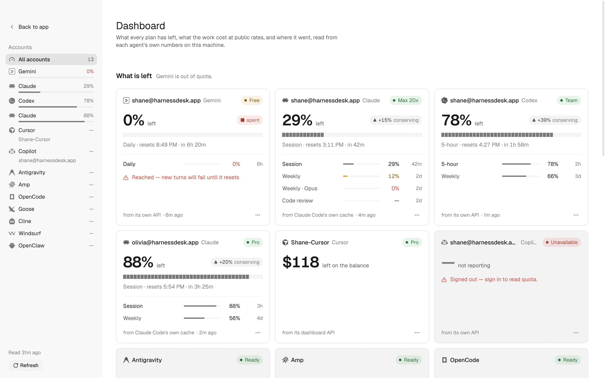

# Usage — the dashboard across every plan

*Design, 2026-08-23. Revised 2026-08-28: the optional CodexBar bridge is gone,
and every number on this screen is now read by HarnessDesk itself. Revised
2026-09-06: the charts. A shared chart kit, a burn-down band, spend split by
the agent that spent it, and comparison periods — all four of them facts the
screen already held and drew away.
The prior art was [CodexBar](https://github.com/steipete/CodexBar), which
solved the hard half — where the numbers come from — for 69 providers. What was
learned from it is the accounting; the surface is our own, because a menu-bar
popover and the window the work happens in are not the same problem.*

## The question

When you run four agents, you have four plans, four reset clocks and four bills,
and the one that ran out is never the one in front of you. Quota used to be
buried in settings panes you never opened before sending a turn, or missing
entirely.

So three questions, in the order you actually ask them:

1. **Can I start this turn now, and on which agent?**
2. **When does it come back?**
3. **What did it cost, and where did it go?**

One screen answers all three. Two smaller surfaces answer the first question
where you actually make the decision — in the conversation header strip, and in
a notification.

## The unit: a lane

Every metered plan is a set of **lanes** — rolling windows with a used share
and a refill time — plus, sometimes, a prepaid **credit** balance and a
**spend** figure. One agent commonly has five: a 5-hour session, a weekly, a
weekly scoped to one model family, a code-review allowance, a routines
allowance.

**The binding lane is the one with the least left.** That is the number that
decides whether you can work, and it is the headline. A plan whose weekly is
exhausted cannot run a turn even though its session lane reads 0% used, so an
exhausted *longer* lane also gates the shorter one: the card promotes the
exhausted weekly as the headline with its later reset, while the session lane
keeps its own remaining share marked as held behind the spent window. Ties keep
the source's own order; a lane with no measurable percentage can only be the
headline when nothing else can.

```ts
/** One rolling allowance, as some source reported it. */
interface UsageLane {
  readonly id: string            // stable across refreshes: 'session', 'weekly:fable'
  readonly label: string         // the source's own wording, never ours
  readonly usedPercent: number   // raw; may exceed 100 — clamp only to draw
  readonly windowMinutes: number | null
  readonly resetsAt: number | null
  readonly resetText?: string | null   // when a source gives words, not a date
  readonly scope?: string | null       // "Fable", "code review" — what it limits
  readonly severity?: 'normal' | 'warning' | 'critical' | null  // if the source says
  readonly usageKnown?: boolean   // false → reset metadata without a usage figure
  readonly placeholder?: boolean  // true → synthesized to stand in for a missing lane
}
```

The last two flags exist because their absence is a lie. A source that gives a
reset time but no usage is not at 0%; a source that returns a zeroed session
window when there is no live session has not told us the session is fresh.
Both draw as *unknown*, never as full.

```ts
interface UsageReport {
  readonly runtime: RuntimeId
  readonly account: string | null        // one report per signed-in account
  readonly plan: string | null           // "Team", "Max", "Pro 20x"
  readonly lanes: readonly UsageLane[]
  readonly credits: UsageCredits | null  // prepaid balance, separate from lanes
  readonly spend: SpendSummary | null    // today / 30d, with provenance
  readonly reached: string | null        // set when a limit has actually been hit
  readonly source: UsageSource           // how we know — shown, not hidden
  readonly fetchedAt: number
  readonly staleAfterMs: number
  readonly error: UsageError | null      // stays on the row; never drops the others
}
```

Four facts travel separately and must never be collapsed, which is the rule
[`lib/limits.ts`](../packages/ui/src/lib/limits.ts) already keeps for one
agent: lanes, credits, *reached* (the only thing that means turns will fail),
and spend. A plan user who never bought credits has `hasCredits: false` and is
perfectly able to work.

## Where the numbers come from

Four tiers, cheapest first. The renderer knows none of this — it reads
`UsageReport`s. Vendor knowledge lives in the host, which is allowed to have
it; `check-layering.mjs` only forbids it above.

| Tier | Mechanism | Covers | Cost |
| --- | --- | --- | --- |
| 1 | Runtime adapter queries | Codex, live, already wired | free |
| 2 | A declared local file the agent already writes | Claude Code: `~/.claude.json → cachedUsageUtilization` — session, weekly, model-scoped lanes, plan, identity, `severity` | free, and watched on disk |
| 3 | A declared credential plus one HTTP call | Cursor (`state.vscdb` → `cursor.com/api/usage-summary`), Gemini (`~/.gemini/oauth_creds.json` → Cloud Code quota API), Copilot (device token in `~/.config/github-copilot/` → `copilot_internal/user`) | one request, cached |
| 4 | The local ledger — the agent's own transcripts | tokens and list-price cost per day, model and project: `~/.codex/sessions/**.jsonl`, `~/.claude/projects/**.jsonl` | one incremental scan |

Tier 2 is the discovery that makes this cheap. Claude Code caches its full
utilization payload — every lane, the reset times, the plan, the account, and
its own severity — in a plain JSON file it rewrites as it runs. No keychain
prompt, no token, no network, and HarnessDesk *runs Claude Code*, so the cache
stays warm on its own. A file watch is the whole implementation.

Tier 4 is where money comes from, and both corpora carry what is needed: a
Codex rollout records `token_count` events with input, cached, output and
reasoning counts — **and an embedded rate-limits snapshot**, which is a free
history of quota usage nobody had to poll for. A Claude transcript records
per-message `usage` with cache-creation and cache-read split out, the model, the
`cwd` and the git branch. Priced against a model table, that is spend by day,
by model and by project.

**One gap on tier 3, measured 2026-09-12.** The Copilot token this reads is
the one the editor plugins write. The Copilot **CLI** signs in with `copilot
login` and puts its token in the OS credential store instead, writing a file
under `~/.copilot` only where there is no keychain and the person consents —
so on a machine where only the CLI is signed in, `~/.config/github-copilot`
does not exist and the meter has nothing to read. A Copilot agent is bound to
this meter either way; it simply has no lanes to report until a road that
writes that file has been used. Nothing here will prompt for keychain access
to close the gap.

**Read-only, always.** HarnessDesk never writes to another application's
credential file, config or cache. It reads to answer one question and keeps
its own copy of nothing but the ledger.

**Cursor reports no tokens, and its request counter is dead.** Its live surface
is `GET /api/usage-summary`, and that payload has no token or request counts in
it at all. The old `GET /api/usage` still answers, with
`{ numRequests, numRequestsTotal, numTokens, maxRequestUsage, maxTokenUsage }`
— but on a current Pro account it reads `numTokens: 0`, `maxTokenUsage: null`,
and `numRequests: 500` of `maxRequestUsage: 500`, pinned at the retired
500-fast-request quota while the same account's live figure is 6% used. It is a
vestigial field, so it is not drawn: a saturated dead counter on a card is the
same class of mistake as the cents that say 99.95% when the dashboard says 6%.
What Cursor *does* say it has spent is the on-demand budget, whose
`used + remaining = limit` and which therefore can be believed on both halves;
that is where the card's `$39.34 used · $10.66 left` comes from. The remaining
POST dashboard endpoints (`get-filtered-usage-events`, `get-user-analytics`)
answer *Invalid origin for state-changing request*, and defeating a vendor's
CSRF guard to read a number is not a thing this desk does.

## What honest costs money to say

A subscription has no per-token bill, so any figure we show is a *list-price
equivalent*: what this month's tokens would have cost at public API rates. That
is a genuinely useful number — it is how you decide whether a plan is
worth keeping — and it is not an invoice. So every total carries its provenance
and coverage in a single summary sentence:

- **Provenance** — `List-price equivalent`, `Plan metered`, or `Metered and
  list-price` when a window mixes both.
- **Coverage** — `16 of 30 days scanned`, and `44 of 30,052 calls carry no
  public price`. An unpriced model is counted as unpriced, never as `$0`.
- **Freshness** — when the scan last ran, with progress while it runs. Three
  gigabytes of rollouts is a real scan, so it is incremental and cursored: each
  file is read once, keyed by path, size and mtime.

Pricing resolves user overlay (`~/.harnessdesk/pricing.json`) → models.dev
(24-hour cache at `~/.harnessdesk/cache/model-pricing.json`). No rates are
bundled: a wrong price is worse than no price, so an unknown model stays
unpriced rather than inventing a rate.

## The screen

One full-window surface called **Dashboard** — the name the sidebar row, ⌘K,
the account menu, the menu-bar item and the window's own title all use. *Usage*
stays the word for the figures themselves: an agent's usage section in
Settings, the usage-source preference. The screen is wider than that, which is
why it is not called it. Reached from the sidebar, from ⌘K (⌘U), and from any
of the smaller surfaces below. Three bands in one scrolling column, and a rail
down the left that lists the **accounts** — clicking one scopes every band to
it.

<p align="center">
  <picture>
    <source media="(prefers-color-scheme: dark)" srcset="images/app/dashboard-dark.png" />
    
  </picture>
</p>

**Why the rail lists accounts.** It listed the three band names for a while,
which produced three rows that looked like tabs and only scrolled a page that
mostly does not scroll — and the thing you actually come here to do, look at
one account, was a segmented control wedged into the first band's header. The
rail is now the scope: one row per account, each carrying its own figure and a
3px meter, so the rail answers "is anything low" before you have read a card,
and clicking a row narrows the whole page — cards, money and history alike.
The band names take over the "where am I" job by sticking to the top of the
page as you pass them. The accounts you have switched off sit under **Not
tracked** at the bottom of the same rail, each offering to be tracked again;
that is where the strip of chips under the cards went.

**Why cards and not a table.** A table sorts well and reads badly: the binding
number, its reset, its pace and its bar are one thought, and splitting them
across columns makes the reader assemble them. Cards also degrade honestly —
an agent with no meter is a card that says why, which a table row cannot do
without an empty cell that reads as zero.

**Why ordered by least left.** Alphabetical order optimises for finding a
known agent; you open this screen because something is about to run out.
The agent that is about to bite comes first, and an agent with nothing to
report sorts last.

**The card, rule by rule.** Each of these is a bug that was found the hard way
somewhere and is cheaper to design out than to fix:

- The headline says **"left"** in the word beside it. A bare percentage next
  to a bar is ambiguous, and a display preference silently flips it.
- **One scale per card.** Every figure and every bar on a card means what is
  left. The card used to answer `10%` at the top and `24% used` two lines
  down, and a reader had to convert one into the other to see which window was
  the one that bit.
- **The headline is a promotion, not a second number.** Under the bar sits a
  table of every window the source reported — name, its own small meter, what
  is left, when it comes back — and the big figure is whichever row of that
  table has least. Which is why the promoted row is still in the table.
- Which window the headline belongs to, and both forms of its reset, are one
  line under the bar: `Weekly · resets Wed 6:00 PM · in 2d 9h`. Table rows
  carry only the short form; a reset already in the past prints nothing rather
  than counting up.
- Lanes that do not fit collapse into `+N more`, counted against **every** lane
  the source reported, not against the subset the card chose to draw.
- A lane with `usageKnown: false` draws a dashed track and no figure. A
  `placeholder` lane is not drawn at all.
- Tone comes from what is left: ≥20% neutral, <20% amber, ≤0% red — overridden
  by the source's own severity when it gives one.
- **At most one line of prose, and only when something needs saying in words.**
  A card used to stack five sentences at one size — the reset, one per lane,
  the overflow, the balance, the pace and the spend — and a column of
  unrelated sentences at one weight is what a log looks like. Everything with
  a number in it now has a column; what is left is the caveat, and there is
  only ever one: the error, or the block, or the gate, or the spent model, or the
  balance on top of the plan, or the pace.
- **Pace is a badge in the header, not the card's one line.** It spent a
  release as the *last* of six candidates for that line, which meant the only
  card that ever showed it was one with nothing else wrong — the opposite of
  when it matters. It is a standing rather than a sentence, so it wears the
  same shape a standing wears everywhere: a glyph, a signed margin, a word.
  `▲ +14% conserving`, `▼ −33% over pace`, `■ spent`. The margin is what is
  left *above* the sustainable rate, so its sign matches the picture in the
  band below: positive is above the diagonal. It is suppressed for a window
  that has barely opened, where the arithmetic is noise, and it takes no tone
  until the burn will actually cost something — a lane at 8% left is already
  amber, and a second amber thing on the card saying the same would be one
  fact wearing two alarms.
- The card's line of prose is then only the *consequence* the badge cannot
  state: `At this rate it runs out in 12h 36m — before the window resets.`
  The two ran together for a while — `−33% over pace` beside `33% ahead of
  pace · runs out in 12h 36m` — which is one number in two vocabularies, and
  a reader has to check whether they agree before deciding to ignore one.
- **The headline's meter is a countable budget**, forty segments rather than a
  continuous bar: a smooth bar reads as a percentage and a segmented one reads
  as a budget being spent, which is the thing being drawn. It still fills with
  what is *left*, it still lights at least one segment while anything remains,
  and a lane nobody reported is drawn hollow rather than as zero.
- Money is optional and clearly derived, and it is no longer a line on a
  metered card — the band below is the whole answer to "what did this cost".
  An agent with a ledger and no meter still gets a card, and there the money
  *is* the headline: `$5.60 spent in 30d`, with no meter under it, because an
  empty track reads as "nothing left".
- The footer names the source in plain words and how old it is, and ends in a
  `⋯` holding the two things you can do about this account — refresh it, or
  stop tracking it. A number whose provenance is hidden is a number nobody can
  act on.

**The headline is the account, not a model.** When a source reports both
account-wide windows and model-scoped ones, the binding lane is chosen from the
account-wide lanes only, and the scoped ones stay in the list below. The reason
is that a spent model is not a spent account: Claude Code's Fable window can sit
at 0% all week while every other model answers normally, and a card headlined
`0% left` would send you to another agent you do not need. The scoped fact
still gets said, in one line under the bar — *Fable is spent — other models
still work* — and only an account-wide limit turns the card red, raises the
banner, or counts as an exhausted agent in the line at the top.

**How far back the money goes.** The spend band picks its own window: a week is
what you are spending now, a month is the cycle most plans bill on, and a quarter
is the one that shows a habit. Everything in the band follows the choice — the
total, the chart, the coverage line, and the ranked rows below it. Asking for
more days than the ledger has scanned is not an error; the line under the chart
says how many of them it actually holds, and past six weeks the columns close
ranks because at that width the chart is a shape rather than a row of days.

**The chart stands on a rule and spans the band**, with its first and last day
named under it. Floated beside the total with no baseline, no scale and no
dates, it was a shape with nothing to measure against — a stray widget rather
than a month.

**It is split by agent, because the ledger already knows.** Every `LedgerDay`
names the runtime that spent it, and the band summed that away into one grey
column — so a $40 Tuesday split three ways looked exactly like a $40 Tuesday
spent by one agent, and the ranked table underneath had nothing above it to
explain. The columns are stacked, keyed by the same tints the table below
uses, with a name-only key under the axis. A day with nothing spent draws no
column at all: the old chart gave every empty day a 2px stub, so a fortnight
of not working read as a fortnight of small spending.

**Hovering a day gives the app's own tooltip, not the browser's.** A `title`
attribute takes a second to appear, cannot hold a breakdown, cannot be styled,
and does not exist for a keyboard. The chart is one focus stop; ← and → walk
the cursor, Home and End jump to the ends, Escape puts it away, and where it
lands is announced. The whole series is also present as text, so the chart is
never the only copy of its own data.

**Shorter periods beside the total, and each with its change.** Today and the
last seven days sit under the window's own figure. A total with nothing beside
it cannot be read — $6,045 is either a quiet week or an alarming one, and only
the week before it says which. They are arithmetic on the days already loaded:
no wider scan, no second request. A period longer than the window is not
offered rather than being truncated into a smaller figure wearing a bigger
label, and a change is computed only where the whole earlier period is loaded
too. The window's own total is the headline above them and is never repeated
as a third tile.

**The comparison windows end at the last complete day, and today is its own
tile.** A day still running measured against a whole one falls every morning
and recovers by evening, which is a property of the clock rather than of the
spending. It is worst at one day, where the figure can be a tenth of what it
will be, and it is still a systematic understatement of up to a seventh over a
week — on a real account the seven-day change read −64% with the running day
included and −27% without it, and the difference is a spending drop that never
happened. So the multi-day windows drop the running day from *both* sides, and
today keeps a tile of its own with **so far** under it and no percentage,
because there is nothing it can honestly be compared against. The pair reads
correctly together: those two words are what tell you that the window beside
them is a finished one.

**Days are stepped by the calendar, never by 86,400,000 ms.** The host buckets
by *local* midnight, and local midnights are 23 or 25 hours apart across a
daylight-saving transition — so a chart that steps by a fixed day generates
keys an hour off and its exact-equality lookup misses every bucket at or
before the changeover. The failure is silent and total: those columns come
back as zero-spend days while the legend beside them, built from the raw rows,
still names every agent. A month of empty chart under a full legend, twice a
year, and nothing in the diff that caused it would look like the reason. The
host survives the same arithmetic in its range queries because there it is a
`from` bound, which tolerates being an hour out; a map key does not.

**Where it went shows shares, and draws them as parts when there are few
enough.** At six rows or fewer the band leads with a doughnut carrying the
total in its hole, and the rows are keyed by the same colour rather than
carrying a bar: the wedge already says the proportion, and two encodings of
one number invite the reader to check whether they agree. Past six the
doughnut is a stacked bar in a costume, so the rows keep their ranking bars
instead. The doughnut is drawn from every row in the window, not from the
twelve the table shows — a whole with a slice missing is not a whole.

**One sentence, not four chips.** What the figure is worth — where the price
came from, how many tokens, how many calls carry no public price, how many of
the requested days were scanned — is one line of prose with a quiet **Rescan**
at its end. Those four facts wore chip borders for a while, which made the
band's most important line look like a toolbar: a chip is a thing you can act
on, and none of them were. The same reasoning removed the `has unpriced` badge
from the ranked rows, where it repeated down a column until it stopped reading
as a warning and started reading as a category; it is a footnote under the
table now, counting the rows it applies to.

## Will it last

One band, and only when the rail is on one agent. The first screen is triage and
triage wants one figure per account; scoping to an agent *is* the question
"tell me more about this one", and this is the more.

Each of the account's windows gets a **burn-down**: what is left plotted
against what an even burn to the reset would have left. Four lines, and the
reading is in how they relate rather than in any one of them — the dashed
diagonal is the sustainable rate, the solid line is the account, the fine
dotted line continues its average burn to the reset or to the floor, and the
dot is now. Above the diagonal is headroom; below it is borrowing against the
rest of the window. That is the whole instruction and it needs no legend,
which is why the shape beats the sentence it replaces.

Beside it, the three figures you actually act on: what is left, when it comes
back, and whether it runs dry first — `Runs out in ~12h 36m` in danger ink,
`Ran out: already` if spent, or `Runs out: after reset`. When an agent holds
more than one signed-in account, each account gets its own cards with its
account name shown, and the per-account cap tightens from three windows to two
so the band stays a row of comparable charts rather than a list.

Everything on it comes from one value. `burn(lane, now)` in
[`lib/burn.ts`](../packages/ui/src/lib/burn.ts) returns the geometry — elapsed,
left, the ideal, the margin, the slope, where the projection ends and whether
it reaches the floor — and `pace()` is now a presenter over it rather than a
second calculation. Those four coordinates were always computed; they were
spent on eight words at the bottom of a card and then thrown away. **One
threshold governs everything a forecast touches**: below 5% of the window the
slope is a single sample, and the projection, the estimate and the verdict are
withheld together. The geometry is still returned, because the *shape* of a
barely-opened window is not a lie — only the prediction is.

The prior art is CodexBar's burn-down widget, which got the axes right. Two
rules of this app change it: a lane whose usage the source never reported has
no geometry at all rather than a line at 100%, and a reset further away than
one whole window is refused rather than drawn, because "now" would fall
outside its own axis.

## The marks, and where they live

Every chart on this screen is `design/ui/chart`, and none of it is written
here. The rule is the one the rest of the design system keeps: a screen may
not answer "what does a meter look like" for itself. Before this pass the
`Sparkline`, `Bars` and `Donut` in `design/ui/spark` existed and were used by
nothing but the design explorer, while the Dashboard, the header strip and the
composer popover each drew their own bar in their own stylesheet — three
answers to one question, and one of them (the composer's) pointed the other
way and said `% used`.

- `SegmentMeter` — what is left of one allowance, as a countable budget.
- `BurnDown` — whether it will last.
- `DayColumns` — a quantity per day, split by whoever spent it, with the
  tooltip and the keyboard cursor.
- `ChartFrame` / `ChartCard` / `ChartHead` / `ChartAxis` / `ChartKeys` /
  `ChartFoot` — the card around the figure, which is most of the work and
  almost none of the published examples.
- `PaceBadge` — a standing against an expected rate. Distinct from `Delta`,
  which reports a *change* between two readings and colours it by whether the
  change is welcome; a rate's sign carries no verdict of its own.

Colour follows the rule `design/ui/tone` sets: a series takes a **tint**
because "which agent" identifies, a meter takes a **tone** because "12% left"
judges. `tintsFor` assigns a set of series their hues at once — resolved across
every registered agent in the roster rather than only the active rows, so an
agent keeps one stable colour whether you view the full month or click into one
runtime.

## Switching an agent off

Not every registered agent is one you want measured. An account you keep for
one repo, a CLI you signed out of, a harness billed to someone else: its card is
noise, and asking after it costs a request every few minutes for an answer
nobody reads.

Each card carries a **Stop tracking** item in the `⋯` menu in its footer — it is
a decision made once, and a button standing on every card at all times would
compete with the figure the card exists to show. What it sets is the `usageOff`
preference, a list of agent ids, and the host reads that list on **every**
reading rather than at boot: the switch needs no restart, in either direction.

The important word is *asking*. A switched-off agent is filtered out of the
runtimes the usage service queries at all, so nothing is requested, no token is
spent, no credential file is read, and its limits report null — which takes the
agent out of the composer ring and the sidebar footer along with its card, its
row in the rail, its bar in the header strip, and the count in the line at the
top. Hiding the answer while still paying for the question would be the wrong
switch.

Two things deliberately stay. The agent is still listed, once, in a **Not
tracked** group at the foot of the rail, where the row is the button that brings
it back — a switch with no visible way back is a trap. And its spend stays in the
ledger, because the ledger is history read off transcripts already on this
machine, not a reading taken from an account: money that was spent was spent,
and quietly subtracting it from the total would make the total lie.

## The strip in the header

The screen answers *where do I stand* when you go and ask it. The header has to
answer the question nobody thinks to ask until it is too late: **is the agent I
am about to use still working?** It is the one piece of this that must be true
without being opened.

This began as one bar per metered agent, which made it a dashboard — and a
dashboard grows. The strip is inelastic and the session's name is the only
elastic thing in the header, so the fifth agent was paid for by the title of the
conversation you were in: four bars holding 240px while the name read
`ni.goog…`. Accounts make it worse than agents do, because one agent can hold
several, and a token for the whole roster is the only shape that does not grow.

So the strip holds **two facts and no more**, and it costs the same at forty
agents as at two:

**The anchor** — this conversation's own agent. It is not one of *n* bars; it is
the header's subject, and it is the only agent whose plan decides whether the
next Send starts. Fixed slot, first, never re-ordered, never folded away. With
no conversation open the selected agent stands in. If signed out, it displays a
sign-in button in accent ink, offering the one press that clears the blocker.

**The rest** — one token, of constant width, for every other agent: the mark for
*everyone*, and one figure. It says `3 out` in red when three of them are out,
otherwise the least left among them, otherwise how many there are. It carries
tone, because a bare `+5` would have to be opened before anyone could tell
whether it mattered, and that is the one thing chrome must never ask. Its panel
is the roster it stands for — one row per **account**, in roster order, plus the
agents with no bar saying what they are instead, so the count and the rows can
never disagree.

**Promotion.** An agent that is *out* and is not the anchor gets a chip of its
own between the two — the mark and the countdown, `2h` — because "Codex is out
for two hours" is a fact you act on and a number in a token cannot say who. Two
at most. The chips are an addition, never a subtraction: the token counts every
out agent whether or not a chip names it, which is what lets a narrower header
drop the chips without dropping a fact.

**The bar is the binding lane.** Not an average of an agent's limits — an
average reads "fine" on the morning the weekly runs out. The lane with the
least left is the lane that stops the work, so that is the lane on the strip,
and it is chosen by the same `bindingLane` the screen uses. The strip and the
screen cannot disagree, because they are the same arithmetic.

**Two accounts, one agent.** Lanes inside an account are conjunctive — every
window must have room — so the binding lane is the one with least left.
Accounts are the opposite: signed in to two, either one will run the turn, so
the account that decides is the one with **most** left, and an agent is out only
when every one of its accounts is. It is the rule already kept for a
model-scoped lane: a limit you can step around is not a limit on the agent.
`workingAccount` is that rule, and the menu bar takes it too — before it, both
surfaces used whichever report had arrived first, so which account they were
describing depended on a race.

**What a bar is made of.** The agent's mark, a 34px track filled by what is
*left*, and the figure. The mark identifies the agent without spending a word on
its name; the fill is read before any number is; the figure is what you
actually repeat out loud. Tone is what is left — ≥20% neutral, under 20% amber,
nothing left red. The card's tone also folds in pace, and the strip deliberately
does not: pace is a prediction, a 34px bar has no room to explain one, and an
unexplained amber on an agent with 71% left is noise. Colour on the strip means
a state; predictions live where a sentence can sit beside them.

**When it is out**, the figure is replaced by the countdown — `2d 1h`. Out of
quota is the one state where the percentage is not the useful number; when it
comes back is. The *track* turns red rather than the fill: a bar filled with
what is left has nothing to draw at zero, and an empty track reads as "no
reading" rather than as "none left".

**Only agents that report a lane get a bar.** An agent with no meter has none,
because a permanent row of dashes teaches people to stop looking. It is still
counted by the token and still listed in its panel, which is where "why is this
one missing" gets its answer.

**No account is the anchor's business alone.** The agent *this* conversation
uses says so in words, with the press that fixes it — it is the one thing that
stops the next Send, and it is never hidden at any width. Every other
signed-out agent folds into the token, because a name per signed-out agent is
the same unbounded row of chrome by another shape.

**The order never changes.** The strip is chrome you look at a hundred times a
day, and chrome that re-sorts itself is chrome you have to read every time. The
roster order stands, and the anchor's slot is fixed whatever it contains;
urgency is carried by colour and by the token's figure, never by re-arranging.

**Two widths, and each one folds rather than trims.** The header is the
container, so the strip gives way to the session's name in a narrow column even
on a wide screen. No width knows less than the widest does:

| Room | The strip shows |
| --- | --- |
| Wide | the anchor's bar and figure, up to two out-of-quota chips, the token |
| < 760px | the anchor and the token — the chips fold in, and the token was already counting them |
| < 520px | the same, with the anchor's figure only where it is under 20% |

Measured, not guessed: the strip is 279px with two chips and 154px without, and
those widths are the header's *content* box, which is what a container query
sees — about 28px inside the header's own width.

**Hover gives the card, click opens the screen.** The anchor's and a chip's
hover panel is that agent's lanes, its plan and its spend today — the same
`describeReport` view the card is built from, at a smaller size. The token's is
the roster. A click opens Dashboard scoped to that agent. Nothing on the strip
is a control: it cannot change anything, only tell you.

**It costs nothing to keep true.** The strip reads `snapshot.usage`, which the
host already pushes when a turn finishes or a watched file changes. The only
new cost is loading the reports once when the app connects, instead of on the
first ⌘U.

## The two smaller surfaces

**In the composer — nothing.** This was going to be a micro-meter on the agent
chip, appearing under 20%. The strip above makes it a second meter for the same
fact, two inches from the context ring, which is exactly the confusion the
original note warned about. The composer keeps the context ring — how full
*this conversation* is — and the plan lives in one place. The account menu in
the sidebar keeps its quota line, which now speaks for meter-backed agents too,
because that line is about the account you are looking at rather than about all
of them.

**As a notification.** Three events, deduplicated per agent, lane and reset
cycle, so a lane cannot warn twice in one window:

| Event | Surface | Says |
| --- | --- | --- |
| Crossed 80%, then 95% | Toast | how much is left and when it refills |
| Pace says it will not last | `Banner`, amber | when it will run out, and who else has runway |
| Reached | `Banner`, red | turns will fail; past sessions still readable |

**And the thing only this app can do.** When the agent in front of you is out
and another signed-in agent is not, the desk already knows both facts *and*
already has hand-off. So the banner is not a dead end —
it offers to move the conversation to an agent with runway, carrying the
summary, the transcript or the files changed. A menu bar can tell you that you
are out. Only the desk can do something about it.

## Refresh, without a poll loop

The desk knows when work happens, which is better information than a timer:

- A turn finishing on an agent refreshes that agent — for Codex the snapshot
  already arrives on the token-count notification, and for Claude Code the file
  it reads is rewritten by the run itself.
- File-backed meters are **watched**, not polled.
- Everything else: 2 minutes while the Dashboard is open, 5 minutes while any
  session is live, 30 minutes idle, and once on window focus after 5 minutes.
- A network meter is never refreshed for a screen nobody is looking at.
- Manual refresh, per card and for all, always available. A failing source keeps
  its last good reading with its age shown, and puts the error on its own card.

## Where the code goes

| Layer | What lands there |
| --- | --- |
| `packages/protocol` | types and contracts for lanes, reports, spend summaries, and ledger queries |
| `packages/server/src/usage/` | the meter registry, built-in meters, and refresh scheduling. Vendor specifics live here |
| `packages/server/src/ledger/` | incremental transcript scanners, pricing, and the SQLite store at `~/.harnessdesk/usage.sqlite` — zero new dependencies |
| `packages/ui/src/lib/usage.ts` | pure and unit-tested off React: binding lane, gating projection, pace, runway, tone, formatting |
| `packages/ui/src/components/Usage.tsx` | the screen. No brand strings, no runtime-id tests — names come from `RuntimeInfo.presentation`, meters from the report |
| `packages/ui/src/lib/plan-strip.ts` | what the header strip says: the anchor, the promoted chips, the token — a pure function of the snapshot and a clock |
| `packages/ui/src/components/PlanMeters.tsx` | the header strip, drawing what `describeStrip` decided |
| `packages/ui/src/lib/usage-alerts.ts` | when to speak: crossings between two readings, and the condition a banner states |

`RateLimits` stays as it is and becomes one meter among several, so nothing
that reads it today has to change.

## The bridge that was, and is not

A fifth tier once existed: an optional bridge that shelled out to the CodexBar
CLI for an agent no built-in tier could meter. It was off by default, asked
last, and silent when the tool was absent — but it was still a third party
standing between this app and a number it claims to report, and every agent it
was actually wired to already had a meter of our own. Removed 2026-08-28.
The four tiers above are the whole answer, and a new meter is a day's work
when someone wants one.

What it taught, kept as a rule for every meter here: only a window with a real
length or a real reset becomes a lane. DeepSeek's usage payload has a
"primary" with neither — its reset description is a dollar figure like
`$4.58 (Paid: $4.58 / Granted: $0.00)`, a prepaid balance wearing a window's
clothes. Drawn as a lane it would be a full-width bar at 0% on an account that
has no window to run out of, so it belongs in `credits`, and the card says
*pay as you go* rather than *not metered*.

## What this deliberately is not

- **Not 69 providers.** Five providers across four tiers, all of them ours. A
  new meter is a day's work when someone wants it.
- **Not a bill.** No figure here is presented as one, and the word "estimate"
  is on the screen, not in a tooltip.
- **Not a second history.** The ledger holds daily roll-ups, not transcripts.
- **Not networked.** Nothing leaves the machine. No sync, no telemetry, and no
  account emails in any log.
