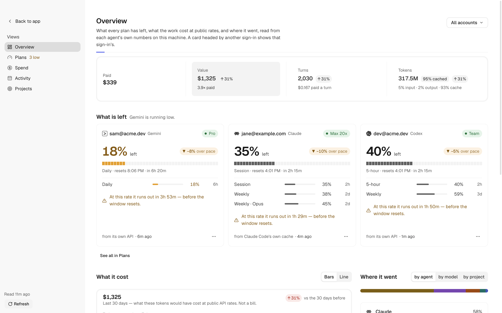

# Usage — the dashboard across every plan

*Design, 2026-08-23. Revised 2026-08-28: the optional CodexBar bridge is gone,
and every number on this screen is now read by HarnessDesk itself. Revised
2026-09-06: the charts. A shared chart kit, a burn-down band, spend split by
the agent that spent it, and comparison periods — all four of them facts the
screen already held and drew away.
The prior art was [CodexBar](https://github.com/steipete/CodexBar), which
solved the hard half — where the numbers come from — for 69 providers. What was
learned from it is the accounting; the surface is our own, because a menu-bar
popover and the window the work happens in are not the same problem.*

## The question

## Insight

Insight is the read-only historical companion to the account dashboard. It
reads the same agent-owned corpora at call or session granularity and carries
the source, observation time, price basis and missing fields with every total.
An unavailable value is **Unknown**, never zero. List-price equivalents are
estimates; agent-recorded vendor USD is labelled separately. Account balances,
quota windows and context occupancy are not attributed as spend.

Project and Goal views leave corpus rows without a unique historical Seat
unattributed. They never divide a total among Goals, rewrite receipts, or
append evidence. A comparison accepts only an explicit selected cohort with
compatible complete money observations on both sides.

When you run four agents, you have four plans, four reset clocks and four bills,
and the one that ran out is never the one in front of you. Quota used to be
buried in settings panes you never opened before sending a turn, or missing
entirely.

So three questions, in the order you actually ask them:

1. **Can I start this turn now, and on which agent?**
2. **When does it come back?**
3. **What did it cost, and where did it go?**

One screen answers all three. Two smaller surfaces answer the first question
where you actually make the decision — in the conversation header strip, and in
a notification.

## The unit: a lane

Every metered plan is a set of **lanes** — rolling windows with a used share
and a refill time — plus, sometimes, a prepaid **credit** balance and a
**spend** figure. One agent commonly has five: a 5-hour session, a weekly, a
weekly scoped to one model family, a code-review allowance, a routines
allowance.

**When a report has account-wide windows, the binding lane is the account-wide
window that leads the next decision.**
When account-wide windows are present and none is spent, automatic selection
uses the shortest reported account-wide window: it gives the near-term limit
the headline, even when a longer window has less left. A valid account pin to a
measured, live window takes precedence over that automatic choice. Any spent
account-wide window is a hard block and leads over a live shorter window or a
pin; when several are spent, the longest is shown because it is the hold that
cannot be stepped around.
Ties keep the source's order, and a window with no measurable percentage is
considered only when no measurable candidate exists. The card shows the lane
rows that fit and reports additional lanes as `+N more`. A lower longer-term
balance stays visible when its lane fits in those rows, even when the shorter
window is the headline. A spent model-scoped lane still cannot
speak for the account — see
[The headline is the account, not a model](#the-headline-is-the-account-not-a-model).

```ts
/** One rolling allowance, as some source reported it. */
interface UsageLane {
  readonly id: string            // stable across refreshes: 'session', 'weekly:fable'
  readonly label: string         // the source's own wording, never ours
  readonly usedPercent: number   // raw; may exceed 100 — clamp only to draw
  readonly windowMinutes: number | null
  readonly resetsAt: number | null
  readonly resetText?: string | null   // when a source gives words, not a date
  readonly scope?: string | null       // "Fable", "code review" — what it limits
  readonly severity?: 'normal' | 'warning' | 'critical' | null  // if the source says
  readonly usageKnown?: boolean   // false → reset metadata without a usage figure
  readonly placeholder?: boolean  // true → synthesized to stand in for a missing lane
}
```

The last two flags exist because their absence is a lie. A source that gives a
reset time but no usage is not at 0%; a source that returns a zeroed session
window when there is no live session has not told us the session is fresh.
Both draw as *unknown*, never as full.

```ts
interface UsageReport {
  readonly runtime: RuntimeId
  readonly account: string | null        // one report per signed-in account
  readonly plan: string | null           // "Team", "Max", "Pro 20x"
  readonly lanes: readonly UsageLane[]
  readonly credits: UsageCredits | null  // prepaid balance, separate from lanes
  readonly spend: SpendSummary | null    // today / 30d, with provenance
  readonly reached: string | null        // set when a limit has actually been hit
  readonly source: UsageSource           // how we know — shown, not hidden
  readonly fetchedAt: number
  readonly staleAfterMs: number
  readonly error: UsageError | null      // stays on the row; never drops the others
  readonly unverified?: UnverifiedUsage | null  // another sign-in's figures: drawn, never read as the agent's
}
```

Four facts travel separately and must never be collapsed, which is the rule
[`lib/limits.ts`](../packages/ui/src/lib/limits.ts) already keeps for one
agent: lanes, credits, *reached* (the only thing that means turns will fail),
and spend. A plan user who never bought credits has `hasCredits: false` and is
perfectly able to work.

## Where the numbers come from

Four tiers, cheapest first. The renderer knows none of this — it reads
`UsageReport`s. Vendor knowledge lives in the host, which is allowed to have
it; `check-layering.mjs` only forbids it above.

| Tier | Mechanism | Covers | Cost |
| --- | --- | --- | --- |
| 1 | Runtime adapter queries | Codex, live, already wired | free |
| 2 | A declared local file the agent already writes | Claude Code: `~/.claude.json → cachedUsageUtilization` — session, weekly, model-scoped lanes, plan, identity, `severity` | free, and watched on disk |
| 3 | A declared credential plus one HTTP call | Cursor (`state.vscdb` → `cursor.com/api/usage-summary`, plus `api/auth/me` and the legacy `api/usage` on a request-based plan only), Gemini (`~/.gemini/oauth_creds.json` → Cloud Code quota API), Copilot (device token in `~/.config/github-copilot/` → `copilot_internal/user`), Cline (`~/.cline/data/settings/providers.json` → `api.cline.bot` balance), DeepSeek Harness (`DEEPSEEK_API_KEY`, in the row's own environment or `${DSH_HOME:-~/.dsh}/.credentials.yaml` → `api.deepseek.com/user/balance`), OpenRouter (`OPENROUTER_API_KEY` in any agent's own environment → `openrouter.ai/api/v1/key` and `/credits`) | one request, cached (two more for a request-based Cursor plan; two for OpenRouter's pair of endpoints) |
| 3′ | The agent vendor's own CLI, asked for its own report | Antigravity (`agy --print /usage --output-format json` → Google's `retrieveUserQuotaSummary`, a weekly limit per group of models), Amp (`amp usage` → the credit balance) | one process start and one request, at most once a minute (Amp: every five) |
| 4 | The local ledger — the agent's own records | tokens and cost per day, model and project: `~/.codex/sessions/**.jsonl`, `~/.claude/projects/**.jsonl`, Gemini CLI's `~/.gemini/tmp/*/chats/*.jsonl`, Qwen Code's `~/.qwen/projects/*/chats/*.jsonl` (list price); OpenCode's `opencode.db` and Cline's `sessions.db` (the cost the agent recorded) | one incremental scan |

Tier 2 is the discovery that makes this cheap. Claude Code caches its full
utilization payload — every lane, the reset times, the plan, the account, and
its own severity — in a plain JSON file it rewrites as it runs. No keychain
prompt, no token, no network, and HarnessDesk *runs Claude Code*, so the cache
stays warm on its own. A file watch is the whole implementation.

Tier 4 is where money comes from, and both corpora carry what is needed: a
Codex rollout records `token_count` events with input, cached, output and
reasoning counts — **and an embedded rate-limits snapshot**, which is a free
history of quota usage nobody had to poll for. A Claude transcript records
per-message `usage` with cache-creation and cache-read split out, the model, the
`cwd` and the git branch. Priced against a model table, that is spend by day,
by model and by project.

**One gap on tier 3, measured 2026-09-12.** The Copilot token this reads is
the one the editor plugins write. The Copilot **CLI** signs in with `copilot
login` and puts its token in the OS credential store instead, writing a file
under `~/.copilot` only where there is no keychain and the person consents —
so on a machine where only the CLI is signed in, `~/.config/github-copilot`
does not exist and the meter has nothing to read. A Copilot agent is bound to
this meter either way; it simply has no lanes to report until a road that
writes that file has been used. Nothing here will prompt for keychain access
to close the gap.

**Antigravity, measured 2026-09-17.** The ACP server the desk runs (1.1.1,
Google's, proprietary) puts no quota on the wire, and keeps its Google token
in a keychain item (`gemini` / `antigravity-acp`) whose access list names only
its own binary — reading it would prompt, so it is not read. The `agy` CLI
beside it answers the question itself: `/usage` is one of the commands its
print mode runs without a model turn, and with `--output-format json` it
prints the structured payload it draws (`command.data.groups[].buckets[]`:
`window`, `remaining_fraction`, `reset_time`). The meter runs exactly that,
with two guards, because every other run of agy has side effects: it installs
its own updates in place — the first probe of `/usage` moved this machine from
1.2.5 to 1.2.6 — which `AGY_CLI_DISABLE_AUTO_UPDATE=true` turns off (the word:
agy ignores `1` and spawns its updater anyway), and it writes
a ~20 KB log into `~/.gemini/antigravity-cli/log/` per run, which `--log-file`
sends to the null device. A read younger than a minute is answered again
rather than starting agy after every turn of a busy flow.

Signed out is only what agy says it is. Measured with its ADC route forced
and no credentials, the JSON said "authentication failed or timed out" (which
a timeout also says) and stderr said `Error: authentication required. Run
'agy' to log in.`, the sentence Google's headless docs promise. That sentence
and two others of agy's own ("stored credentials are expired or revoked",
"You are not logged into Antigravity") are the whole match; anything else, a
503 from the sign-in service included, is an error.

**A meter that fails keeps what it had.** Until #769 a meter that threw was
dropped as silence however recently it had answered, so one 503 took a card
back to "no source available". It now keeps its last good reading, dated when
it was read, with the failure beside it — the rule a runtime's own figures
already had. With no earlier reading, a failure is still logged and no card.

The figures are **the agy CLI's sign-in**, not the ACP server's: the two sign
in separately (see the known-agents note), and neither says which Google
account it is, so the desk cannot tell whether they are the agent's. So they
are never treated as the agent's. The meter marks its reading `unverified`,
and the service files it under `UsageReport.unverified` rather than in
`lanes`. The Dashboard card draws it under its own name ("agy CLI sign-in",
"from the agy CLI"), with the chip still read from the report itself.
Readiness, the chip, the alerts, the header strip, the tray and Setup Desk all
reduce over `lanes`, which are empty, so a spent `agy` account can never mark
Antigravity out of quota or hide "Use this agent", and an Antigravity whose
own account is spent is not shown as ready on `agy`'s numbers either (review
of #769). The same goes for the two places a second round of that review
found. The Dashboard's rail row names the agent and nothing else, so it
answers from the agent's own lanes ("—" here), never from `unverified`. And
when `agy` fails, the failure is `unverified.error`, drawn in the card's note
beside its last good figures; `report.error` is the agent's own, and would
have turned the chip "Unavailable" over a source the agent does not depend
on. A bucket that is untouched reports a reset of
"now plus a week" that moves on every read, so a full bucket's reset is drawn
as no date at all. Every lane is scoped to a group of models — see the
headline rule below for what that does to the card.

**The rest of the roster, measured 2026-09-18.** Six agents read "not
metered" on the development machine: Antigravity (above), Amp, Cline, Gemini
CLI, OpenCode and Qwen Code. Each was checked in its own source for what it
can say, and each now says it:

| Agent | What it offers a client | What the card shows |
| --- | --- | --- |
| Amp | `amp usage` prints the balance in a short report its server writes (no JSON form); account lookups share a limit of 60 an hour with Amp's own. `amp-acp` forwards none of the SDK's per-message `usage`. | the balance, `$10.00 left`, re-asked at most every five minutes |
| Cline | Its CLI's account screen asks `api.cline.bot` for the user and the billed account's balance (micro-dollars), with the session in `providers.json`. Its ACP server drops the engine's `usage` event. Its `sessions.db` keeps each session's usage and `totalCost`. | the balance, plus the spend Cline billed |
| Gemini CLI | A Code Assist sign-in has a quota (the existing meter); an API key has none anywhere. Its chat logs carry tokens and model per call. | spend at list price |
| OpenCode | Zen's balance has no endpoint an API key can read (requested upstream, anomalyco/opencode#10448). Go's limits do: `GET /zen/go/v1/usage` with the Go key returns the rolling 5-hour, weekly and monthly windows (`status`, `percent`, `resetsAt`) — not read by the desk yet, for want of a Go subscription to measure against. It sends `usage_update` (context, session cost) and keeps each session's tokens and `cost` in `opencode.db`. | spend at the cost OpenCode recorded, a free model's `$0` included |
| Qwen Code | No quota endpoint. Its transcripts record `usageMetadata` per call. | spend at list price |

The token Cline's meter uses is **never refreshed**: refreshing rotates the
refresh token, and without writing the new pair back — which the desk never
does to another application's file — that would sign Cline out. Cline
refreshes it whenever it runs, including each turn the desk sends it; between
times the last reading stands with its own age. A second Cline account is
moved with `--data-dir` on the row, not an environment variable — Cline has
none for it — so the sign-in and the spend are both read from that folder
when the row carries the flag (round 3 review: the binding read only
`CLINE_DATA_DIR`, which a `--data-dir` row never sets, and missed it).
`CLINE_DB_DATA_DIR` still names the database on its own even then, exactly as
it does with no override: the two flags move different things, and a row can
set one without the other (round 4 review). Amp's meter, and the `amp`
binary it runs, read the row's own environment too, not the host process's —
a second Amp account moves the same way, through `PATH` (round 4 review: the
binding built a bare `AmpMeter()` and always asked the host's own `amp`).
And beneath every one of those variables sits the plainest one: a row that
isolates an agent with a bare `HOME` — the ordinary way, ahead of any of the
above — moves every one of these paths with it, `~` in `--data-dir` included,
because that is what the row's own process resolves `homedir()` to (round 5
review: each fallback still read the desk's own `homedir()` when the row set
only `HOME`, so a `HOME`-isolated row's sign-in and spend were the desk's).
The ledger reads OpenCode's
and Cline's databases the same way it reads nothing else: through
`readForeignDatabase`, which never guesses whether the owner is running. A WAL
database with no `-wal` or `-shm` beside it is opened `immutable` and the read
is checked afterwards (a plain read-only open would create both files in the
owner's folder, measured), and is discarded if the file changed meanwhile. One
with either file is copied, with its log, to a private folder and read there,
and the copy is trusted only if the source was the same before and after —
size and time, not bytes, so a rewrite landing on both by chance would be
missed; neither agent's writer does this. A database over 1 GiB that may be
open is refused rather than copied, so a very large store stays on its last
good rows rather than being copied whole on every scan.
Neither a leftover `-shm` (Cline's has outlived its run by weeks) nor a missing
one (an owner in exclusive locking mode has none) says anything about the
owner. Requests an agent priced and requests it did not are never summed into
one ledger row, so a row's cost and provenance are always one or the other.
Gemini CLI writes a message again as its counts
arrive and hides rewound ones without un-spending them, so a chat log is read
whole each time it changes, at the last record of each call. OpenCode's and
Cline's figures are session totals, so a session's spend falls on the day it
was last touched.

Where an agent records what it billed, that figure is the one used, and the
spend says so: `vendorMetered` for those rows alone, `mixed` beside list-priced
ones. A prepaid balance counts as usage reported in the line above the cards,
so an overdrawn Cline reads "Cline is out of credits." rather than "No agent
here reports plan usage."; its card says the balance waits for a top-up, not
a reset; and the Accounts rail shows the balance where a percentage would go.

**DeepSeek and OpenRouter, added 2026-09-26.** Two more sources that were
"doesn't report usage" until now, and the two shapes above (Balance, Metered
key) rather than a new one:

- **DeepSeek Harness** authenticates with a provider key, never a browser
  sign-in (`agent-registry.ts`'s `dsh` entry), so it is bound by runtime —
  the same way `agy_acp_server` is bound to Antigravity's CLI, above — never
  by a base URL check. `GET api.deepseek.com/user/balance`
  (https://api-docs.deepseek.com/api/get-user-balance) answers `{
  is_available, balance_infos: [{ currency, total_balance, … }] }`; a
  prepaid balance, so it is `credits`, never a lane, `billing.kinds:
  ['balance']`. An account can have more than one currency funded at once
  (CNY and USD both topped up) — those are never summed into one figure,
  since they are not fungible; the meter reports the one currency this
  screen can show (USD when it is funded, otherwise the first the response
  lists) rather than inventing a combined number. `is_available: false`
  reads as out, the same as a balance at zero. The key itself is read from
  wherever DSH's own process would read it — the desk's own stored copy
  first, then `DEEPSEEK_API_KEY` in the row's environment, then DSH's own
  store (`${DSH_HOME:-~/.dsh}/.credentials.yaml`, the file its "Models" page
  writes, or a `.env` beside it) — the same two files and the same order
  `whereSecretLives`/`readsKey` in `@harnessdesk/adapter-acp` already check
  for *presence*; this is the one place the *value* is read, and only to put
  it in a request header — never logged, stored beyond that read, or shown
  past its last four characters.
- **OpenRouter** is not an agent at all, so it is never bound by runtime: any
  agent this desk starts with `OPENROUTER_API_KEY` in its own environment
  gets this meter, filling the gap only where nothing stronger already
  answered (Cline's own balance stays Cline's, whatever key its model calls
  also carry). `GET openrouter.ai/api/v1/key`
  (https://openrouter.ai/docs/api-reference/limits) gives the key's own
  `limit`, `limit_reset` and `usage`; a key with a limit is a metered
  allowance — `unit: 'usd'`, `used`, `limit`, `layer: 'plan'`,
  `billing.kinds: ['metered']`, reset per `limit_reset`'s own period
  ("daily" | "weekly" | "monthly"), carried as `resetText` since it names a
  period, never a date. A key with no limit gets no lane at all: nothing
  invents a ceiling that key does not have. `GET
  openrouter.ai/api/v1/credits` (https://openrouter.ai/docs/api-reference/credits)
  gives `total_credits` and `total_usage`; the account-wide balance is
  `total_credits - total_usage`, `billing.kinds` gains `'balance'`. The
  account label this meter reports is its own key's last four characters,
  never OpenRouter's own `label` field, which can itself be shaped like the
  key it names.

Both meters treat a 401 from their vendor as the key or sign-in being wrong,
not a crash: `MeterAuthError` carries that through as `UsageError.needsSignIn`
— worth a card that says "sign in / check key" even with no earlier reading
to fall back on, unlike a plain outage, which stays silent until something
has answered once.

**Read-only, always.** HarnessDesk never writes to another application's
credential file, config or cache. It reads to answer one question and keeps
its own copy of nothing but the ledger.

**Cursor's live meter reports no tokens, and a leftover request counter is
stale, not live.** Its live surface is `GET /api/usage-summary`, and that payload has no
token or request counts in it at all. The old `GET /api/usage` still answers,
with `{ numRequests, numRequestsTotal, numTokens, maxRequestUsage,
maxTokenUsage, startOfMonth }`. On a dollar-cents account this counter is a
holdover from before the account moved onto its current plan: its own
`startOfMonth` names a cycle the summary's `billingCycleStart` has already
moved past, so drawing it as current would say the account is out of requests
when the dollar pool it is actually billed against says otherwise. It is
trusted only when it names *this* cycle — see the next paragraph — and skipped
otherwise. What Cursor *does* say a dollar-cents account has spent is the
on-demand budget, whose `used + remaining = limit` and which therefore can be
believed on both halves; that is where the card's `$39.34 used · $10.66 left`
comes from. `get-user-analytics` still answers *Invalid origin for
state-changing request* and is not read; `get-filtered-usage-events` answers
the same way to a request with no `Origin` header, which reads as a dead end
until it is added — that one header is not a CSRF bypass, and what it opens
up is below.

**A request counter can outlive its plan, and while it is current it is the
primary figure.** An account still on Cursor's older, request-quota tier is
billed against exactly this counter, whether or not `usage-summary` resolves a
percent at all: that percent, when it exists, measures a different pool
entirely — the dollar-denominated "included total usage" — so an account can
be out of requests and still read as mostly left on the summary's own number.
The legacy endpoint is therefore asked whenever the account is not unlimited,
never only when the summary has nothing to say, and its counter is trusted
only when `startOfMonth` names the current cycle: equal to the summary's
`billingCycleStart`, or, lacking one, within the last 31 days. A counter
naming an older cycle is the genuinely stale case from the paragraph above,
and is skipped. When it is live, it becomes the primary `unit: 'requests'`
lane — the card's headline and `reached` come from it alone — with the
summary's plan percent riding after it only as the comparable scale. Its
reset prefers the summary's own `billingCycleEnd`; lacking that, a calendar
month is added to `startOfMonth` instead, never a fixed count of
milliseconds, clamped to the target month's last day rather than rolled into
the one after when the start day does not exist there (the 31st into
September). On-demand spend, when this account has it, draws as its own
`layer: 'overage'` lane beside the request quota rather than folding into
`credits` — the two would say the same thing twice. On-demand spend, whichever
branch reports it, is also restated as `billing.overage.spent` — the one Paid
figure a metered Cursor plan owes (below).

**Cursor's tokens and Value come from a different surface: its own per-request
usage events, folded into the ledger rather than read live.** With the
`Origin: https://cursor.com` header a browser tab would send anyway,
`POST /api/dashboard/get-filtered-usage-events` pages an account's history at
1000 events a page, cookie-authenticated exactly like the meter, and never
needs anything wider than that one header. It is the one built-in scanner
whose source is a network call rather than a file this machine already has
(`packages/server/src/usage/cursor-events.ts`), because Cursor keeps no local
transcript at all (rule 3) — and because it is account-wide, one sync covers
every machine signed in to that account, not only this one.

Confirmed against the real endpoint, read-only, for a bounded window (never
recorded beyond the shape — rule 13): the envelope is `{
totalUsageEventsCount, usageEventsDisplay }`; an empty query answers `{}`; a
terminal page short of a full page can omit `usageEventsDisplay` while keeping
the count, which is what proves the page was the last one rather than an
empty stall. `tokenUsage` — `inputTokens`, `outputTokens`, `cacheReadTokens`,
`cacheWriteTokens`, `totalCents` — is Cursor's own API-rate estimate for that
event, and it is a **disjoint** shape: `inputTokens` excludes both cache
counters, the same as Claude's own usage block and unlike Codex's, where the
cached share sits inside `input_tokens`. That makes a cache-hit rate for
`cursor` the same formula every other disjoint-counter scanner already uses
— `cacheRead / (input + cacheRead)` — never the one measured shape this doc
used to leave undefined for Cline, before Cline's own normalisation was
measured too (see "Tokens" above).

`requestsCosts` is Cursor's own accounting of how many "requests" of a
request-based plan's quota one event consumed: a plain call reads `1`, a cheap
one can read a fraction of that, and a max-mode or otherwise expensive call
reads several — the read behind this paragraph saw values past 300 on a
single event. That is the meter's own unit (the legacy request counter's
`numRequests`, `docs/usage-dashboard.md`'s own Cursor meter section below),
never the ledger's: `LedgerRow.requests` is a call count, the same count
`SpendCoverage.priced` / `unpriced` partitions, so it would misread `requests`
as a fraction of a call or several at once. Every event this scanner keeps
counts as exactly one request, whatever `requestsCosts` said its quota weight
was; `requestsCosts` itself is read only to decide whether a tokenless event
is worth keeping at all. A small share of events carry no `tokenUsage` at all
(a non-token completion Cursor still bills for) — those are kept only when
`requestsCosts` is a nonzero weight, and dropped otherwise. An event whose
`kind` is `USAGE_EVENT_KIND_ABORTED_NOT_CHARGED` carries neither tokens nor a
cost and is skipped outright — not a zero-cost row, no row at all.

`tokenUsage.totalCents / 100` is Value — the agent's own price for the
tokens, `vendorCost` on the row, #992's rule — and it is never `chargedCents`,
which is what the plan actually deducted and belongs only to the meter's
`billing.overage.spent`, never the ledger. A row with no tokens at all is
never priced from the catalogue: the Ledger treats zero tokens as nothing to
price, not a free $0 call, so it stays unpriced regardless of `vendorCost`. A
token-bearing event with no usable `totalCents`, by contrast, falls through
to the catalogue's own list-price rate for its model when one exists — an
*estimate*, not a row left unpriced — and never shares a row with one that
already has a Cursor-reported price: the same split every other scanner keeps
between a request it can cost and one it cannot (`ledger/scan.ts`'s `add`).

Because the source is remote rather than a file, it is keyed as its own
"file" — `cursor-events:<hash of the account's own subject>`, never the raw
identifier or an email — and a re-sync **replaces** the days it just fetched
rather than adding to them: a day this machine already had rows for keeps
whatever the latest fetch says, and a day the account no longer has any
events for (one was deleted upstream) disappears along with it. It syncs
incrementally, from the day after its last successful sync minus one (for an
event Cursor files a little after the fact), at most once an hour, tied into
the same scan a `usage/ledger` read already starts rather than a poll loop of
its own — see "Refresh, without a poll loop" below. A first sync, with no
earlier one to resume from, reaches back ninety days: the account's billing
cycle would need a second network call to learn, and ninety days already
matches the bound `readInsight` holds every other source to, so Cursor's
ledger history starts no further back than the rest of this screen can
already promise to explain. `coverage.earliestDay` for the `cursor` runtime is
therefore the first day that first sync's window covered, not the account's
whole history — a day before it reads "no record yet", exactly as an agent's
own corpus does before its first line.

## What honest costs money to say

A subscription has no per-token bill, so any figure we show is a *list-price
equivalent*: what this month's tokens would have cost at public API rates. That
is a genuinely useful number — it is how you decide whether a plan is
worth keeping — and it is not an invoice. So every total carries its provenance
and coverage in a single summary sentence:

- **Provenance** — `List-price equivalent`, `Plan metered`, or `Metered and
  list-price` when a window mixes both.
- **Coverage** — `16 of 30 days scanned`, and `44 of 30,052 calls carry no
  public price`. An unpriced model is counted as unpriced, never as `$0`.
- **Freshness** — when the scan last ran, with progress while it runs. Three
  gigabytes of rollouts is a real scan, so it is incremental and cursored: each
  file is read once, keyed by path, size and mtime.

Pricing resolves user overlay (`~/.harnessdesk/pricing.json`) → models.dev
(24-hour cache at `~/.harnessdesk/cache/model-pricing.json`). No rates are
bundled: a wrong price is worse than no price, so an unknown model stays
unpriced rather than inventing a rate.

## The five shapes

Every figure on this screen is one of five things, and the rule is that they
never mix: nothing here adds a percentage to a dollar, or a token to a
request. `packages/protocol/src/usage.ts` is where each shape lives, typed so
a card can be built without naming the vendor behind it.

- **Capacity** — how much of a window is left. The one comparable scale is
  `UsageLane.usedPercent`; a lane may *also* carry the vendor's own unit
  (`unit`, `used`, `limit` — `'percent' | 'requests' | 'credits' | 'acu' |
  'usd'`) and which side of the plan it is on (`layer: 'plan' | 'overage'`),
  but the percentage is what makes two agents' lanes comparable at all, and
  it stays even where a source also gives its own unit.
- **Money, Paid** — cash that actually left an account: `billing.fee` (the
  plan's own recurring charge) and `billing.overage.spent` (metered spend past
  the included allowance). A `vendorCost` an agent reports for itself
  (OpenCode, Cline) is that agent's own price for the tokens, not necessarily
  cash that left the account — a bring-your-own-key or subscription seat can
  carry a `vendorCost` with nothing paid — so it is **Value**, not Paid.
- **Money, Value** — tokens priced at public API rates, a *list-price
  equivalent* and never an invoice — the whole of "What honest costs money to
  say" above.
- **Turns** — a plain count of person-or-agent prompts answered, never a
  percentage: `UsageReport.turns`, `{ count, unitsPerTurn, since }`. It was
  once framed only for a plan with no ceiling to show a ratio against — a
  request-based plan that *does* give one, Cursor's legacy tier
  (`numRequests` of `maxRequestUsage`), is still a **Capacity** lane instead
  (`unit: 'requests'`), because a real percentage exists to show — but the
  ledger's own turn count (below, "Turns") is independent of whether a lane
  exists at all, so it is now filled wherever the ledger knows it, lanes or
  not. `unitsPerTurn` is null where the source does not say what a turn is
  worth against its own unit — see "Turns" for the three cases — and `since`
  bounds what the count covers — never assumed to be the plan's whole
  lifetime.
- **Tokens** — the ledger's own count, split into what a model is actually
  billed for: `LedgerRow`/`LedgerDay`'s `input`, `output`, `cacheRead`,
  `cacheWrite`, `reasoning` and `requests`, and `LedgerReport.totals` for the
  same six across the whole window. `tokens` (and `totalTokens`) is
  `input + output + cacheRead + cacheWrite` — reasoning is already inside
  `output` for every scanner in `ledger/scan.ts`, so it is never added a
  second time, only kept so a caller can say "of which N reasoning" without
  a second total that could disagree with the first. All five scanners here
  — Codex, Claude, Gemini/Qwen, OpenCode and Cline — normalise `input` to
  exclude the cache before it is stored, so a cache-hit rate is always
  `cacheRead / (input + cacheRead)` — the share of the *input* side that came
  from cache — never `cacheRead / tokens`, which would dilute it with output
  that was never a candidate for the cache at all. Cline was the last to be
  measured: its `metadata_json.usage.inputTokens` is the full prompt Cline's
  own SDK normalizes every provider format to (Anthropic, OpenAI,
  OpenAI-compatible and Cline's own default gateway alike — its provider
  adapters, and its own `sdk/packages/core/src/services/usage.ts` doc
  comment, say so plainly),
  cache reads *and* cache writes both folded in, with nothing in
  `sessions.db` naming which format a given session used. Since the fold-in
  is not format-specific, `scanClineDatabase` nets out both fields from every
  session rather than guessing a format from data that does not carry one.

`UsageReport.billing.kinds` names which of these a plan actually has —
`'windows' | 'allowance' | 'balance' | 'metered' | 'free'` — as a set, because
a plan can be more than one shape at once (a Codex plan is `windows` for its
lanes and also `balance` the moment it carries prepaid credit). Every reader
that can say cheaply now does: Codex and Claude Code are `windows`; Codex adds
`balance` when its prepaid credit is actually on, and Claude Code adds
`metered` when its extra usage is — spend against a monthly cap, the same
shape as Cursor's on-demand, not a prepaid balance. Cursor is `allowance` —
true of its dollar-cents plan and of its legacy request quota alike — plus
`metered` when on-demand spend is enabled; Copilot is `allowance`; Amp and
Cline, which report only a prepaid balance and no window at all, are
`balance`; a Gemini Code Assist sign-in is `windows`. Antigravity's
own quota is never in this shape at all — it arrives through `agy`, filed
under `UnverifiedUsage` rather than `lanes` because the sign-in cannot be tied
to the agent's own account (see `UnverifiedUsage`), so it has no `billing` to
fill — and OpenCode's Go tier has no reader yet (`bootstrap.ts`'s
`localUsageFor`). Reading `earliestDay` into the heatmap is still open — see
the field comments in `usage.ts` for exactly what each kind may never be
collapsed with.

`SpendCoverage.earliestDay` is the other new field here, and it is not one of
the five shapes — it is what makes **Tokens** honest on a calendar. It is the
earliest day the ledger has *any* row for, unwindowed — not a scan horizon,
since the scan reads every file each time: a day before `earliestDay` simply
has no record and draws as "no record yet," while a day at or after it with
no row had no recorded use (for session-total runtimes — OpenCode, Cline —
whose whole session lands on the day it was last touched, a gap is not proof
the agent was idle throughout). `daysCovered` answers "how much of the window
I asked for came back"; `earliestDay` answers "how far back does this
agent's history go at all," and the two are read for different questions.

## Turns

A **turn** is one prompt — a person's, or another agent's — answered by the
agent: one user message and the work until the agent's reply ends. It is not
an API request — one turn is routinely several requests, a tool call and its
retries included — and it is not a tool call. It is also not a report a
background task hands back on its own, with nobody having asked it anything
just now: Claude Code's own `<task-notification>` lines, a subagent's inline
report, and their equivalents on every other runtime are excluded on purpose
(owner decision, 2026-09-26) — the model may well answer one, but nobody
prompted it, so it is not the number a plan's per-turn rate is priced against.
The ledger keeps the count beside tokens because the two answer different
questions: tokens say what a window cost, turns say how much was actually
asked of it, and a plan that bills by the turn (or that gives no other honest
denominator) needs the second number on its own.

**Where a count comes from, per runtime.** Two sources, never both for the
same agent:

- **The agent's own transcript, where a turn boundary is readable in it.**
  Four of the six scanners in `ledger/scan.ts` have one:
  - **Codex** — a `turn_context` record, written once per turn ahead of the
    exchange it introduces, and distinct from `session_meta` (once per
    session, never itself a turn). It carries that turn's own model, so the
    count lands on the same row its tokens will, with no lag. A `turn_context`
    written directly after a `compacted` record is compaction settling back
    in, not a new prompt, and does not count — a flag set on `compacted` and
    cleared on the next `turn_context` carries this across an incremental
    scan's own resume boundary (`contextBefore`), so a scan that picks up
    mid-file right after a compaction still knows it.
  - **Claude Code** — a `type: 'user'` line whose content is not entirely
    `tool_result` parts, and not one of several other shapes Claude Code
    itself writes to a `user`-role line that nobody actually typed:
    `isSidechain: true` (a subagent's own transcript line — every line under
    `subagents/*.jsonl` carries this, so a subagent's turns are excluded with
    no separate file-level filter, while its tokens still count), `isMeta:
    true` (hook context, a caveat, a slash command's own expansion), `isCompactSummary:
    true` (the session's own note that it continued from a compaction), text
    starting with `[Request interrupted` (a turn nobody finished), and text
    containing `<local-command-stdout>`, `<local-command-stderr>`,
    `<local-command-caveat>` or `<task-notification>` (a local command's own
    echo, or a background task's report). This mirrors the replay sieve's own
    boundary — `classifyReplayed` in `packages/claude-acp/src/bridge.ts` —
    which already treats every one of these as a notice or drops it outright;
    the predicate is kept in step with it by hand, since the server does not
    import `claude-acp`. Consecutive surviving lines with no model call
    between them are one turn, not several, so a slash command's own line and
    its expansion count once, and a local command's line simply merges into
    the real prompt that follows it. Filed under the model of the *next*
    reply this scan pass sees — the one that actually answers it — not the
    one before it.
  - **Gemini CLI and Qwen Code** — a `type: 'user'` record, the same "next
    reply" filing as Claude's. Gemini CLI additionally excludes a `type:
    'user'` record whose content is entirely `functionResponse` parts — a
    tool result handed back to the model, the same thing `tool_result` is for
    Claude's transcript. Qwen Code never writes that shape under `type:
    'user'` at all, so it needs no equivalent exclusion.

  OpenCode's and Cline's databases keep only session totals — one row per
  session, not per message — with no message table read here, so neither has
  a turn boundary yet; their rows carry no `turns` at all rather than a
  guessed one. Reading a real message table, if one is confirmed in either
  agent's own store, is future work, not a guess made now.
- **The desk's own transcript, only where the agent's own history is
  unreadable at all** — `ledger/desk-turns.ts`. Today that means Cursor
  (rule 3, AGENTS.md: it keeps no local transcript of its own) and any ACP
  agent this desk has no scanner for at all. A stored session's own `turns`
  array already *is* the host's own segmentation of the conversation into
  turns, so this counts that array's length, one row per local day and
  project, with no tokens or cost — the desk did not watch what anything
  cost, only that a turn happened. Only a turn a prompt actually opened
  counts: one whose first item is a `userMessage`, or a `notice` that both
  opened a live prompt and was answered (`AgentSession.send(recordAs:
  'notice')` — a real prompt recorded as a notice so it never shows as the
  person's own words, still a turn under the definition above). A bare notice
  with nothing after it — a replay's own reconstruction of housekeeping, an
  interrupted turn nobody answered — is not a prompt anyone sent, and a
  message queued but never run has no stored `Turn` at all, so neither is
  counted. A turn a session reopen can only date *approximately* — the ACP
  adapter's own replay has no reliable `startedAt` for history it is
  reconstructing rather than living through, so it opens those turns with
  `startedAt: null` — is skipped outright rather than dated to the moment of
  the replay: `TranscriptStore.enrich` keeps the host's own previously stored
  `startedAt`/`completedAt` for a turn that pairs across a reopen, so a
  session recorded once, then reopened and synced again on a different day,
  never re-dates that turn to today and never counts it twice.

  **The no-double-count rule** is decided once, at wiring time, never
  detected per session: `bootstrap.ts`'s `localUsageFor` hands a runtime
  *either* a corpus from the list above *or* `deskTurns: true`, never both,
  and `host.ts`'s `bindUsage` only ever registers the desk-transcript source
  when the runtime has no corpus at all. There is exactly one place that
  decides which source counts a given runtime's turns, so there is no path
  by which both could run for the same one. `bootstrap-turns.test.ts` checks
  the invariant holds for every named CLI, not only the ones tested by hand.
  An agent this table has no entry for still gets `{ deskTurns: true }` from
  `localUsageFor`'s own default, so every unrecognised ACP agent is bound to
  the desk fallback rather than left with no usage source at all.

A runtime neither of these covers has `turns: undefined` everywhere it could
appear — `LedgerRow`, `LedgerDay`, `LedgerReport.totals`, `UsageReport.turns`
— read as "unknown", never as zero. `SpendCoverage.turnsKnownFor` lists which
runtimes in a given window are known at all, so a caller can say "turns known
for N of M agents" instead of drawing a silent zero for the rest.
`LedgerRow.turns` and `LedgerReport.totals.turns` go further: a row or a total
that mixes a turn-known runtime with one that is not is *also* left
`undefined`, because a partial count dressed as a whole one is the same lie a
missing runtime reading as zero would be — see `Ledger.#turnsIfKnown`.

**NULL is not a stale zero.** The `turns` column in the ledger's own SQLite
store is nullable, with no default. A row a turn-capable scanner actually
counted always carries a real integer (0 or more); a row from before turns
existed carries `NULL` instead, which the store's `since()` and every reader
above it treat as "never counted", not as a real zero — summing `row.turns ??
0` only ever applies to a row that is genuinely known. The migration that adds
the column resets every local corpus file's own cursor and deletes the rows
those cursors cover (never a remote source's own rows, which are never
tracked by a file cursor and simply re-cover their own window on their own
schedule), so the very next scan reads those files from byte zero and refills
both their tokens and their turns honestly, rather than leaving a rescanned
total that quietly excludes whatever came before the upgrade. Between the
migration and that first scan finishing, `LedgerStore.turnsReady()` is false,
and a turn-capable runtime reads exactly as unknown as one this ledger was
never told about at all — never a real but too-low count read while the
rescan is still in flight.

**`UsageReport.turns.unitsPerTurn` prices one turn in the lane's own unit**,
computed in `usage/service.ts`, and needs at least ten turns in the window
before it says a rate at all — fewer is too thin a sample, and the count is
still reported with `unitsPerTurn: null`. `Ledger.turnsFor` also returns
`source: 'agent' | 'desk'`, and the rate is **exact, or not reported at all —
never an approximation** (owner decision, 2026-09-26):

- **`source: 'agent'`** (Codex, Claude Code, Gemini CLI, Qwen Code) — both
  sides of the rate come from the same transcript, which covers standalone
  use exactly as well as use through this desk, so dividing one by the other
  is always apples to apples:
  - **An allowance lane in requests** (none of these today, but the rule is
    general) — ledger requests over the same window the turn count covers,
    divided by turns.
  - **A balance or a metered key** — `Ledger.valueFor`, the same window
    `turnsFor` and `requestsFor` count (never `spendFor`'s own day-rounded
    window, which can cover a different number of days for the same
    `since`), divided by turns, in the report's own currency.
  - **A plain percent window** (Codex, Claude Code's plan lanes) — `null`.
    This needs a history of lane snapshots — how full the window was at two
    points in time — to say what one turn is worth against a percentage, and
    the host does not keep that history yet. The turn count itself is still
    real; only the rate is withheld.
- **`source: 'desk'`** (Cursor, and any unrecognised ACP agent) —
  `unitsPerTurn` is **always `null`**. The turn count is desk-only — exactly
  what ran through this session, on this machine — while everything else a
  meter has for the same runtime (Cursor's own request quota, its balance) is
  account-wide: another machine signed in to the same account, or the agent
  used standalone outside this desk at all, adds requests and Value the turn
  count never saw. Dividing one by the other is not a smaller-sample
  estimate, it is a number with no real relationship to the one being
  reported. Exact per-conversation attribution — matching Cursor's own usage
  events to a desk session by a shared conversation id, so both the numerator
  and the denominator are scoped to the same sessions, and dividing the
  matched requests (or Value) by the matched desk turns — was investigated
  for this change and is not done: the desk's Cursor ACP adapter keeps only
  its own local `chatId` (`packages/cursor-acp/src/store.ts`, minted by
  `cursor-agent create-chat`), and Cursor's usage-events endpoint
  (`usage/cursor-events.ts`) carries no session or conversation identifier at
  all in what this codebase reads from it today — there is nothing to match
  the two on. If that identifier is ever confirmed and read, the rate for a
  desk-sourced runtime should be computed only from the matched events and
  the matched desk turns, `unitsPerTurn: null` whenever the desk does not
  know the conversation id for a given event or none match — never a
  division of the full account-wide figure by this desk's own turns, which is
  the mistake this rule exists to rule out.

`since` is the current billing cycle when the binding lane's own reset says
one (`resetsAt` minus `windowMinutes`), else the last 14 days — never assumed
to be the plan's whole lifetime, and never a window shorter than a day, since
the ledger's own grain is a day; `Ledger.turnsFor` rounds `since` itself to
local midnight before counting, and returns that rounded value rather than
the raw one it was asked for, so a caller cannot end up reading a window that
starts earlier than what was actually counted.

## The screen

One full-window surface called **Dashboard** — the name the sidebar row, ⌘K,
the account menu, the menu-bar item and the window's own title all use. *Usage*
stays the word for the figures themselves: an agent's usage section in
Settings, the usage-source preference. The screen is wider than that, which is
why it is not called it. Reached from the sidebar, from ⌘K (⌘U), and from any
of the smaller surfaces below, landing on **Overview**. The window is the same
shell as Settings — a rail of rows down the left, each a real page — and the
rail lists **views**, not accounts:

1. **Overview** — the whole story on one screen: an accounts summary limited
   to what needs looking at first, a bento of what it cost beside where it
   went, and when it ran.
2. **Plans** — every account in one table, sorted by what is left, filtered
   by shape, expanding into its own shape's story; below it, whether it will
   last, the accounts not being tracked, and the agents that report nothing.
3. **Spend** — what it cost and where it went, full width, over 7, 30 or 90
   days.
4. **Activity** — when it ran, full width.
5. **Projects** — project usage, by Goal or by Agent.

<p align="center">
  <picture>
    <source media="(prefers-color-scheme: dark)" srcset="images/app/dashboard-dark.png" />
    
  </picture>
</p>

**Why the rail lists views, not accounts.** It listed one row per account for
a while, and that rail was carrying four jobs a plain list does none of well.
It **duplicated a list already a click away** — every account it named also
had its own card on the page, so the rail and the body said the same thing
twice. **Half its rows said nothing**: an account that had switched off
tracking, or had never answered who was signed in, sat in the rail wearing a
dash where a figure goes, next to rows that had a real percentage to show.
**Its one figure mixed units** — a plan's remaining share, a prepaid balance in
whatever currency the vendor kept it in, an em dash for "not metered" — three
different kinds of fact reading as one column, which is what a rail's "is
anything low" promise actually needs to be one thing to keep. And the rail's
meter was a **ragged second line**: present under a metered account, absent
under a balance or a dash, so the rail's own rows did not line up with each
other. Worst of all, the rail was **a filter dressed as navigation** — clicking
a row did not go anywhere, it narrowed the one page underneath it, which is
what a header control does, not what a rail does.

A rail of views has none of these problems: five rows, five real pages, an
icon and — on Plans alone, because it alone earns one — a count. **Scope moved
to the header** instead: an "All accounts ▾" control beside every view's own
title, built on the same `Popover` + `Menu` a card's own "…" already draws —
not a new select, which would be a second thing to learn — and lists one row
per runtime (scope is by runtime, not by account) alongside "All accounts".
Picking one scopes whichever view is open exactly as clicking that account in
the old rail did, and — unlike the old rail — the choice now survives a switch
between views, because it is one piece of state the window remembers rather
than five copies of "which page is this."
The accounts you have switched off sit at the bottom of **Plans**, each
offering to be tracked again; that is where the rail's own "Not tracked" group
went.

**Plans is a table now, not a card grid.** The grid was right for a handful of
accounts and wrong for the roster this screen was built to hold: read once
you have four or five of them, "one card per account" is a scroll before the
one that is about to bite is even on screen, and a grid cannot be sorted,
filtered or scanned the way a list of comparable rows can. `lib/plans-table.ts`
is where every rule below lives, pure and unit-tested off React —
`PlansTable.tsx` only draws what it decides.

**The shape filters are the page-per-shape idea without extra pages.** A chip
row above the table — `All · Windows N · Allowances N · Balances N · Keys N ·
Free N · Not reporting N` — each with its own count from `shapeCountsOf`, built
on the design system's `Segmented`. An account's primary shape is the first of
`billing.kinds` `primaryShapeOf` finds, in the fixed order windows → allowance
→ balance → metered → free; a report with no `billing`, no lanes and no
balance reads as `'none'` — "not reporting" — rather than falling through
silently. Picking a chip filters the table to that shape alone; "Not
reporting" also reaches every agent that has never answered at all
(`silentAgentsOf`), which the table has no row for regardless of the filter,
so those still show in the list underneath (see "Not reporting" below).

**One table, one row per account, least left first.** Alphabetical order
optimises for finding a known agent; you open this screen because something
is about to run out, so `sortRows` puts the account about to bite first — any
`'out'` row leads regardless of its percentage, then by what is left (a tie
breaks by status severity, then the soonest reset, then the runtime and the
account, so the order is stable across refreshes), then the shapes with
nothing measurable, `'none'` last of all. Built on `design/ui/table` — a real
`<table>`, with column headers (Account, Shape, Status, Left, %, Amount, ≈
Turns, Resets) and a disclosure `Button` in the row's first cell
(`aria-expanded`/`aria-controls`), not a `Button` standing in for the whole
row: a screen reader used to announce one long button name with a meter
nested inside it. A container query drops Shape, the bar, Amount and ≈ Turns
below about 640px, keeping Account, Status, % and Resets — "which one, how
bad, when." Each row carries the mark and name (`presentation.name` — rule 8,
never a runtime id), the account, a shape chip, a status chip
(`Ready`/`Low`/`Out`/`On overage`/`No limit`, from `statusOf`, which reads
**one** needs-attention rule — `reportNeedsAttention` (`lib/usage.ts`), the
same one Overview's "N low" count reads — never a second, disagreeing
judgement of whether an account is in trouble; the row and its expanded
body's own chip cannot say two different things because both are `statusOf`),
a "left" bar, its percent, the figure in the vendor's own unit ("312 of 500
requests", "$0.88 balance", "$22.40 of $50 budget" — or "—" rather than
"$0.00" when the spend behind a figure is unknown), an approximate turn count
("~97", only where `turns.unitsPerTurn` is known **and** the lane's own unit
is one a turn count can honestly divide — requests for an allowance, the
report's own currency for a balance or a key's budget — never for a plain
percent window, which has no rate to approximate with), and the binding
lane's own reset. Enter, Space or a click on the disclosure expands the row
in place into that account's own shape body, drawn as a full-width row of its
own; Escape collapses it, whether focus is on the row or inside the body
itself (moving focus back to the row's own button); one is open at a time.

When the account provides its own activity history, the expanded Plans row
adds an **All machines** band: its daily token counts cover the account across
every machine, so the 30-day total can exceed the figures above, which come
only from this machine's transcripts.

**Each shape's bar means something different, because the shapes are not the
same kind of fact.** Windows and Allowance draw the binding lane's own percent
left — the same figure the card's headline promotes. Balance has no window at
all, so its bar is a **runway**: the balance divided by the mean of the
window's own non-zero days, plotted against a flat 30-day scale — a fresh
account with no spend history yet draws no bar rather than a false "plenty."
Key draws what is left of a person's own budget, when one is set, and no bar
at all without one — a vendor limit is not this account's own cap. Free draws
no bar, ever: there is nothing in it to run out of, and an empty track would
say the opposite of what the row means.

**The six shape bodies share one frame** — mark, name, account, plan chip,
shape chip and status chip in the header; source, age and one action in the
footer; a Value · Fee row where `moneyRowOf` has one. This row shows only
what this PR decides: **Value** is `spend.windowCost`, the ledger's own
figure for the runtime, never drawn as `$0.00` when it is unknown ("unpriced"
instead); **Fee** is the plan's own recurring charge exactly as set — "$20.00
a month · you set this" for a person's own figure, or a "Fee not set" link to
the account's own Plan card in Settings when none is. **Paid** — the fee
prorated across the window, plus overage only when it applies to this period
— is a follow-up: `paid.ts` (#1068, in this package's own `lib/`) owns that
definition, and this row
does not compute a second one that could disagree with it (an earlier
version of this row added the whole `fee.amount` regardless of period,
always added overage, and divided by a window of a different length than the
fee's own — none of which survived review). **Windows** reuses the existing
card body verbatim — the binding-window headline, its segmented meter, the
pace badge, the lanes table, "Then: extra usage" — `Card` (`shared.tsx`)
gained two additive slots, `shapeChip` and `moneyRow`, for exactly this
rather than being redrawn. **Allowance** headlines in the vendor's own unit
("312 of 500 requests left"), an "≈ 97 turns" chip beside it, the lanes by
layer — plan, then overage, with on-demand shown as the next layer only when
there is no overage lane of its own to repeat ("off", or what it has spent)
— and a per-turn row: units a turn, and the effective price of one unit when
the plan has a fee and the lane's own unit and reset cadence can honestly
bear that division (`feePerUnitOf`: `requests` or `credits` only, and the
fee's period has to match the lane's own cycle — never a `percent` or `usd`
lane, and never a yearly fee divided by a monthly limit). **Balance** is
"$12.10 left," the runway in days (the balance divided by the mean cost over
the days the report actually covers, zero days included, rather than only
the days something was spent — leaving idle days out overstated the draw),
and the daily rate; negative reads Out, with "top up to continue," and says
plainly when the history is waiting for its next reading. The host records
balance readings itself at most hourly, keeps them for 400 days, and the row
charts the last 30 local days. Its footer is "Refresh": no
adapter reports a real top-up URL today, so a "Top up ↗" that only refreshed
was a promise the row could not keep. **Key** is spend this month, the
budget bar when one is set (or "Spend not known yet" when it is set but the
spend behind it is not, never "No budget set." on an account that has one),
or "No budget · Set a budget on this account's Plan card in Settings," and
its footer — "Set a budget" or "Edit budget" — opens that Plan card, threaded
in as `onOpenPlanSettings` from `Usage` down to here (Settings › Runtimes,
focused on the agent — the closest existing door to it). **Free** is tokens
and turns this period and nothing else — no meter, ever, and no line
restating that in different words. **Not reporting** is not a shape body at
all: a row whose own `primaryShapeOf` is `'none'` expands into the same list
the section below draws for one entry, because there is no story past "here
is why, and here is the one fix."

**Placement, and why it costs the design audit nothing.** The five bodies and
the table itself are screen-owned — `components/usage/PlanFrame.tsx`,
`ShapeBodies.tsx`, `PlansTable.tsx`, `NotReporting.tsx` — beside
`PlansView.tsx`, `OverviewView.tsx` and the rest, all drawing from the one
`usage.module.css` a screen family already owns. They were tried one level
deeper, in a `plans/` subfolder, first: `script/design-audit.mjs`'s
`ownsStylesheet` only allows a screen file to reach its own
`<Name>.module.css` or the one named after its *immediate* parent folder, and
`plans/` answered to neither, so it read as one screen reaching into
another's stylesheet. Flattened beside the other `*View.tsx` files, it reaches
`usage.module.css` the same way they already do. The row's hover fill and the
money row's own inset are composed, not drawn — `Button`'s `variant="row"
size="table-row"` for the first, `CardContent` for the second — because a raw
`background`/`padding` declaration in a screen's own stylesheet is exactly the
appearance the design system already owns (`docs/design-system.md`; the audit
calls the family out by name). `node script/design-audit.mjs --strict` holds
this PR to the same count `main` already has.

**Not reporting.** One list, fed by two populations that read the same way:
an agent `silentAgentsOf` has never heard answer `runtime/account` (the fix is
signing in), and an account that answered but whose own `primaryShapeOf` is
`'none'` — a report with no billing shape, no lanes and no balance at all (the
fix is a refresh, in case the source simply has not caught up yet). Each row
is the agent's mark, its name, the reason, and the one fix — a button where
the person can act, a word otherwise. It is reachable through its own filter
chip and is drawn under the table whenever either population is non-empty,
independent of which chip is picked; the table itself has a row only for the
second population, since the first has no report to have a row from at all.

**The card, rule by rule** below still describes exactly what it always did —
Overview's own grid draws it unchanged, and so does the Windows shape body
above, reused rather than redrawn. Each of these is a bug that was found the
hard way somewhere and is cheaper to design out than to fix:

- The headline says **"left"** in the word beside it. A bare percentage next
  to a bar is ambiguous, and a display preference silently flips it.
- **One scale per card.** Every figure and every bar on a card means what is
  left. The card used to answer `10%` at the top and `24% used` two lines
  down, and a reader had to convert one into the other to see which window was
  the one that bit.
- **The headline is a promotion, not a second number.** Under the bar sits a
  visible lane list — name, its own small meter, what is left, when it comes
  back — and the big figure promotes the binding lane selected by the rule
  below. The promoted lane is included in the visible rows.
- Which window the headline belongs to, and both forms of its reset, are one
  line under the bar: `Weekly · resets Wed 6:00 PM · in 2d 9h`. Table rows
  carry only the short form; a reset already in the past prints nothing rather
  than counting up.
- Lanes that do not fit collapse into `+N more`, counted against **every** lane
  the source reported, not against the subset the card chose to draw.
- A lane with `usageKnown: false` draws a dashed track and no figure. A
  `placeholder` lane is not drawn at all.
- Tone comes from what is left: ≥20% neutral, <20% amber, ≤0% red — overridden
  by the source's own severity when it gives one.
- **At most one line of prose, and only when something needs saying in words.**
  A card used to stack five sentences at one size — the reset, one per lane,
  the overflow, the balance, the pace and the spend — and a column of
  unrelated sentences at one weight is what a log looks like. Everything with
  a number in it now has a column; what is left is the caveat, and there is
  only ever one: the error, or the block, or the gate, or the spent model, or the
  balance on top of the plan, or the pace.
- **Pace is a badge in the header, not the card's one line.** It spent a
  release as the *last* of six candidates for that line, which meant the only
  card that ever showed it was one with nothing else wrong — the opposite of
  when it matters. It is a standing rather than a sentence, so it wears the
  same shape a standing wears everywhere: a glyph, a signed margin, a word.
  `▲ +14% conserving`, `▼ −33% over pace`, `■ spent`. The margin is what is
  left *above* the sustainable rate, so its sign matches the picture in the
  band below: positive is above the diagonal. It is suppressed for a window
  that has barely opened, where the arithmetic is noise, and it takes no tone
  until the burn will actually cost something — a lane at 8% left is already
  amber, and a second amber thing on the card saying the same would be one
  fact wearing two alarms.
- The card's line of prose is then only the *consequence* the badge cannot
  state: `At this rate it runs out in 12h 36m — before the window resets.`
  The two ran together for a while — `−33% over pace` beside `33% ahead of
  pace · runs out in 12h 36m` — which is one number in two vocabularies, and
  a reader has to check whether they agree before deciding to ignore one.
- **The headline's meter is a countable budget**, forty segments rather than a
  continuous bar: a smooth bar reads as a percentage and a segmented one reads
  as a budget being spent, which is the thing being drawn. It still fills with
  what is *left*, it still lights at least one segment while anything remains,
  and a lane nobody reported is drawn hollow rather than as zero.
- Money is optional and clearly derived, and it is no longer a line on a
  metered card — the band below is the whole answer to "what did this cost".
  An agent with a ledger and no meter still gets a card, and there the money
  *is* the headline: `$5.60 spent in 30d`, with no meter under it, because an
  empty track reads as "nothing left".
- The footer names the source in plain words and how old it is, and ends in a
  `⋯` holding the two things you can do about this account — refresh it, or
  stop tracking it. A number whose provenance is hidden is a number nobody can
  act on.

**The headline is the account, not a model.** When a source reports both
account-wide windows and model-scoped ones, the binding lane is chosen from the
account-wide lanes only; scoped lanes appear in the visible rows when they fit,
and any others are included in the `+N more` count. The reason is that a spent
model is not a spent account: Claude Code's Fable window can sit at 0% all week
while every other model answers normally, and a card headlined
`0% left` would send you to another agent you do not need. When the source
reports a reached scoped lane and no higher-priority error, account-block, or
gate note applies, the card calls it out in one line under the bar — *Fable is
spent — other models still work*. An account-wide block, or an unresolved
source-reported `reached` lane, turns the card red, raises the banner, and
counts as an exhausted agent in the line at the top; a spent model-scoped lane
alone does none of these.

Among live account-wide windows, automatic selection leads with the shortest
window, not the smallest remaining percentage. The choice from #715 gives the
near-term window first position; the displayed lane rows below the headline
show each lane's own remaining share. For example, Session at 29% left leads
when Weekly has 12% left, while Weekly remains visible as the tighter amber
lane in this two-lane report. A valid account-level pin can choose another live
window. A spent account-wide window overrides both because it blocks work
regardless of the shorter window or the pin.

**With no account-wide lane, the scopes are alternatives.** Antigravity
reports a weekly limit for its Gemini models and another for its Claude and
GPT ones, and nothing for the account; Gemini CLI reports one per model. Same
rule, other shape: spent scopes are stepped around while any scope is not known
to be spent, and one of those alternatives becomes the headline. A spent lane
is shown in red with its reported reset, if any, when it fits among the visible
rows; otherwise it is included in the `+N more` count. The account is normally
out only when every scope is spent; an unresolved source-reported `reached`
lane is also treated as blocked. When every scope is spent, the scope with the
earliest reported reset time is the headline; scopes without one come last,
with source order breaking ties. (Until 2026-09-17 such a report was treated as
blocked by its tightest scope, on the stated assumption that no source had this
shape; Gemini CLI already did.) Seating an Agent asks
the same question, plus one: a candidate whose model has a spent lane of its
own is passed over for another (#778). A lane counts as the model's own when
its scope is exactly the model id, as Gemini CLI reports it; a scope that names
a group, like Antigravity's, matches no candidate.

**How far back the money goes.** The spend band picks its own window: a week is
what you are spending now, a month is the cycle most plans bill on, and a quarter
is the one that shows a habit. Everything in the band follows the choice — the
total, the chart, the coverage line, and the ranked rows below it. Asking for
more days than the ledger has scanned is not an error; the line under the chart
says how many of them it actually holds, and past six weeks the columns close
ranks because at that width the chart is a shape rather than a row of days.

**The chart stands on a rule and spans the band**, with its first and last day
named under it. Floated beside the total with no baseline, no scale and no
dates, it was a shape with nothing to measure against — a stray widget rather
than a month.

**It is split by agent, because the ledger already knows.** Every `LedgerDay`
names the runtime that spent it, and the band summed that away into one grey
column — so a $40 Tuesday split three ways looked exactly like a $40 Tuesday
spent by one agent, and the ranked table underneath had nothing above it to
explain. The columns are stacked, keyed by the same tints the table below
uses, with a name-only key under the axis. A day with nothing spent draws no
column at all: the old chart gave every empty day a 2px stub, so a fortnight
of not working read as a fortnight of small spending.

**Hovering a day gives the app's own tooltip, not the browser's.** A `title`
attribute takes a second to appear, cannot hold a breakdown, cannot be styled,
and does not exist for a keyboard. The chart is one focus stop; ← and → walk
the cursor, Home and End jump to the ends, Escape puts it away, and where it
lands is announced. The whole series is also present as text, so the chart is
never the only copy of its own data.

**Shorter periods beside the total, and each with its change.** Today and the
last seven days sit under the window's own figure. A total with nothing beside
it cannot be read — $6,045 is either a quiet week or an alarming one, and only
the week before it says which. They are arithmetic on the days already loaded:
no wider scan, no second request. A period longer than the window is not
offered rather than being truncated into a smaller figure wearing a bigger
label, and a change is computed only where the whole earlier period is loaded
too. The window's own total is the headline above them and is never repeated
as a third tile.

**The comparison windows end at the last complete day, and today is its own
tile.** A day still running measured against a whole one falls every morning
and recovers by evening, which is a property of the clock rather than of the
spending. It is worst at one day, where the figure can be a tenth of what it
will be, and it is still a systematic understatement of up to a seventh over a
week — on a real account the seven-day change read −64% with the running day
included and −27% without it, and the difference is a spending drop that never
happened. So the multi-day windows drop the running day from *both* sides, and
today keeps a tile of its own with **so far** under it and no percentage,
because there is nothing it can honestly be compared against. The pair reads
correctly together: those two words are what tell you that the window beside
them is a finished one.

**Days are stepped by the calendar, never by 86,400,000 ms.** The host buckets
by *local* midnight, and local midnights are 23 or 25 hours apart across a
daylight-saving transition — so a chart that steps by a fixed day generates
keys an hour off and its exact-equality lookup misses every bucket at or
before the changeover. The failure is silent and total: those columns come
back as zero-spend days while the legend beside them, built from the raw rows,
still names every agent. A month of empty chart under a full legend, twice a
year, and nothing in the diff that caused it would look like the reason. The
host survives the same arithmetic in its range queries because there it is a
`from` bound, which tolerates being an hour out; a map key does not.

**Where it went shows shares, and draws them as parts when there are few
enough.** At six rows or fewer the band leads with a doughnut carrying the
total in its hole, and the rows are keyed by the same colour rather than
carrying a bar: the wedge already says the proportion, and two encodings of
one number invite the reader to check whether they agree. Past six the
doughnut is a stacked bar in a costume, so the rows keep their ranking bars
instead. The doughnut is drawn from every row in the window, not from the
twelve the table shows — a whole with a slice missing is not a whole.

**One sentence, not four chips.** What the figure is worth — where the price
came from, how many tokens, how many calls carry no public price, how many of
the requested days were scanned — is one line of prose with a quiet **Rescan**
at its end. Those four facts wore chip borders for a while, which made the
band's most important line look like a toolbar: a chip is a thing you can act
on, and none of them were. The same reasoning removed the `has unpriced` badge
from the ranked rows, where it repeated down a column until it stopped reading
as a warning and started reading as a category; it is a footnote under the
table now, counting the rows it applies to.

**When it ran is a calendar, not a chart of the current window.** It sits
between "Where it went" and "Project usage", and it keeps its own ledger
query — 365 days, independent of the money band's 7/30/90 range — because the
question it answers, *when* did the work happen, is on a different clock from
what a rolling window can show: a month of columns cannot draw a streak or
name a busiest weekday, and a year of them would be a shape rather than a row
of days. **Year** draws 53 weeks by 7 days, Monday first, with month labels
across the top and today's cell ringed; **By agent** draws the last 13 weeks
as one row per agent, so a pattern that belongs to one agent does not have to
be read out of a shared column. Both read Tokens or Cost, and both follow the
rail's scope like every band here.

**By hour** groups this year's recorded tokens or calls by local weekday and
hour, Monday first; there is no cost figure at this granularity. A runtime
whose calls do not carry a local hour is unknown, not a week of zeros: until
any runtime is hour-known the grid says "No hours recorded yet", and partial
coverage names how many agents with ledger rows have known hours.

**Levels come from the data's own quartiles, not from `value / max`.** A
scale built off the single highest day makes every ordinary day look empty
the moment one huge day appears in the window — the outlier does not just
stand out, it flattens everything beside it. Splitting the non-zero values
into quartiles instead means the breakpoints move with the *shape* of a
year's work: the six ordinary days in a week still land somewhere above
empty, and the one unusual day is still the top of the scale, without erasing
the six.

**Three kinds of nothing, because a blank cell answers a different question
each time.** A **zero** is a scanned day the ledger genuinely has nothing
for — a weekend, a day off — and draws as an empty cell, level 0. **No
record yet** is a day before the ledger holds any row at all, which is not
"nothing happened" but "this screen cannot say" — the fixed ledger shape
(`LedgerDay`) carries no per-day scanned flag, so it is derived the same way
the money band's own coverage line is: the earliest day with any row at all
is treated as where scanning starts, and everything before it is hatched
rather than left blank. The label says "no record yet" rather than "not
scanned" for exactly that reason — the host has no scan-horizon field of its
own yet (`coverage.earliestDay` is a data-side follow-up), so this screen is
honest about a guess rather than claiming a fact it cannot back. And with
**Cost** selected, a day whose tokens were spent but whose cost reads as
nothing is marked the same hatched way rather than as `$0` — real usage the
ledger cannot price is not a free day, and `LedgerDay` has no per-day price
flag to say otherwise, so `tokens > 0` with `cost <= 0` on an
otherwise-scanned day is read as unpriced rather than free. The same honesty
applies to the facts card and the tooltip footer: a scope nothing in it can
be priced reads "unpriced", never `$0`.

**The ramp is the desk's own accent, not green.** A calendar heatmap reads a
quantity — *how much*, not *pass or fail* — and green is this app's own
verdict colour everywhere else it appears (`--hd-success`); using it here
would make a busy day look like good news and a quiet one look like a
warning, neither of which this band is claiming. Five tokens,
`--hd-chart-heat-0` through `-4`, each a deeper wash of `--hd-accent`, plus
`--hd-chart-heat-not-scanned` for the hatch — `design/foundation/tokens.css`,
never a literal in the component.

**The grid itself is `design/ui/heat-grid.tsx`.** One tab stop, and arrow
keys walk a cursor over the two axes: `ArrowLeft`/`ArrowRight` move a column
and `ArrowUp`/`ArrowDown` move a row, whatever a row and a column mean to the
caller — a week and a weekday in Year, a day and an agent in By agent.
`Escape` puts the cursor away and stops there, but only when one is active:
the same document-level Escape this window closes itself on must still reach
it when nothing is being pointed at. The tooltip is data handed to the grid —
a title, up to three agents, an overflow count, a total — rather than
pre-rendered markup, the same split `DayColumns` keeps for the money chart's
own tip; a band that composed the tooltip's borders and colour itself would
be appearance the design system already owns, drawn twice.

The arithmetic behind all of this — building a day by the calendar rather
than by a fixed millisecond step (the DST bug `lib/ledger.ts` already
documents), the quartile breakpoints, the current and best streak, the
busiest day and weekday — lives in
[`lib/heat.ts`](../packages/ui/src/lib/heat.ts) and is tested without a
browser.

## The Overview strip

One bordered object above "What is left", four cells on hairlines: **Paid**,
**Value**, **Turns** and **Tokens**, all four for the same window the Spend
chart below draws — the Overview's own 7/30/90-day range, the one range
control this screen already has. Value, Turns and Tokens are also buttons:
clicking one switches that chart between cost, turns and tokens per day
(`stackDailyMetric`, `lib/ledger.ts`), so reading the figure and choosing what
the chart plots are the same click. Paid is not a chart measure — there is no
"paid per day" series the ledger keeps — so its cell is a plain figure, and
its caption is the one that opens Settings instead.

**Paid** is cash that actually left, not a list-price estimate: for every
account in the strip's scope, its `billing.fee` prorated across the days of
the window — split by calendar day, so a window crossing a month boundary
(or a leap-year February) charges each day its own month's fair share rather
than the window's average of two different month lengths — plus
`billing.overage.spent` when the account's own billing cycle started at or
after the window opened, so the whole of what that cumulative,
no-daily-breakdown figure counts happened inside the window. The cycle start
comes from the report itself (`cycleStartFromLanes`, a lane's own `resetsAt`
minus its `windowMinutes`), never assumed from `fee.period` — a monthly fee
is not generally billed from the calendar 1st, and overage is usually
metered monthly even under a yearly fee. When the cycle start falls before
the window, or the report does not say, the overage is never dropped: it is
named *beside* the figure instead ("+ $50 overage this cycle"), because
Paid cannot honestly fold in a figure covering money spent partly outside
what is on screen. Paid has no delta of its own: there is no billing history
to compare a past cycle against yet, so any change would only be measuring
today's fee applied to the past. The arithmetic is
[`lib/paid.ts`](../packages/ui/src/lib/paid.ts).

An account with no fee set is never folded into the sum as $0 — it is left
out, and counted instead: the caption reads "fee not set for N", linking to
that account's own Plan card (Settings › Agents › the account, the same page
`billing.fee` is set on). When *no* account in scope has a fee, the figure
itself reads "—" and the caption becomes "Set plan prices", both pointing at
Settings rather than reading as an answer. Paid never sums two currencies:
the figure leads with the ledger's own currency when a known account shares
it, else whichever currency's sum is largest, and the caption names each
other currency's own total ("+ €20") rather than silently converting,
silently dropping, or merely flagging that more exists.

**Value** is the ledger's own total cost for the window — the same figure
the Spend chart's own headline shows, labelled by provenance exactly as that
chart's hint is (`provenanceLabel`, "List-price equivalent" and its
neighbours), because Value is a list-price estimate first and only sometimes
a bill. Unpriced is never $0: with no public price to draw on at all, the
figure reads "unpriced", the same word the Spend headline already uses. Its
caption compares Value against Paid — `{ratio}× paid` (Value ÷ Paid) — only
when the two answer the same question: every account in scope has a fee set,
in one currency, matching the ledger's own currency
(`paidScopeMatchesLedger`). Dividing anyway when scope does not match would
inflate the ratio with fee-less accounts' Value or silently convert across
currencies, so outside that match the caption falls back to `{amount} a
day`, the window's own average, the same as when Paid is not known at all.
The ratio's own tone is neutral at 1× or above and the warning tone below
it — never the success tone: this figure is never good news the way "nothing
is wrong" is, only, below 1×, a fact worth noticing (`docs/decisions.md`).
Its delta is neutral: a rising cost is a fact about the work done, not by
itself good or bad news the way a rising bill is.

**Turns** is `LedgerReport.totals.turns` for the window — unknown, never
zero, whenever the window mixes a turn-known runtime with one that is not
(`docs/usage-dashboard.md`, "Turns", above). Its caption prices a turn
against Paid when both sides are real *and* scope-matched, the same test
Value's ratio uses (`{amount} paid a turn`), and falls back to "known for N
of M agents" when coverage is partial and Paid cannot answer either — "N of
M" here counts the runtimes the ledger actually has rows for
(`ledgerRuntimeIds`), not every account in scope, since an account with
nothing recorded this window is neither known nor unknown. Its delta is
neutral, and suppressed outright whenever either the current or the previous
period mixes a turn-unknown runtime — a rise measured against a partial
figure on either side overstates or understates it.

**Tokens** is `LedgerReport.totalTokens`, with a cache-hit chip riding the
figure's own line: `cacheRead / (input + cacheRead)`, the share of the
*input* side that came from cache — never `cacheRead / tokens`, which would
dilute it with output that was never a cache candidate — and never drawn at
all with nothing on the input side to divide by. Its caption reads "known
for N of M agents" under its *own* coverage, `tokenCoverage` — deliberately
not the Turns cell's `turnsKnownFor`: the two ask different questions of
different sources (a turn boundary is not a token count), and do not
generally travel together, so a runtime can be turn-unknown yet still fully
tokens-known. `tokenCoverage` reads the ledger's own rows directly: a
runtime counts as tokens-known only when *none* of its rows in the window
carries a null token count. Otherwise the caption splits the total in words,
now naming cache as its own share so the split still adds to the figure:
`{n}% input · {n}% output · {n}% cache` (plain input/output when there is no
cache at all). Its delta is neutral.

The arithmetic behind Value, Turns and Tokens — the percentage change against
the previous period, the cache-hit rate, the coverage and split captions —
lives in
[`lib/overview-strip.ts`](../packages/ui/src/lib/overview-strip.ts) and is
tested without a browser, the same as everything else on this page.

## Will it last

One band, and only when the rail is on one agent. The first screen is triage and
triage wants one figure per account; scoping to an agent *is* the question
"tell me more about this one", and this is the more.

Each of the account's windows gets a **burn-down**: what is left plotted
against what an even burn to the reset would have left. Four lines, and the
reading is in how they relate rather than in any one of them — the dashed
diagonal is the sustainable rate, the solid line is the account, the fine
dotted line continues its average burn to the reset or to the floor, and the
dot is now. Above the diagonal is headroom; below it is borrowing against the
rest of the window. That is the whole instruction and it needs no legend,
which is why the shape beats the sentence it replaces.

Beside it, the three figures you actually act on: what is left, when it comes
back, and whether it runs dry first — `Runs out in ~12h 36m` in danger ink,
`Ran out: already` if spent, or `Runs out: after reset`. When an agent holds
more than one signed-in account, each account gets its own cards with its
account name shown, and the per-account cap tightens from three windows to two
so the band stays a row of comparable charts rather than a list.

Everything on it comes from one value. `burn(lane, now)` in
[`lib/burn.ts`](../packages/ui/src/lib/burn.ts) returns the geometry — elapsed,
left, the ideal, the margin, the slope, where the projection ends and whether
it reaches the floor — and `pace()` is now a presenter over it rather than a
second calculation. Those four coordinates were always computed; they were
spent on eight words at the bottom of a card and then thrown away. **One
threshold governs everything a forecast touches**: below 5% of the window the
slope is a single sample, and the projection, the estimate and the verdict are
withheld together. The geometry is still returned, because the *shape* of a
barely-opened window is not a lie — only the prediction is.

The prior art is CodexBar's burn-down widget, which got the axes right. Two
rules of this app change it: a lane whose usage the source never reported has
no geometry at all rather than a line at 100%, and a reset further away than
one whole window is refused rather than drawn, because "now" would fall
outside its own axis.

## The marks, and where they live

Every chart on this screen is `design/ui/chart`, and none of it is written
here. The rule is the one the rest of the design system keeps: a screen may
not answer "what does a meter look like" for itself. Before this pass the
`Sparkline`, `Bars` and `Donut` in `design/ui/spark` existed and were used by
nothing but the design explorer, while the Dashboard, the header strip and the
composer popover each drew their own bar in their own stylesheet — three
answers to one question, and one of them (the composer's) pointed the other
way and said `% used`.

- `SegmentMeter` — what is left of one allowance, as a countable budget.
- `BurnDown` — whether it will last.
- `DayColumns` — a quantity per day, split by whoever spent it, with the
  tooltip and the keyboard cursor.
- `ChartFrame` / `ChartCard` / `ChartHead` / `ChartAxis` / `ChartKeys` /
  `ChartFoot` — the card around the figure, which is most of the work and
  almost none of the published examples.
- `PaceBadge` — a standing against an expected rate. Distinct from `Delta`,
  which reports a *change* between two readings and colours it by whether the
  change is welcome; a rate's sign carries no verdict of its own.

Colour follows the rule `design/ui/tone` sets: a series takes a **tint**
because "which agent" identifies, a meter takes a **tone** because "12% left"
judges. `tintsFor` assigns a set of series their hues at once — resolved across
every registered agent in the roster rather than only the active rows, so an
agent keeps one stable colour whether you view the full month or click into one
runtime.

## Switching an agent off

Not every registered agent is one you want measured. An account you keep for
one repo, a CLI you signed out of, a harness billed to someone else: its card is
noise, and asking after it costs a request every few minutes for an answer
nobody reads.

Each card carries a **Stop tracking** item in the `⋯` menu in its footer — it is
a decision made once, and a button standing on every card at all times would
compete with the figure the card exists to show. What it sets is the `usageOff`
preference, a list of agent ids, and the host reads that list on **every**
reading rather than at boot: the switch needs no restart, in either direction.

The important word is *asking*. A switched-off agent is filtered out of the
runtimes the usage service queries at all, so nothing is requested, no token is
spent, no credential file is read, and its limits report null — which takes the
agent out of the composer ring and the sidebar footer along with its card, its
row in the rail, its bar in the header strip, and the count in the line at the
top. Hiding the answer while still paying for the question would be the wrong
switch.

Two things deliberately stay. The agent is still listed, once, in a **Not
tracked** group at the foot of the rail, where the row is the button that brings
it back — a switch with no visible way back is a trap. And its spend stays in the
ledger, because the ledger is history read off transcripts already on this
machine, not a reading taken from an account: money that was spent was spent,
and quietly subtracting it from the total would make the total lie.

## The strip in the header

The screen answers *where do I stand* when you go and ask it. The header has to
answer the question nobody thinks to ask until it is too late: **is the agent I
am about to use still working?** It is the one piece of this that must be true
without being opened.

This began as one bar per metered agent, which made it a dashboard — and a
dashboard grows. The strip is inelastic and the session's name is the only
elastic thing in the header, so the fifth agent was paid for by the title of the
conversation you were in: four bars holding 240px while the name read
`ni.goog…`. Accounts make it worse than agents do, because one agent can hold
several, and a token for the whole roster is the only shape that does not grow.

So the strip holds **two facts and no more**, and it costs the same at forty
agents as at two:

**The anchor** — this conversation's own agent. It is not one of *n* bars; it is
the header's subject, and it is the only agent whose plan decides whether the
next Send starts. Fixed slot, first, never re-ordered, never folded away. With
no conversation open the selected agent stands in. If signed out, it displays a
sign-in button in accent ink, offering the one press that clears the blocker.

**The rest** — one token, of constant width, for every other agent: the mark for
*everyone*, and one figure. It says `3 out` in red when three of them are out,
otherwise the least left among them, otherwise how many there are. It carries
tone, because a bare `+5` would have to be opened before anyone could tell
whether it mattered, and that is the one thing chrome must never ask. Its panel
is the roster it stands for — one row per **account**, in roster order, plus the
agents with no bar saying what they are instead, so the count and the rows can
never disagree.

**Promotion.** An agent that is *out* and is not the anchor gets a chip of its
own between the two — the mark and the countdown, `2h` — because "Codex is out
for two hours" is a fact you act on and a number in a token cannot say who. Two
at most. The chips are an addition, never a subtraction: the token counts every
out agent whether or not a chip names it, which is what lets a narrower header
drop the chips without dropping a fact.

**The bar is the binding lane.** Not an average of an agent's limits — an
average reads "fine" on the morning the weekly runs out. The lane with the
shortest live account-wide window leads the strip, unless the account has
pinned another live window; any spent account-wide window takes precedence.
The same `bindingLane` chooses it for the strip and the screen, so they cannot
disagree.

**Two accounts, one agent.** Lanes inside an account are conjunctive — every
account-wide window must have room — so a spent one blocks the account; while
the windows still have room, the binding lane uses the same primary-window
rule above. Accounts are the opposite: signed in to two, either one will run
the turn, so the account that decides is the one with **most** left, and an
agent is out only when every one of its accounts is. It is the rule already
kept for a model-scoped lane: a limit you can step around is not a limit on
the agent.
`workingAccount` is that rule, and the menu bar takes it too — before it, both
surfaces used whichever report had arrived first, so which account they were
describing depended on a race.

**What a bar is made of.** The agent's mark, a 34px track filled by what is
*left*, and the figure. The mark identifies the agent without spending a word on
its name; the fill is read before any number is; the figure is what you
actually repeat out loud. Tone is what is left — ≥20% neutral, under 20% amber,
nothing left red. The card's tone also folds in pace, and the strip deliberately
does not: pace is a prediction, a 34px bar has no room to explain one, and an
unexplained amber on an agent with 71% left is noise. Colour on the strip means
a state; predictions live where a sentence can sit beside them.

**When it is out**, the figure is replaced by the countdown — `2d 1h`. Out of
quota is the one state where the percentage is not the useful number; when it
comes back is. The *track* turns red rather than the fill: a bar filled with
what is left has nothing to draw at zero, and an empty track reads as "no
reading" rather than as "none left".

**Only agents that report a lane get a bar.** An agent with no meter has none,
because a permanent row of dashes teaches people to stop looking. It is still
counted by the token and still listed in its panel, which is where "why is this
one missing" gets its answer.

**No account is the anchor's business alone.** The agent *this* conversation
uses says so in words, with the press that fixes it — it is the one thing that
stops the next Send, and it is never hidden at any width. Every other
signed-out agent folds into the token, because a name per signed-out agent is
the same unbounded row of chrome by another shape.

**The order never changes.** The strip is chrome you look at a hundred times a
day, and chrome that re-sorts itself is chrome you have to read every time. The
roster order stands, and the anchor's slot is fixed whatever it contains;
urgency is carried by colour and by the token's figure, never by re-arranging.

**Three widths, and each one folds rather than trims.** The header is the
container, so the strip gives way to the session's name in a narrow column even
on a wide screen. No width knows less than the widest does:

| Room | The strip shows |
| --- | --- |
| Wide | the anchor's bar and figure, up to two out-of-quota chips, the token |
| < 760px | the anchor and the token — the chips fold in, and the token was already counting them |
| < 520px | the same, with the anchor's figure only where it is under 20% |
| < 400px | phone width: the anchor's bar and the token's mark/tone survive; both figures hide |

Measured, not guessed: the strip is 279px with two chips and 154px without, and
those widths are the header's *content* box, which is what a container query
sees — about 28px inside the header's own width.

**Hover gives the card, click opens the screen.** The anchor's and a chip's
hover panel is that agent's lanes, its plan and its spend today — the same
`describeReport` view the card is built from, at a smaller size. The token's is
the roster. A click opens Dashboard scoped to that agent. Nothing on the strip
is a control: it cannot change anything, only tell you.

**It costs nothing to keep true.** The strip reads `snapshot.usage`, which the
host already pushes when a turn finishes or a watched file changes. The only
new cost is loading the reports once when the app connects, instead of on the
first ⌘U.

## The two smaller surfaces

**In the composer — nothing.** This was going to be a micro-meter on the agent
chip, appearing under 20%. The strip above makes it a second meter for the same
fact, two inches from the context ring, which is exactly the confusion the
original note warned about. The composer keeps the context ring — how full
*this conversation* is — and the plan lives in one place. The account menu in
the sidebar keeps its quota line, which now speaks for meter-backed agents too,
because that line is about the account you are looking at rather than about all
of them.

**As a notification.** Three events, deduplicated per agent, lane and reset
cycle, so a lane cannot warn twice in one window:

| Event | Surface | Says |
| --- | --- | --- |
| Crossed 80%, then 95% | Toast | how much is left and when it refills |
| Pace says it will not last | `Banner`, amber | when it will run out, and who else has runway |
| Reached | `Banner`, red | turns will fail; past sessions still readable |

**And the thing only this app can do.** When the agent in front of you is out
and another signed-in agent is not, the desk already knows both facts *and*
already has hand-off. So the banner is not a dead end —
it offers to move the conversation to an agent with runway, carrying the
summary, the transcript or the files changed. A menu bar can tell you that you
are out. Only the desk can do something about it.

## Refresh, without a poll loop

The desk knows when work happens, which is better information than a timer:

- A turn finishing on an agent refreshes that agent — for Codex the snapshot
  already arrives on the token-count notification, and for Claude Code the file
  it reads is rewritten by the run itself.
- File-backed meters are **watched**, not polled.
- Everything else: 2 minutes while the Dashboard is open, 5 minutes while any
  session is live, 30 minutes idle, and once on window focus after 5 minutes.
- A network meter is never refreshed for a screen nobody is looking at.
- Manual refresh, per card and for all, always available. A failing source keeps
  its last good reading with its age shown, and puts the error on its own card.

## Where the code goes

| Layer | What lands there |
| --- | --- |
| `packages/protocol` | types and contracts for lanes, reports, spend summaries, and ledger queries |
| `packages/server/src/usage/` | the meter registry, built-in meters, and refresh scheduling. Vendor specifics live here |
| `packages/server/src/ledger/` | incremental transcript scanners, pricing, and the SQLite store at `~/.harnessdesk/usage.sqlite` — zero new dependencies |
| `packages/ui/src/lib/usage.ts` | pure and unit-tested off React: binding lane, gating projection, pace, runway, tone, formatting |
| `packages/ui/src/components/Usage.tsx` | the screen. No brand strings, no runtime-id tests — names come from `RuntimeInfo.presentation`, meters from the report |
| `packages/ui/src/lib/plan-strip.ts` | what the header strip says: the anchor, the promoted chips, the token — a pure function of the snapshot and a clock |
| `packages/ui/src/components/PlanMeters.tsx` | the header strip, drawing what `describeStrip` decided |
| `packages/ui/src/lib/usage-alerts.ts` | when to speak: crossings between two readings, and the condition a banner states |

`RateLimits` stays as it is and becomes one meter among several, so nothing
that reads it today has to change.

## The bridge that was, and is not

A fifth tier once existed: an optional bridge that shelled out to the CodexBar
CLI for an agent no built-in tier could meter. It was off by default, asked
last, and silent when the tool was absent — but it was still a third party
standing between this app and a number it claims to report, and every agent it
was actually wired to already had a meter of our own. Removed 2026-08-28.
The four tiers above are the whole answer, and a new meter is a day's work
when someone wants one.

What it taught, kept as a rule for every meter here: only a window with a real
length or a real reset becomes a lane. DeepSeek's usage payload has a
"primary" with neither — its reset description is a dollar figure like
`$4.58 (Paid: $4.58 / Granted: $0.00)`, a prepaid balance wearing a window's
clothes. Drawn as a lane it would be a full-width bar at 0% on an account that
has no window to run out of, so it belongs in `credits`, and the card says
*pay as you go* rather than *not metered*.

## What this deliberately is not

- **Not 69 providers.** Five providers across four tiers, all of them ours. A
  new meter is a day's work when someone wants it.
- **Not a bill.** No figure here is presented as one, and the word "estimate"
  is on the screen, not in a tooltip.
- **Not a second history.** The ledger holds daily roll-ups, not transcripts.
- **Not networked.** Nothing leaves the machine. No sync, no telemetry, and no
  account emails in any log.
